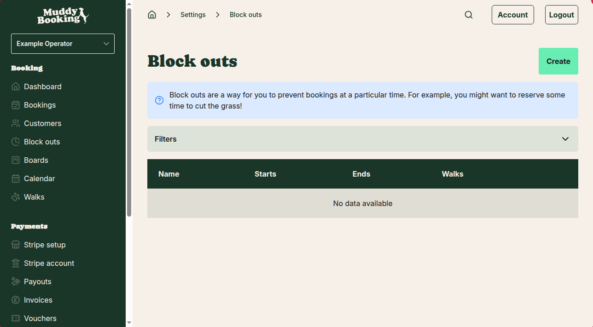
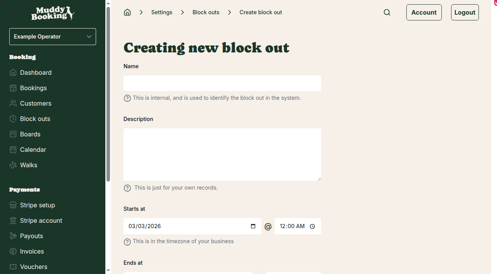

## What is a block out?

A block out temporarily blocks off time slots so customers cannot book walks during those periods. This is perfect when you need to reserve time for other activities — like cutting the grass, taking a personal break, or handling maintenance tasks.

## Finding block outs

You can access block outs in two ways:

1. **From the main menu** - Click **Block outs** in the left-hand menu
2. **From Settings** - Go to **Settings**, then look under the "Bookings" section and click **Block outs**

Both options will take you to the same block outs page.

## Adding a new block out

### Step 1: Start creating a block out

On the Block outs page, click the **Create** button **(1)** to add a new block out.

### Step 2: Fill in the block out details

You'll see a form with several fields to complete:

**Name** - Give your block out a clear name that helps you identify it later. This is just for your internal use, so make it descriptive. For example: "Grass cutting" or "Personal appointment".

**Description** - Add any extra notes that will help you remember what this block out is for. This field is optional and is just for your own records.

**Starts at** - Choose when your block out begins. You'll select both the date and time. The @ symbol shows where you can pick the specific time. All times are shown in your business timezone.

**Ends at** - Choose when your block out finishes. Again, you'll pick both the date and time. Make sure the end time is after the start time.

**Walks** - Select which walks this block out applies to. You'll see a list of your available walks (like "Sample Walk" in the example). You can select multiple walks if the block out affects more than one service.

### Step 3: Check for conflicts

The system will automatically check if your block out conflicts with any existing bookings. You'll see a message telling you whether there are any conflicts. If there are conflicts, you may need to adjust your block out times or handle those existing bookings separately.

### Step 4: Save your block out

Once you've filled in all the details and checked for conflicts, click **Create block out** to save your new block out.

## Tips for using block outs

- **Be specific with names** - Use clear names like "Vet appointment" or "Equipment maintenance" so you can easily identify block outs later
- **Plan ahead** - Create block outs as soon as you know you'll be unavailable to prevent customers from booking those times
- **Check conflicts** - Always review any booking conflicts before creating your block out
- **Use descriptions** - The description field is helpful for adding details like "Annual vet check for Rover" or "Monthly equipment servicing"

## Managing existing block outs

After creating block outs, you can view them all on the main Block outs page. The table shows:

- **Name** - The name you gave the block out
- **Starts** - When the block out begins
- **Ends** - When the block out finishes  
- **Walks** - Which walks are affected

This gives you a quick overview of all your scheduled block outs so you can plan your availability accordingly.