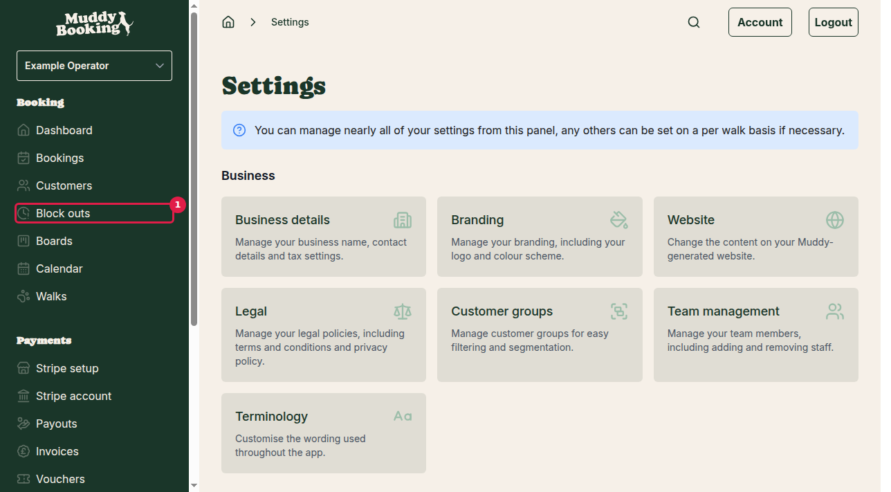
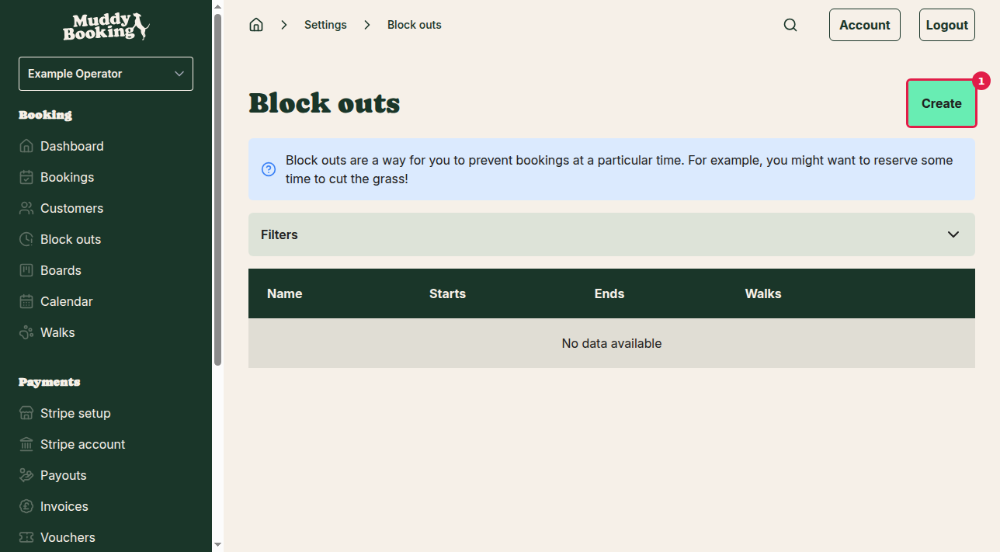
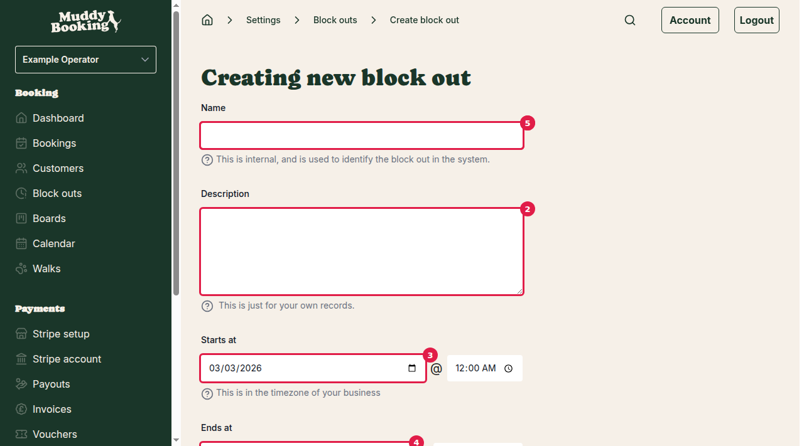

## What are block outs?

Block outs are a way to prevent bookings during specific times when you're not available. For example, you might want to reserve time for maintenance activities like cutting grass, personal appointments, or holidays.

## How to access block outs

There are two ways to get to the block outs section:

**Option 1: From the main menu**
1. Click **Block outs** in the left-hand menu

**Option 2: Through Settings**
1. Click **Settings** in the left-hand menu
2. Under the **Bookings** section, click **Block outs** **(1)**

Both options will take you to the same block outs page.

## Adding a new block out

### Step 1: Start creating a block out

From the main block outs page, click the **Create** button **(1)** to start adding a new block out.

### Step 2: Fill out the block out details

You'll see a form with several fields to complete:

**Name** **(1)** (Required)
Enter a name to identify this block out in your system. This is just for your internal reference — customers won't see this name. For example: "Grass cutting", "Holiday", or "Equipment maintenance".

**Description** **(2)** (Optional)
Add any additional notes about this block out for your own records. This might include specific details about why you're blocking this time.

**Starts at** **(3)** (Required)
Set when the block out begins. Click the field to select both the date and time. The system will use your business timezone.

**Ends at** **(4)** (Required)  
Set when the block out ends. Click the field to select both the date and time. Make sure this is after your start time.

**Walks** **(5)** (Required)
Choose which walks this block out applies to. You can select specific walks or multiple walks. This determines which services won't be available during the blocked time.

### Step 3: Check for conflicts

The system will automatically check if your block out conflicts with any existing bookings. You'll see a message showing whether there are any conflicts.

If there are conflicts, you'll need to either:
- Change your block out times
- Contact customers to reschedule their bookings
- Cancel the conflicting bookings

### Step 4: Save your block out

Once you've filled in all the required information and resolved any conflicts, click **Create block out** **(6)** to save your new block out.

## What happens after creating a block out

- The blocked time will no longer be available for new bookings
- Customers won't be able to select the blocked time slots when making bookings online
- The block out will appear in your block outs list for future reference
- You can edit or delete the block out later if needed

## Tips for using block outs effectively

- **Plan ahead**: Create block outs as soon as you know about upcoming unavailable periods
- **Use clear names**: Choose descriptive names so you can easily identify different block outs
- **Regular maintenance**: Consider setting up recurring block outs for regular maintenance activities
- **Holiday planning**: Block out holiday periods well in advance to prevent bookings during your time off
- **Buffer time**: Consider adding a small buffer before and after important activities to allow for preparation or overrun