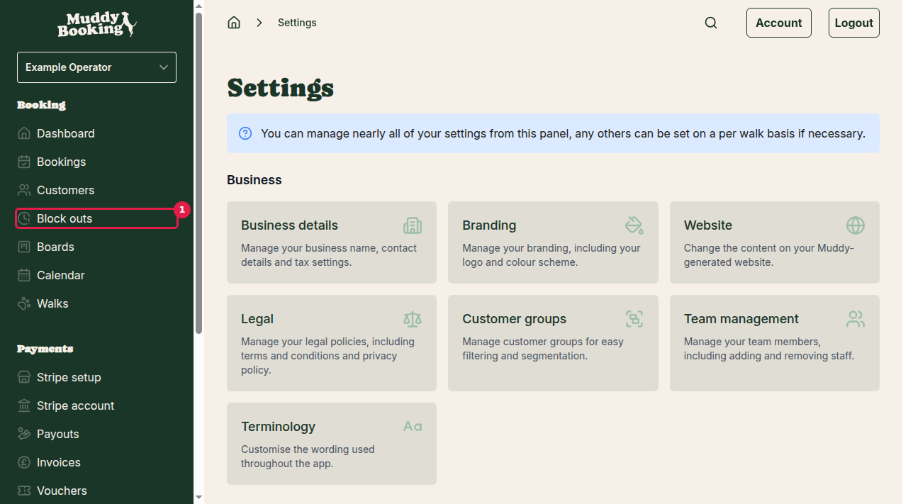
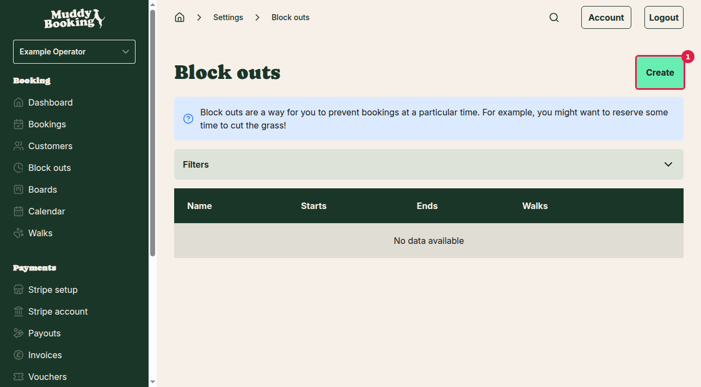
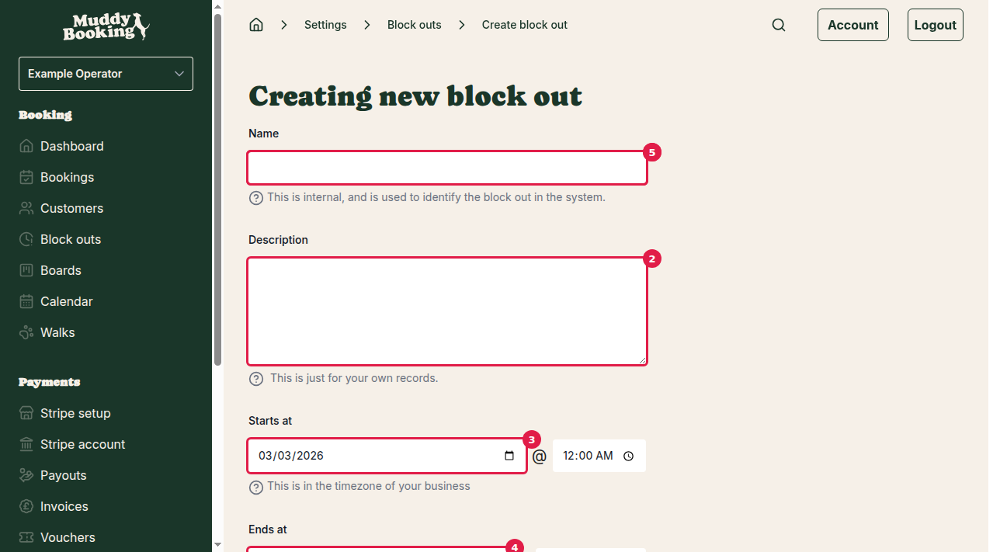

## What are block outs?

A block out stops customers booking during a time you're not available, such as a holiday, a personal appointment or a morning set aside for cutting the grass. For your regular weekly hours, see [Setting up opening times](setting-up-opening-times.md).

## How to access block outs

You can get to block outs in two ways:

**From the main menu**
1. Click **Block outs** in the left-hand menu

**Through Settings**
1. Click **Settings** in the left-hand menu
2. Under **Bookings**, click **Block outs** **(1)**

Both take you to the same page.

## Adding a new block out

### Step 1: Start creating a block out

Click **Create** **(1)**.

### Step 2: Fill out the block out details

**Name** **(1)** (Required)
A name to help you recognise the block out, such as "Grass cutting", "Holiday" or "Equipment maintenance". Customers don't see it.

**Description** **(2)** (Optional)
Any notes for your own records, such as why you're blocking the time.

**Starts at** **(3)** (Required)
The date and time the block out begins, in your business timezone.

**Ends at** **(4)** (Required)
The date and time the block out ends. This must be after the start.

**Walks** **(5)** (Required)
The [walks](creating-a-walk.md) the block out applies to. You can pick one or several. Only the walks you pick are closed during the block out.

### Step 3: Check for conflicts

Muddy checks whether the block out overlaps any existing bookings and shows you the result.

If there are conflicts, you can:
- Change the block out times
- Contact the customers to rebook
- Cancel the conflicting bookings

### Step 4: Save your block out

Click **Create block out** **(6)**.

## What happens after creating a block out

- Customers can't book the blocked time online
- The block out appears in your block outs list
- You can edit or delete it later

## Tips

- Add block outs as soon as you know you'll be away, before customers book those times
- Give each block out a clear name so the list is easy to scan
- Leave a little time either side of an appointment in case it runs over
