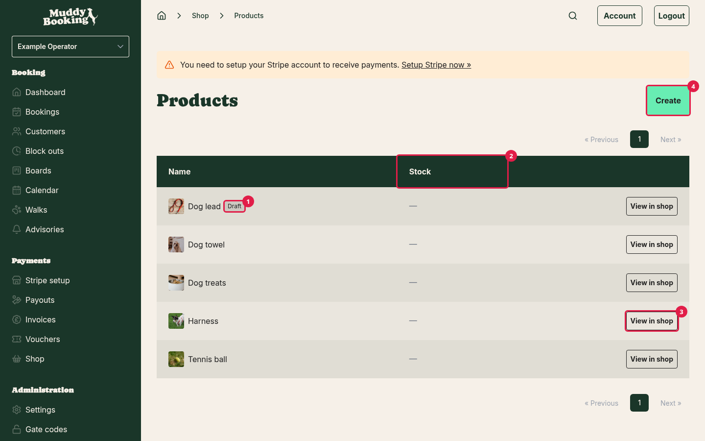
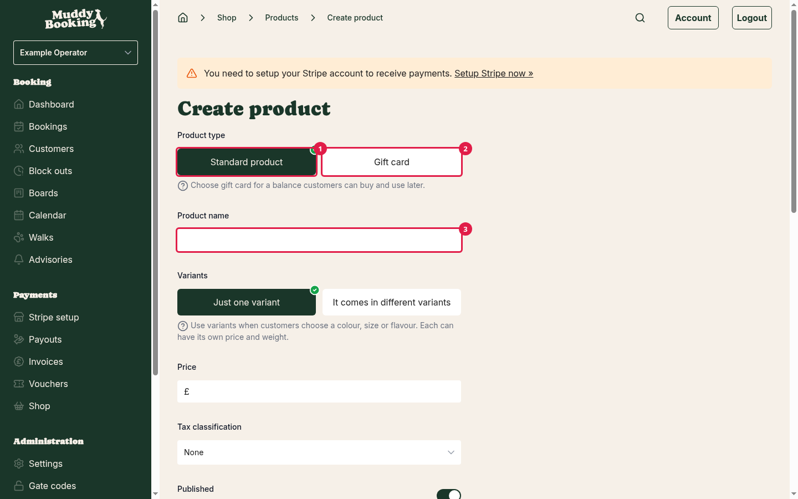
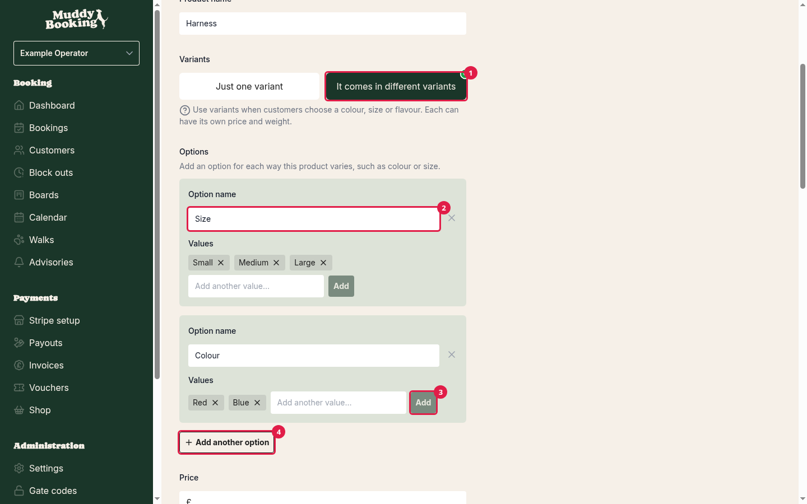
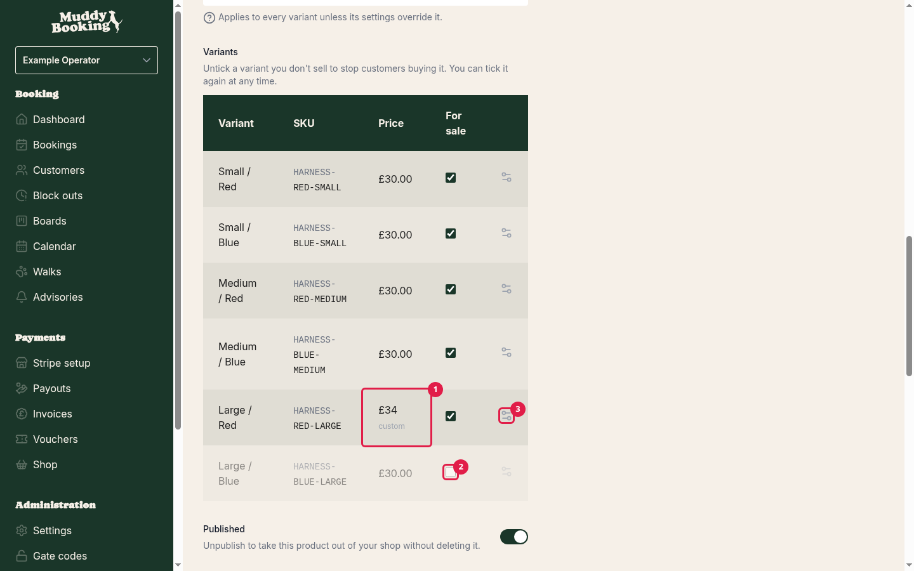
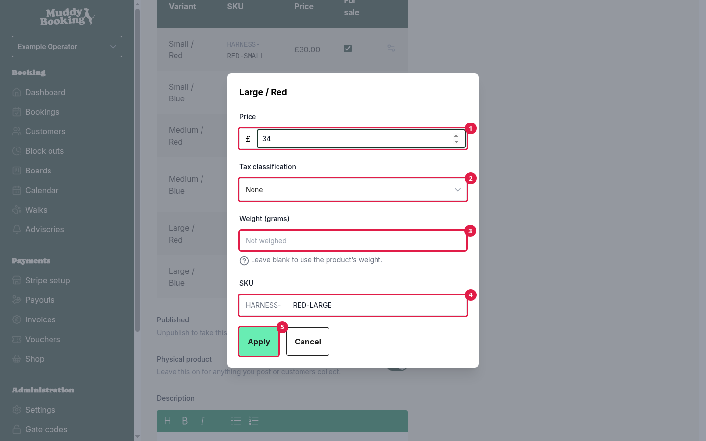
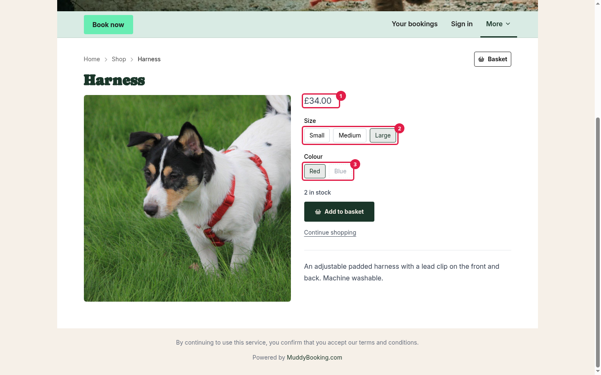
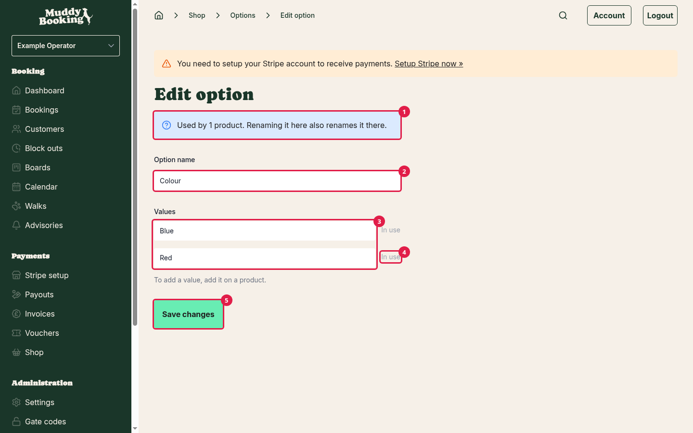
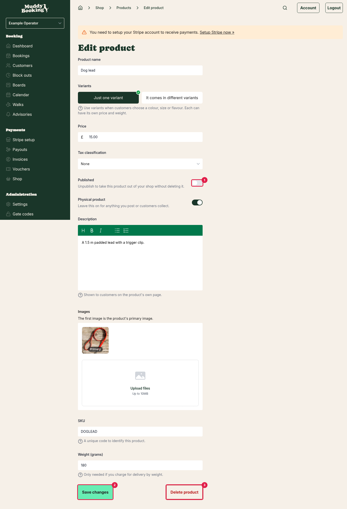
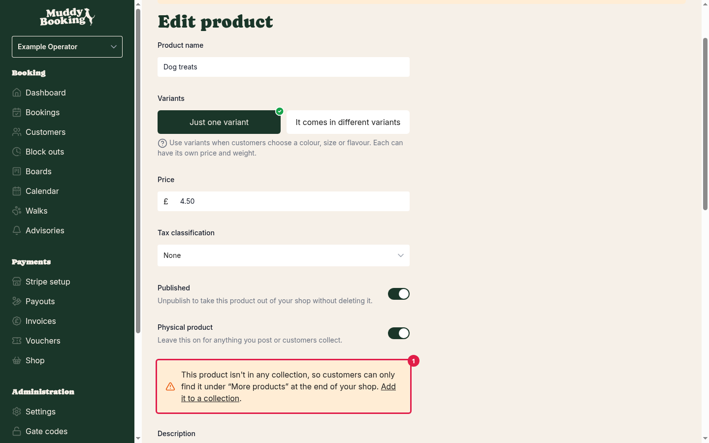

## Getting to your products

1. Click **Shop** in the left-hand menu.
2. Click **Products**.

If you haven't opened your shop yet, the **Shop** page shows your setup steps instead. Use **Add a product** or **Review products** there. See [Setting up your shop for the first time](setting-up-your-shop.md#setting-up-your-shop-for-the-first-time).

The **Products** page lists everything you sell. Products you haven't published yet have a **Draft** **(1)** badge. The **Stock** **(2)** column shows how many you have, if you track stock for that product (see [Tracking stock](tracking-shop-stock.md)).

If you've made collections, you can use the menu at the top to show one collection at a time.

To check how a product looks to customers, click **View in shop** **(3)** next to it. This works for drafts too, and before your shop is open.

## Adding a product

1. On the **Products** page, click **Create** **(4)**.
2. Under **Product type**, choose **Standard product** **(1)**.

Choose **Gift card** **(2)** instead if you want to sell a balance customers can spend later. Gift cards work a little differently, so they have their own article: [Selling gift cards](selling-gift-cards.md). You can't change the product type after you've created the product.

Then fill in the details below, starting with the **Product name** **(3)**.

### Product name

What customers see in your shop, in their basket and on their receipt.

Leave **Variants** set to **Just one variant** unless the product comes in different colours or sizes (see [below](#products-that-come-in-different-colours-or-sizes)).

### Price

What the customer pays for one of this product.

### Tax classification

If you're VAT registered, choose the VAT rate that applies to this product. If you're not, leave it as **None**.

If you choose a VAT rate, a **Prices include tax** switch appears. Leave it on if the price you entered already includes VAT, which is usual for things you sell to the public.

### Published

Leave this on to show the product in your shop. Switch it off to hide the product without deleting it. This is useful for seasonal items, or for a product you're still working on.

### Physical product

Leave this on for anything you post or hand over, including things customers collect from you. Switch it off only for things that never need delivering. Muddy only asks customers for a delivery address when something in their order is physical.

### Description

Shown on the product's own page. Use it for anything a customer would want to know before buying, like size, ingredients or care instructions. You can use bold text, lists and links.

### Images

Add photos of the product. The first image is the main one, marked **Primary**, and it's the one shown on your shop front. Customers can look through the rest on the product's page. Use the arrows on each image to change the order.

### SKU

A short code to identify the product, useful if you keep stock records elsewhere. Muddy suggests one as you type the name, but you can change it. Each product needs a different SKU.

### Weight (grams)

Only needed if you charge for delivery by weight. If any of your delivery rates use weight, set a weight on every physical product. Otherwise customers can't have a basket containing that product delivered by that method.

When you're done, click **Create product**.

If you're adding your first product while setting up your shop, the button says **Save and continue** and takes you to the next setup step.

## Products that come in different colours or sizes

If a product comes in more than one version, such as a harness in three sizes and two colours, you don't need to create a separate product for each. Add **options** instead, and Muddy creates a **variant** for each combination.

1. Under **Variants**, choose **It comes in different variants** **(1)**.
2. Click **Add an option**.
3. Type an **Option name** **(2)**, such as **Size**.
4. Add each **value**, such as **Small**, **Medium** and **Large**. Click **Add** **(3)** after each one.
5. To add another way the product varies, click **Add another option** **(4)**. For example, add **Colour** with the values **Red** and **Blue**.

As you type, Muddy suggests option names and values you've used on other products. Picking one of these keeps your shop consistent.

You can add up to three options per product, and a product can have up to 100 variants.

### The variants table

Muddy lists every combination in the **Variants** table. In the example above, you'd get six variants: Small Red, Small Blue, Medium Red, and so on.

- **Every variant sells at the product's price** unless you change it. A variant with its own price, tax or weight shows **custom** **(1)** with its price.
- Untick **For sale** **(2)** on a variant you don't sell, such as a colour you don't stock in large. Customers won't be able to choose that combination. You can tick it again at any time.
- To give one variant a different price, tax or weight, click its settings icon **(3)**.

In a variant's settings, change its **Price** **(1)**, or set its own **Tax classification** **(2)**, **Weight (grams)** **(3)** and **SKU** **(4)** ending. Tax starts as the product's rate. Leave the weight blank to use the product's weight. Click **Apply** **(5)** to keep your changes.

With variants, the product's **SKU** becomes an **SKU prefix**. Muddy adds the variant's values to the end to make each variant's code.

You must leave at least one variant for sale. Otherwise the product has nothing to sell.

### What customers see

On your shop front, the product shows **From** the lowest variant price. On the product's own page, the first available variant is already chosen, and customers pick from buttons for each option **(2)**. The price **(1)** changes as they choose. Combinations you don't sell, or that are out of stock, are greyed out **(3)**.

## Renaming an option

If you rename an option or one of its values, the change applies to every product that uses it. So if you rename **Colour** to **Colours**, every product with a colour option changes too.

1. Click **Shop** in the left-hand menu.
2. Click **Options**.
3. Click the option you want to change.
4. Change the **Option name** **(2)** or any of its **Values** **(3)**.
5. Click **Save changes** **(5)**.

The top of the page **(1)** tells you how many products use the option, so you know how far the change will reach.

On this page you can't add new values. Add them on a product instead, and they'll appear here.

You can only remove a value if no product uses it. Values that are still used show **In use** **(4)**. Take the value off those products first, including any variants you've unticked.

You can only delete a whole option once no products use it.

## Taking a product off sale

There are two ways to stop selling something.

### Unpublish it (recommended)

Edit the product, switch **Published** **(1)** off, then click **Save changes** **(2)**. The product disappears from your shop and from any baskets it's in. Everything else stays, so you can publish it again later.

### Delete it

Edit the product, then click **Delete product** **(3)**, then click **Delete it** to confirm.

**Warning:** deleting a product is permanent and can't be undone. Its variants, and its place in any collections, go with it. Orders customers have already placed keep the product's name and details, but they're no longer linked to the product. Unless you're sure you'll never need it again, unpublish it instead.

### Switching back to a single variant

If you change a product with variants back to **Just one variant**, Muddy stops selling the other variants. Orders already placed aren't affected. If you change your mind and add the same options back, the old variants come back as they were.

## Products not in a collection

If you use collections, a product that isn't in any collection only appears under **More products** at the end of your shop. Muddy warns you about this **(1)** when you edit the product. See [Organising your shop with collections](organising-shop-collections.md).

