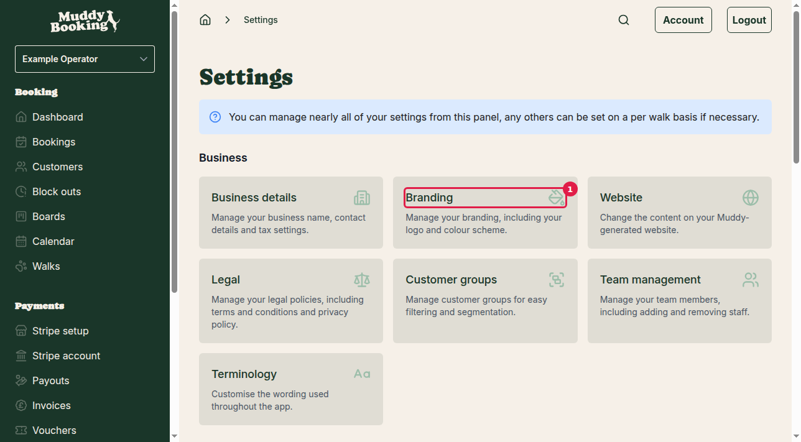
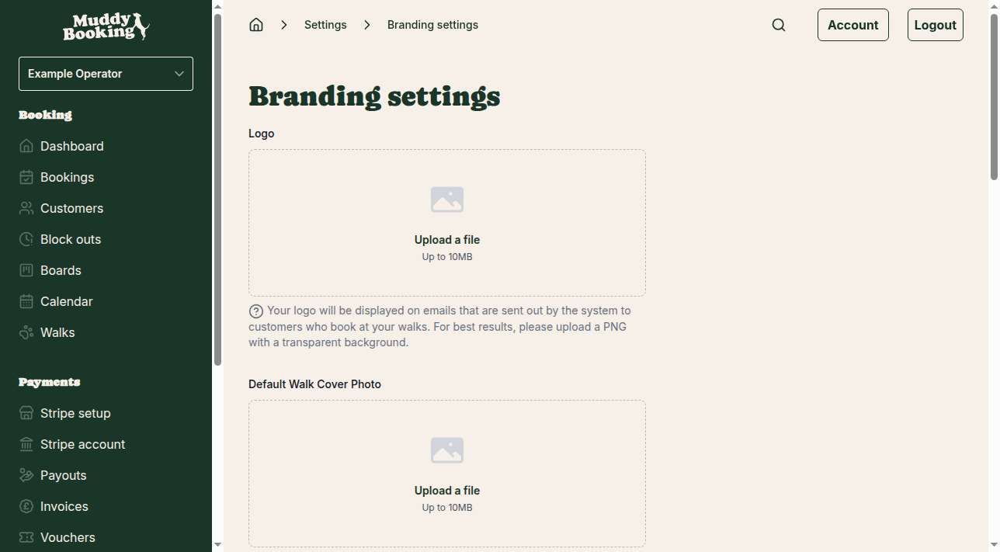
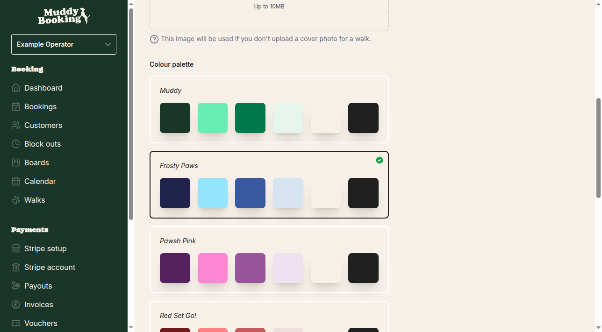

## Accessing the colour scheme settings

The colour scheme settings control the visual appearance of both your booking forms and your admin area. To change your colour scheme:

1. Go to **Settings** from the main menu
2. Click **Branding** **(1)** in the Business section

## Selecting your colour scheme

On the Branding settings page, you'll find the **Colour palette** section with seven different colour schemes to choose from **(1)**:

The available colour schemes are:

- **Muddy** — The original Muddy Booking colour scheme
- **Frosty Paws** — A cool, frosty colour palette
- **Pawsh Pink** — A stylish pink-themed scheme
- **Red Set Go!** — A bold red colour palette
- **Pumpkin Pup** — An autumn-inspired orange scheme
- **Bark Mode** — A dark, modern colour scheme
- **Noble Paws** — An elegant, refined colour palette

Simply click on your preferred colour scheme to select it.

## Saving your changes

Once you've selected your preferred colour scheme, click the **Save** button **(1)** at the bottom of the page to apply your changes.

Your new colour scheme will be applied immediately and will affect:

- **Your admin area** — All the pages you use to manage your business
- **Your booking forms** — The forms your customers see when making bookings
- **Customer-facing pages** — Any Muddy-generated pages your customers visit

## Important notes

- The colour scheme change applies to your entire Muddy Booking system
- There's no preview available — you'll see the changes after clicking **Save**
- Your customers will see the new colours on their booking forms straight away
- You can change your colour scheme as often as you like