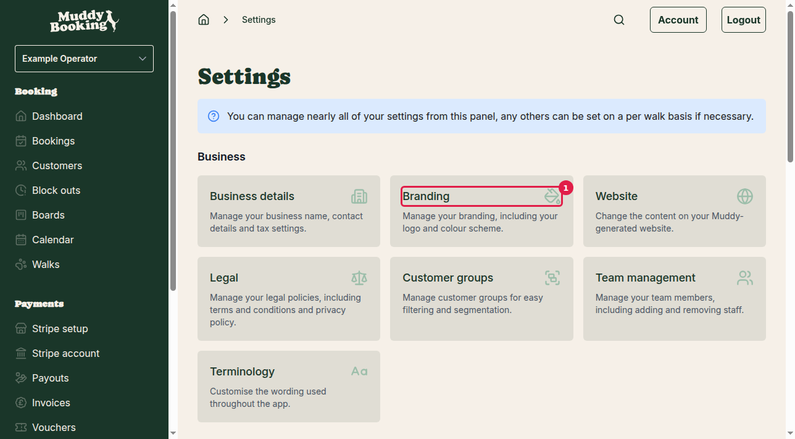
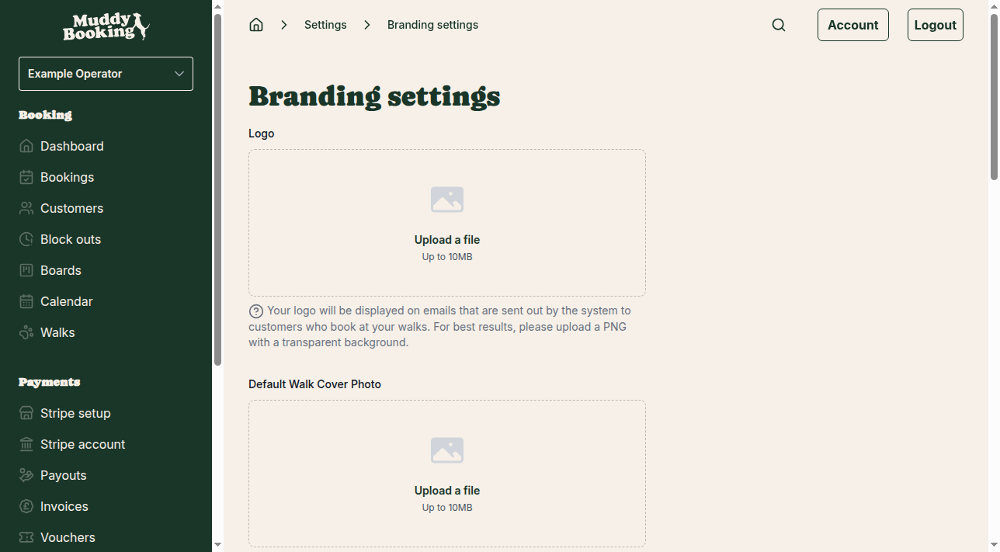
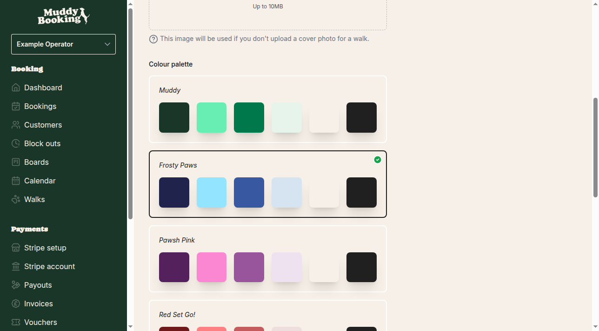

## Accessing the colour scheme settings

The colour scheme sets the colours of your booking forms and your admin area. To change it:

1. Go to **Settings**
2. Click **Branding** **(1)** in the Business section

## Selecting your colour scheme

On the [Branding settings page](customizing-branding-and-website.md#customizing-your-branding), the **Colour palette** section has seven schemes to choose from **(1)**:

- **Muddy**: the original Muddy Booking colours
- **Frosty Paws**: cool, icy tones
- **Pawsh Pink**: pink
- **Red Set Go!**: bold red
- **Pumpkin Pup**: autumn orange
- **Bark Mode**: dark
- **Noble Paws**: muted and elegant

Click a scheme to select it.

## Saving your changes

Click **Save** **(1)** at the bottom of the page.

The new colours apply straight away to:

- Your admin area
- Your booking forms
- Any other Muddy pages your customers visit

## Important notes

- There's no preview, so you'll only see the new colours after clicking **Save**
- The scheme applies across your whole account, not to a single walk
- You can change it as often as you like
