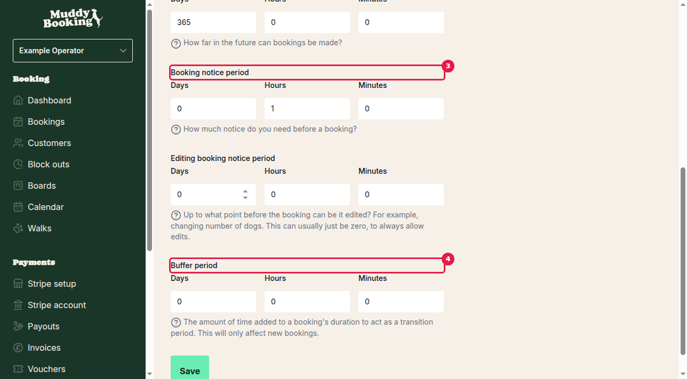

## Accessing booking settings

To configure your booking rules, go to **Settings** in the left-hand menu, then click **Booking settings** in the Bookings section.

## Key booking rule settings

The booking settings page contains all the rules that control how customers can make bookings with you. Here's what each setting does:

### Maximum dogs per walk **(1)**

This sets the maximum number of dogs that can be included in a single booking. For example, if you set this to 3, customers can book walks for up to 3 dogs at once, but not more.

### Start booking slots at **(2)**

This controls what times customers can book slots for. You have several options:

- **Top of the hour** — Bookings start at 9:00am, 10:00am, 11:00am, etc.
- **Quarter past the hour** — Bookings start at 9:15am, 10:15am, 11:15am, etc.
- **Half past the hour** — Bookings start at 9:30am, 10:30am, 11:30am, etc.
- **Quarter to the hour** — Bookings start at 8:45am, 9:45am, 10:45am, etc.
- **Every fifteen minutes** — Bookings can start at any 15-minute interval (9:00am, 9:15am, 9:30am, 9:45am, etc.)
- **Every thirty minutes** — Bookings can start at 30-minute intervals (9:00am, 9:30am, 10:00am, etc.)

This helps you organize your schedule and ensures bookings align with your preferred timing.

### Future booking period

This controls how far in advance customers can make bookings. Set this using days, hours, and minutes.

For example:
- **365 days** means customers can book up to a year in advance
- **7 days** limits bookings to one week ahead
- **48 hours** restricts advance bookings to 2 days

This prevents customers from booking too far into the future when your availability might be uncertain.

### Booking notice period **(3)**

This sets the minimum amount of notice you need before a booking takes place. Customers won't be able to book walks that are too close to the current time.

For example:
- **1 hour** means customers must book at least 1 hour before the walk time
- **24 hours** requires customers to book at least a day in advance
- **0 hours** allows immediate bookings (as long as you have availability)

This gives you time to prepare and prevents last-minute bookings when you might not be available.

### Editing booking notice period

This controls how close to the walk time customers can still edit their bookings (like changing the number of dogs). 

The system notes that "this can usually just be zero, to always allow edits" — meaning customers can modify their bookings right up until the walk time. However, you might want to set a small buffer if you need time to prepare for changes.

### Buffer period **(4)**

This adds extra time between bookings to give you a transition period. The buffer time gets automatically added to each booking's duration.

For example:
- **15 minutes** means if you offer 30-minute walks, each booking slot actually takes 45 minutes
- **30 minutes** gives you a full half-hour between walks for travel, preparation, or rest

This prevents back-to-back bookings and gives you breathing room between walks. The buffer only affects new bookings after you change this setting.

## Saving your changes

After adjusting any of these settings, click **Save** at the bottom of the page to apply your new booking rules. The changes will take effect immediately for all future bookings.