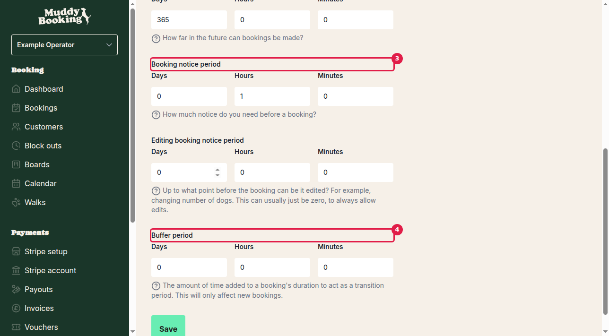

## Accessing booking settings

Go to **Settings** in the left-hand menu, then click **Booking settings** in the Bookings section.

## Key booking rule settings

These settings control when and how customers can book with you.

### Maximum dogs per walk **(1)**

The most dogs a customer can include in one booking. If you set it to 3, a customer can book for up to 3 dogs at once.

### Start booking slots at **(2)**

The times a booking can start:

- **Top of the hour**: 9:00am, 10:00am, 11:00am and so on
- **Quarter past the hour**: 9:15am, 10:15am, 11:15am and so on
- **Half past the hour**: 9:30am, 10:30am, 11:30am and so on
- **Quarter to the hour**: 8:45am, 9:45am, 10:45am and so on
- **Every fifteen minutes**: 9:00am, 9:15am, 9:30am, 9:45am and so on
- **Every thirty minutes**: 9:00am, 9:30am, 10:00am and so on

### Future booking period

How far ahead customers can book, set in days, hours and minutes. For example:
- **365 days** lets customers book up to a year ahead
- **7 days** limits bookings to the coming week
- **48 hours** limits bookings to the next 2 days

A shorter period stops customers booking dates you can't yet commit to.

### Booking notice period **(3)**

The minimum notice you need before a walk. Customers can't book a slot that starts sooner than this. For example:
- **1 hour** means customers must book at least an hour before the walk
- **24 hours** means customers must book at least a day ahead
- **0 hours** allows bookings right up to the start time, as long as you have [availability](setting-up-opening-times.md)

### Editing booking notice period

How close to the walk customers can still edit their booking, for example to change the number of dogs.

As the page says, "this can usually just be zero, to always allow edits", which lets customers make changes right up to the walk. Set it higher if you need time to prepare for changes. For cancellation and rescheduling rules, see [Setting up a cancellation policy](setting-up-cancellation-policy.md).

### Buffer period **(4)**

Extra time added to the end of each booking so walks don't run back to back. For example:
- **15 minutes** turns a 30-minute walk into a 45-minute slot
- **30 minutes** gives you half an hour between walks for travel, preparation or a break

The buffer only applies to bookings made after you change it.

## Saving your changes

Click **Save** at the bottom of the page. The new rules apply straight away to future bookings. To override some of these settings for a single walk, see [Creating a walk](creating-a-walk.md#booking-configuration).
