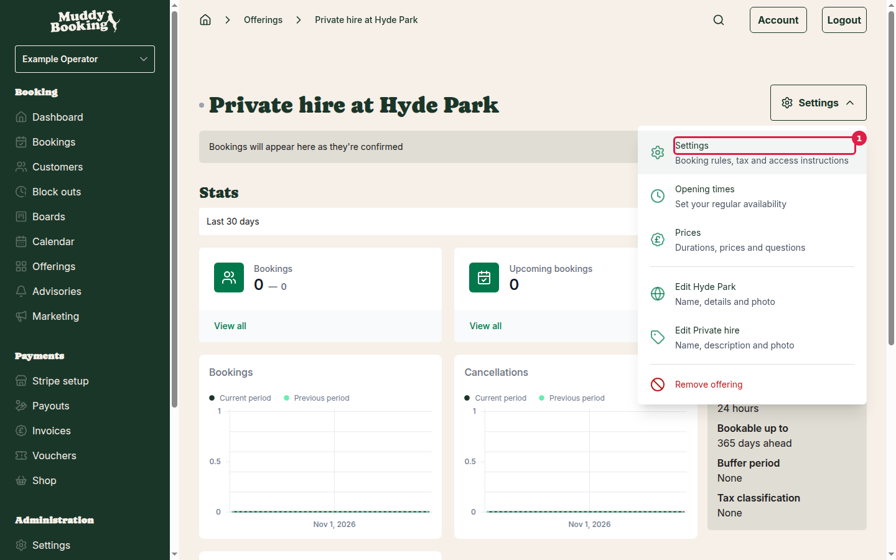
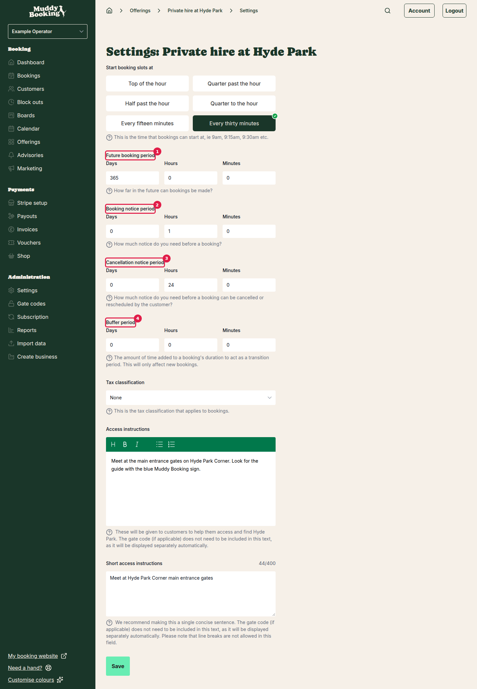
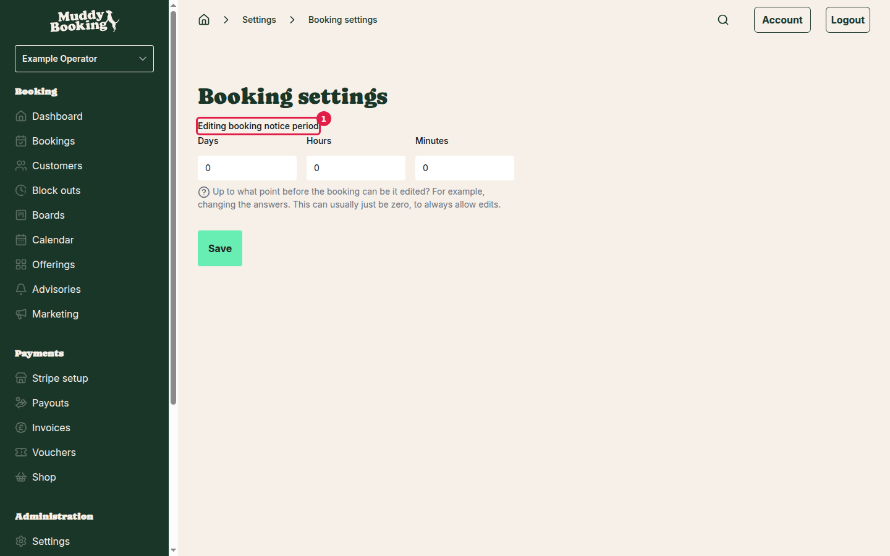

## Where booking rules live

Most booking rules are set on each offering individually, so you can give different services or locations their own rules. Go to **Offerings** in the left-hand menu, click the offering you want to configure, then click **Settings** **(1)**.

A small menu appears. Click **Settings** (described as "Booking rules, tax and access instructions").

If you haven't set up your offerings yet, see [Setting up your offerings](creating-a-walk.md) first.

## Booking rules on each offering

The settings page for an offering contains the booking rules for that offering.

### Start booking slots at

The times bookings can start, such as on the hour or every fifteen minutes, are set on the offering's **Opening times** page, so different days and times can start differently. See [Choosing when bookings start](setting-up-opening-times.md#choosing-when-bookings-start).

### Future booking period **(1)**

How far ahead customers can book, set in days, hours and minutes. For example, 365 days lets customers book up to a year in advance, while 7 days limits bookings to the coming week. A shorter period stops customers booking dates you can't yet commit to.

### Booking notice period **(2)**

The minimum notice you need before a booking starts. Customers can't book a slot that begins sooner than this. For example:

- **1 hour** means customers must book at least an hour before the booking starts
- **24 hours** means customers must book at least a day ahead
- **0 hours** allows bookings right up to the start time, as long as you have [opening times](setting-up-opening-times.md) set

### Cancellation notice period **(3)**

How much notice a customer must give to cancel or reschedule a booking on their own. For example, 24 hours means they can't cancel within a day of the booking. For how fees work when customers cancel, see [Setting up a cancellation policy](setting-up-cancellation-policy.md).

### Buffer period **(4)**

Extra time added to the end of each booking so bookings don't run back to back. For example, 15 minutes turns a 30-minute booking into a 45-minute slot in your calendar, giving you time to travel or prepare.

The buffer only applies to bookings made after you change it.

### Limiting how many dogs can come

There is no maximum dogs setting here. To limit how many dogs (or people, or horses) a customer can bring, add a question such as "How many dogs are you bringing?" on the offering's **Prices** page and set its **At most** number. See [Setting up prices and questions](setting-up-prices-and-questions.md).

## Saving your changes

Click **Save** at the bottom of the page. The new rules apply straight away to future bookings on that offering.

## Editing booking notice period (global setting)

There is one booking rule that applies across all your offerings rather than per offering. Go to **Settings** in the left-hand menu, then click **Booking settings** in the Bookings section.

### Editing booking notice period **(1)**

How close to the start of a booking a customer can still edit their booking, for example to change their answers to your booking questions. As the page note says, this can usually just be zero, to always allow edits. Set it higher if you need more preparation time before changes take effect.

Click **Save** to apply the change.
