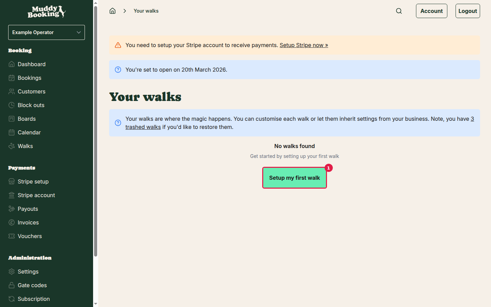
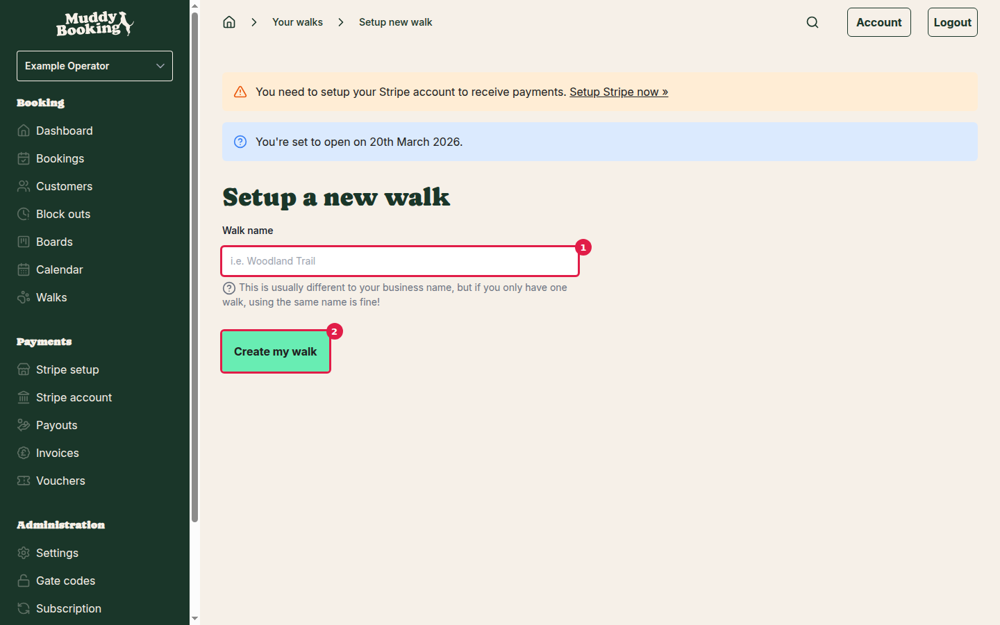
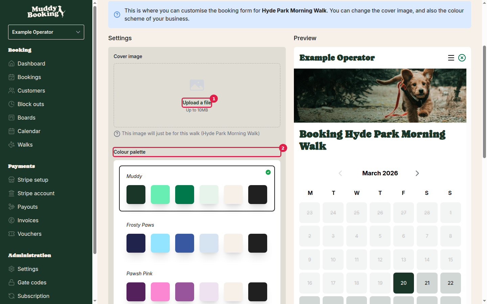
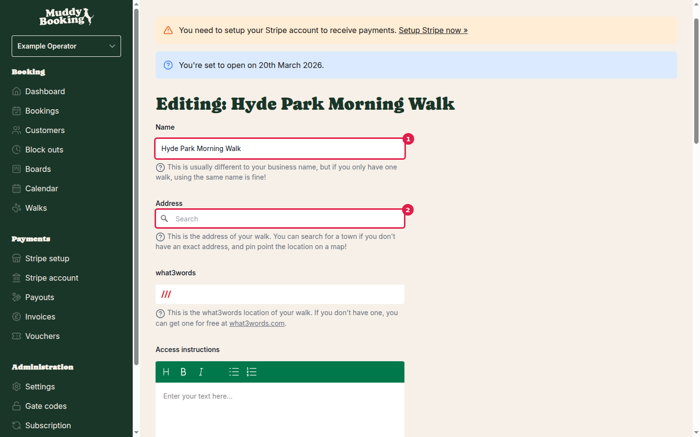
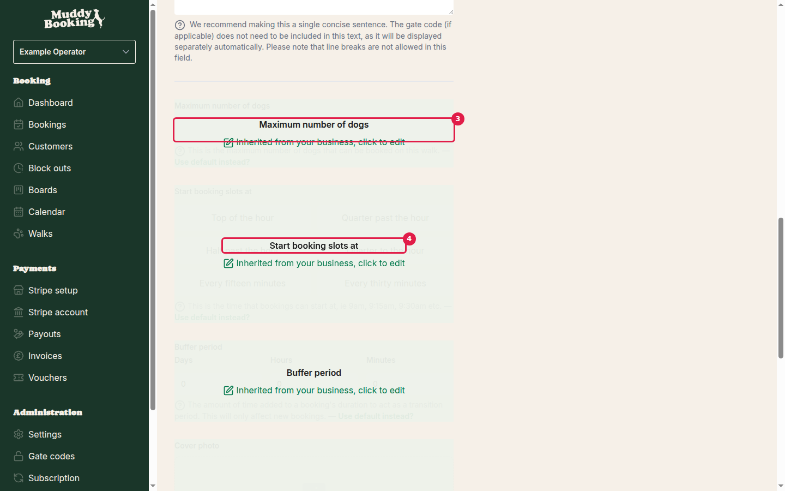

## Starting from scratch

When you first set up Muddy Booking, you'll need to create your first walk. Go to **Walks** in the left menu to get started.

Click **Setup my first walk** **(1)** to begin the creation process.

## Creating your walk

The first step is simple — just give your walk a name. This is usually different from your business name, but if you only have one walk route, using the same name is fine.

1. Enter your walk name in the field **(1)** — for example, "Hyde Park Morning Walk"
2. Click **Create my walk** **(2)** to proceed

## Styling your walk

After creating the walk, you'll be taken to the styling page where you can customise how your walk appears to customers.

Here you can:

- **Upload a cover image** **(1)** — Add a photo that represents your walk (up to 10MB). This image will be specific to this walk only
- **Choose a colour palette** **(2)** — Select from predefined colour schemes like Muddy, Frosty Paws, or Pawsh Pink. Note that this colour scheme will apply to all your walks, not just this one

Click **Save changes** when you're happy with your styling choices, or **Preview** to see how your booking form will look to customers.

## Configuring walk settings

To configure the core settings for your walk, go to the Settings section. You'll find comprehensive options to customise how your walk operates.

### Basic information

- **Name** **(1)** — The display name for your walk that customers will see
- **Address** **(2)** — The location of your walk. You can search for a town if you don't have an exact address, and pinpoint the location on a map
- **what3words** — A precise location reference that customers can use for navigation (get one free at what3words.com)
- **Access instructions** — Detailed directions to help customers find you and access the walk location. Gate codes don't need to be included here as they'll be displayed separately
- **Short access instructions** — A single, concise sentence summarising how to find you (maximum 400 characters)

### Booking configuration

These settings are inherited from your business by default, but you are able to change them on a per walk level if you need to.

- **Maximum number of dogs** **(3)** — Set the capacity limit for each walk slot
- **Start booking slots at** **(4)** — Choose when bookings can begin (e.g., on the hour, every 15 minutes, every 30 minutes)
- **Buffer period** — Add extra time between bookings as a transition period

### Display settings

You can also customise the terminology used for this specific walk:

- **Display noun** — The word used to refer to this walk throughout the app
- **Display verb** — The action word for attending this walk  
- **Display subject** — How the focus of this walk is described

Most settings inherit from your business defaults, but you can override them for individual walks by unchecking "Use default instead?"

Don't forget to click **Save** to apply your changes.

## Your completed walk

Once configured, your walk will appear in your walks list and you'll have access to a detailed overview page showing bookings, revenue, and key settings.

The overview page displays:

- **Statistics dashboard** — Track bookings, revenue, and invoices over different time periods
- **Recent bookings** — See your latest customer bookings at a glance
- **Quick configuration summary** — View key settings like maximum dogs, booking intervals, and notice periods
- **New booking button** — Jump directly to the booking form

Your walk is now ready to accept bookings! Customers can find and book it through your booking form, and you can manage all aspects from this central dashboard.
