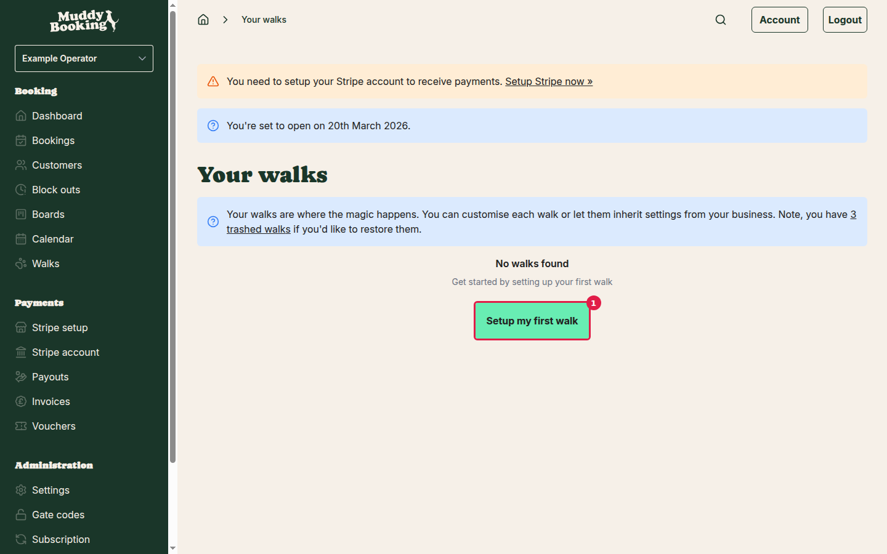
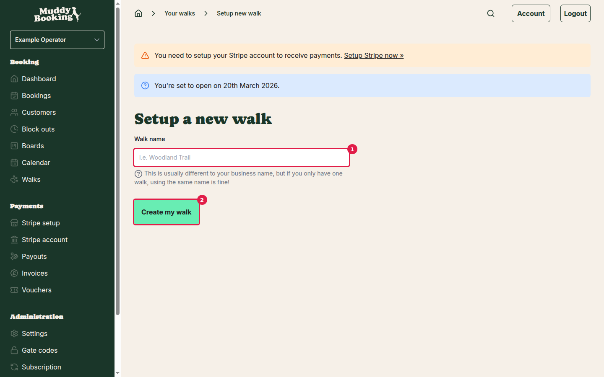
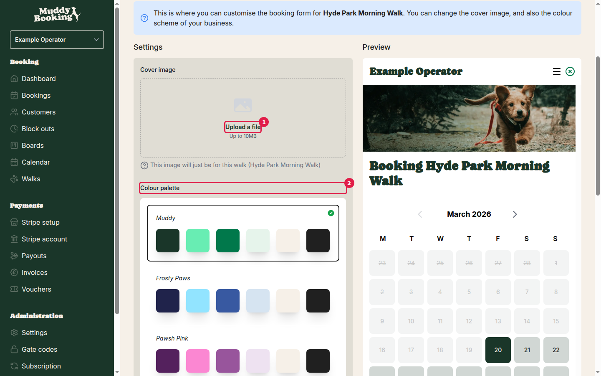
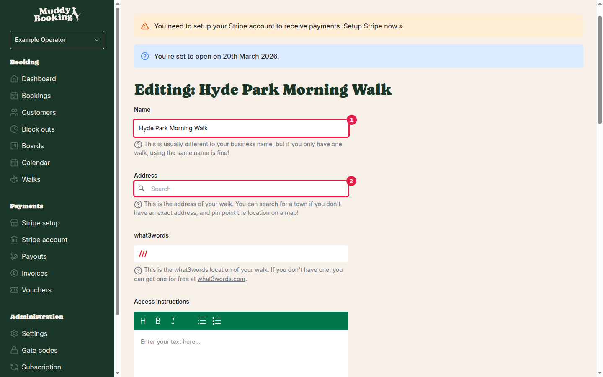
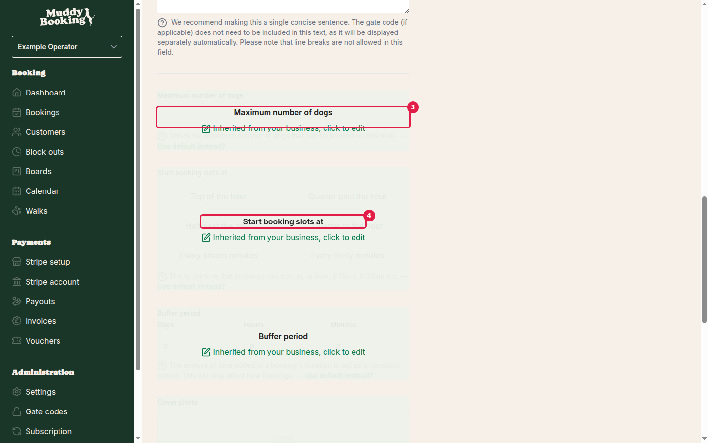

## Starting from scratch

Go to **Walks** in the left-hand menu.

Click **Setup my first walk** **(1)**.

## Creating your walk

Give your walk a name. It's usually different from your business name, but if you only have one walk, using the same name is fine.

1. Enter the name **(1)**, for example "Hyde Park Morning Walk"
2. Click **Create my walk** **(2)**

## Styling your walk

Next you'll see the styling page, where you choose how the walk looks to customers.

- **Upload a cover image** **(1)**: a photo for this walk only, up to 10MB
- **Choose a colour palette** **(2)**: one of the [colour schemes](changing-system-colour-scheme.md), such as Muddy, Frosty Paws or Pawsh Pink. This applies to all your walks, not just this one

Click **Save changes**, or **Preview** to see the booking form as customers will.

## Configuring walk settings

The walk's main settings are in its Settings section.

### Basic information

- **Name** **(1)**: the name customers see
- **Address** **(2)**: where the walk is. If you don't have an exact address, search for the town and pinpoint the spot on the map
- **what3words**: a precise location customers can use to find you (get one free at what3words.com)
- **Access instructions**: directions for finding and getting into the walk. Leave out gate codes, as they're shown separately
- **Short access instructions**: one sentence on how to find you, up to 400 characters

### Booking configuration

These start out the same as your [business booking rules](configuring-booking-rules.md), but you can change them for this walk.

- **Maximum number of dogs** **(3)**: how many dogs each slot can take
- **Start booking slots at** **(4)**: when bookings can start, such as on the hour, every 15 minutes or every 30 minutes
- **Buffer period**: extra time between bookings

### Display settings

You can also change the [terminology](customizing-app-terminology.md) for this walk:

- **Display noun**: the word used for the walk
- **Display verb**: the word for taking part in it
- **Display subject**: the word for who or what is booked, such as dogs

Most settings use your business defaults. To set a different value for this walk, untick **Use default instead?** next to it.

Click **Save** to apply your changes.

## Your completed walk

The walk now appears in your walks list. Its overview page shows:

- **Statistics**: bookings, revenue and invoices over different time periods
- **Recent bookings**: the latest bookings for this walk
- **Configuration summary**: key settings such as maximum dogs, booking intervals and notice periods
- **New booking**: a button that takes you straight to the booking form

Customers can now book the walk through your booking form.
