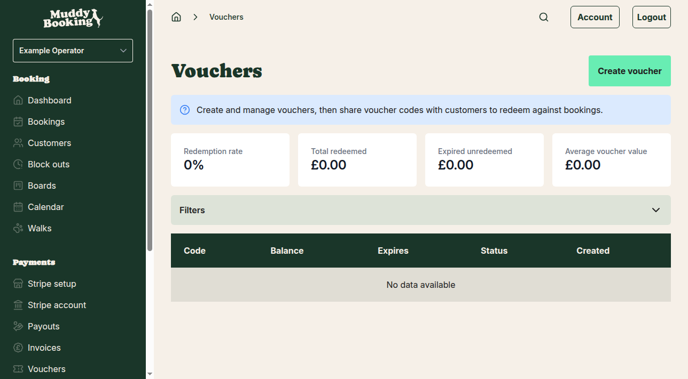
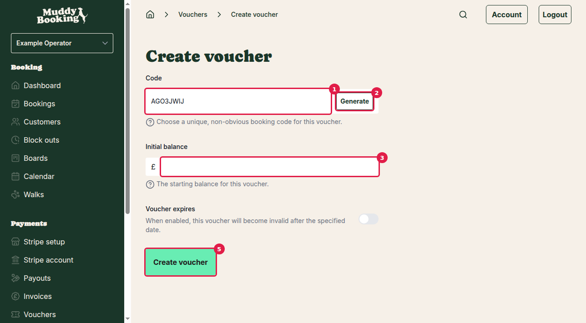
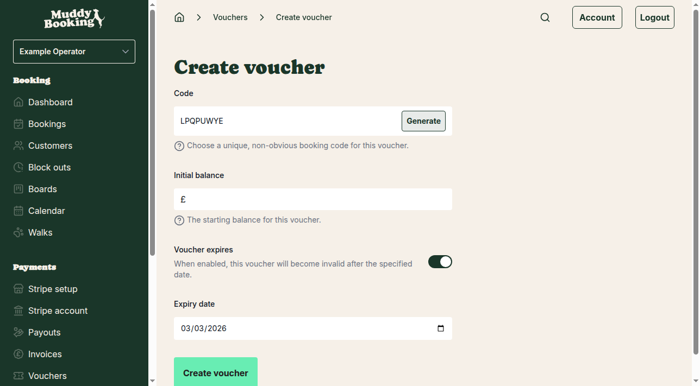
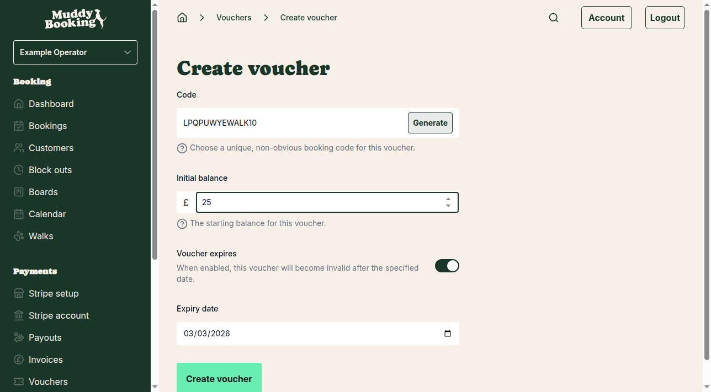
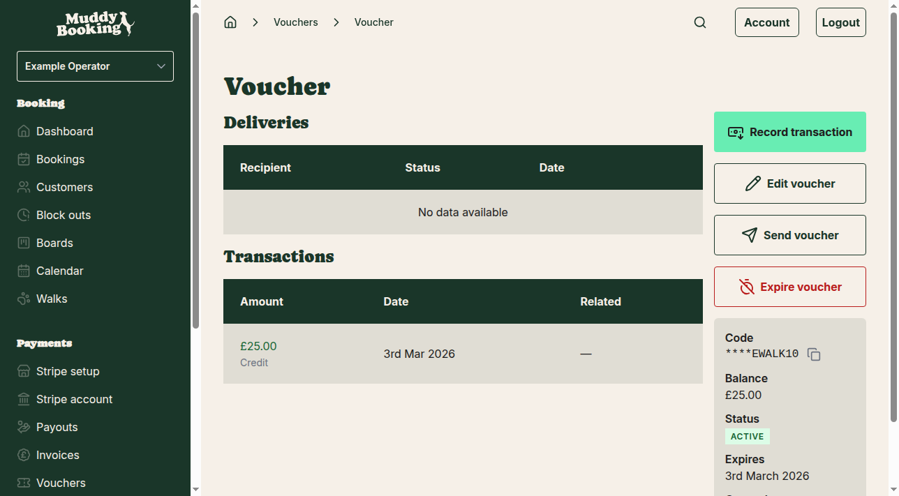

## Getting to vouchers

Vouchers allow you to create credit that customers can redeem against their bookings. This is useful for gift certificates, promotional credits, or refunds.

To access vouchers, go to the left-hand menu and click **Vouchers**.

On this page, you can see an overview of your voucher statistics including redemption rates, total amounts, and a list of all created vouchers.

## Creating a new voucher

To create a voucher, click **Create voucher** at the top of the page.

You'll need to fill in the following information:

1. **Code** **(1)** — Enter a unique voucher code that customers will use to redeem the voucher. This should be non-obvious for security. You can either:
   - Type your own custom code (like "WALK10" or "GIFT50")
   - Click **Generate** **(2)** to automatically create a random code

2. **Initial balance** **(3)** — Enter the monetary value of the voucher in pounds. This is how much credit the voucher will provide.

3. **Voucher expires** **(4)** — Click this section if you want the voucher to have an expiry date. When enabled, an additional date field will appear where you can set when the voucher becomes invalid.

When you enable the expiry option, you can set the **Expiry date** by entering a date in the format shown.

4. When you've filled in all the details, click **Create voucher** **(5)** to save the voucher.

## After creating a voucher

Once created, you'll be taken to the individual voucher page where you can see all the voucher details and manage it further.

This page shows:
- The voucher code (partially hidden with asterisks for security)
- Current balance
- Status (Active, expired, etc.)
- Expiry date (if set)
- Creation date
- Transaction history showing the initial credit
- Delivery history (if the voucher has been sent to customers)

## Managing existing vouchers

From the individual voucher page, you can:

- **Edit voucher** — Modify the code or expiry date
- **Send voucher** — Share the voucher code with customers
- **Expire voucher** — Manually deactivate the voucher before its expiry date
- **Record transaction** — Add additional credits or debits to adjust the balance

## Voucher list view

Return to the main vouchers page to see all your created vouchers in a table format.

The list shows each voucher's code, current balance, expiry date, status, and creation date. You can click on any voucher to view its details and manage it.

## Tips for voucher codes

- Choose codes that are easy for customers to remember but not obvious for others to guess
- Consider including your business name or service type in the code (e.g., "DOGWALK25")
- Avoid simple sequences like "1234" or common words like "DISCOUNT"
- The generate function creates secure random codes if you prefer not to create your own

## How customers use vouchers

Customers enter voucher codes during the booking process to apply credit to their booking. The voucher balance will be reduced by the booking amount, and any remaining balance can be used for future bookings until the voucher expires or is fully used.