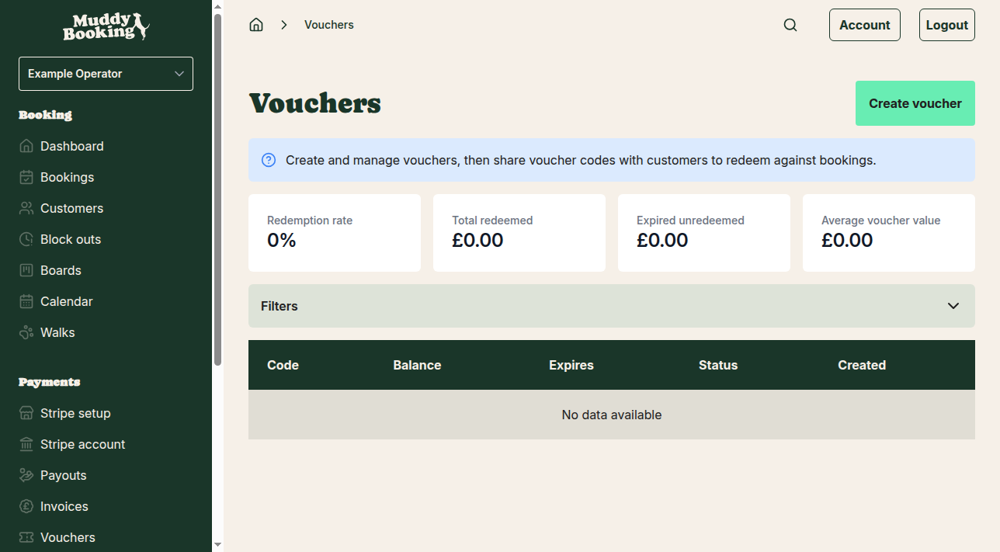
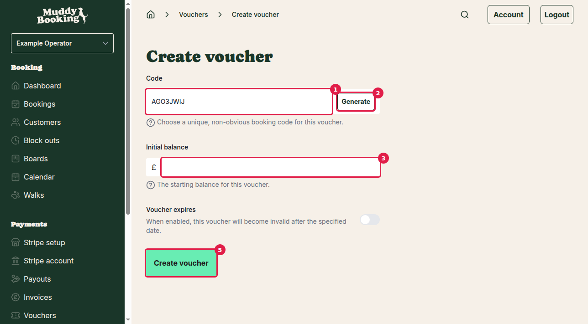
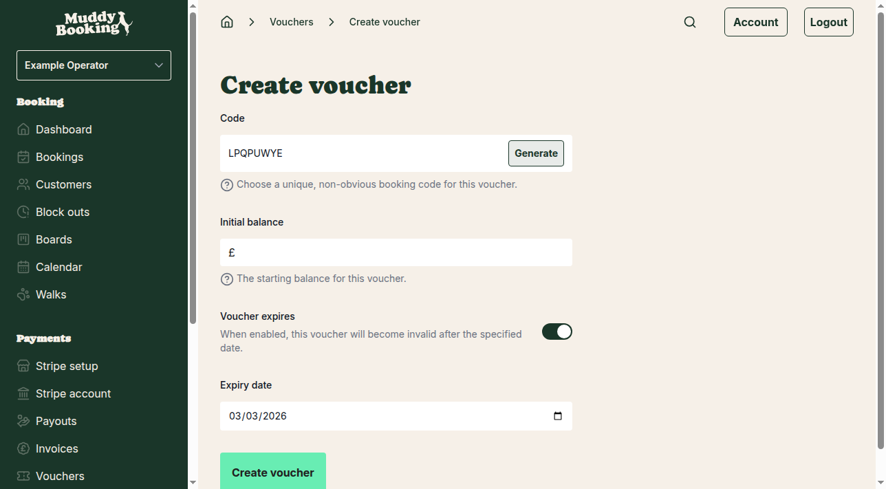
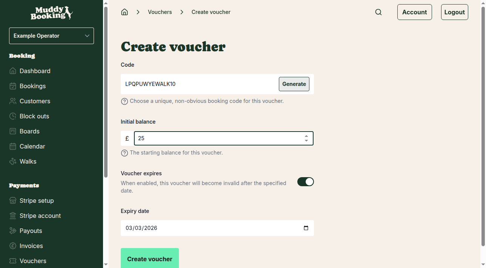
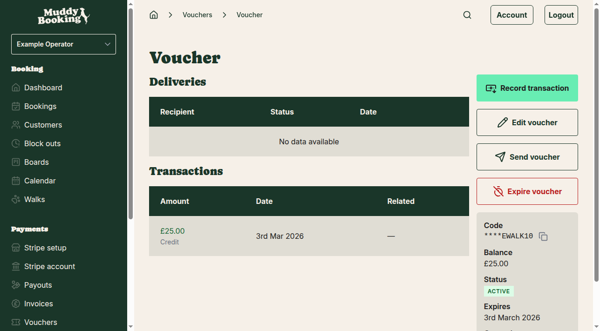

## Getting to vouchers

A voucher is credit a customer can spend on bookings. Use them for gift vouchers, promotions or refunds.

Click **Vouchers** in the left-hand menu.

The page shows your voucher statistics, such as redemption rates and total amounts, and a list of your vouchers.

## Creating a new voucher

Click **Create voucher** at the top of the page.

1. **Code** **(1)**: the code customers enter to use the voucher. Make it hard to guess. You can either:
   - Type your own, such as "WALK10" or "GIFT50"
   - Click **Generate** **(2)** for a random code

2. **Initial balance** **(3)**: how much credit the voucher holds, in pounds.

3. **Voucher expires** **(4)**: click this if the voucher should expire. An **Expiry date** field appears. Enter the date in the format shown.

4. Click **Create voucher** **(5)**.

## After creating a voucher

You'll be taken to the voucher's page.

It shows:
- The code, partly hidden with asterisks
- The current balance
- The status, such as Active or Expired
- The expiry date, if there is one
- The date it was created
- Its transactions, starting with the initial credit
- Its delivery history, if you've sent it to anyone

## Managing existing vouchers

From the voucher's page you can:

- **Edit voucher**: change the code or expiry date
- **Send voucher**: [send the code to a customer](sending-vouchers-to-customers.md)
- **Expire voucher**: stop the voucher working before its expiry date
- **Record transaction**: add or remove credit

## Voucher list view

The main vouchers page lists all your vouchers.

Each one shows its code, balance, expiry date, status and creation date. Click a voucher to open it.

## Tips for voucher codes

- Pick codes that are easy for the customer to remember but hard for anyone else to guess
- You could include your business name or service, such as "DOGWALK25"
- Avoid sequences like "1234" and common words like "DISCOUNT"
- If you'd rather not think of one, **Generate** makes a random code

## How customers use vouchers

Customers enter the code when they book. The booking cost comes off the voucher's balance, and whatever's left can be spent on later bookings until it runs out or expires.
