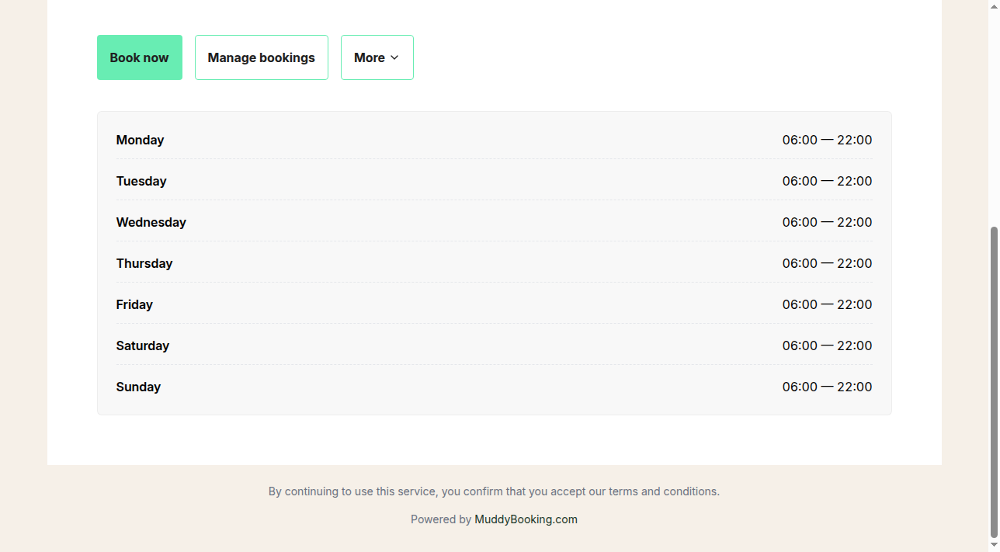
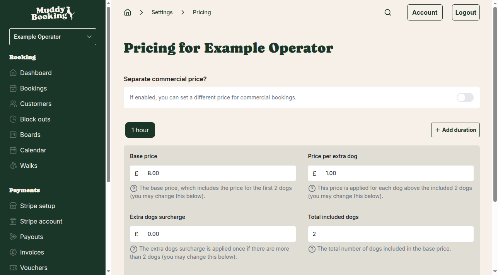

## Overview

Your customers can book walks through your personalized booking website. This guide walks through the complete booking process from a customer's perspective, helping you understand what they see and do when making a booking.

## Accessing the booking website

Each business has its own booking website URL. You can find yours by:

1. Going to **Settings** in the left-hand menu
2. Clicking **Website embedding** in the Business section
3. Your booking website URL is listed at the top

Alternatively, you can access it quickly from the main navigation where it appears as "My booking website".

## The booking website homepage

When customers visit your booking website, they see your business information and opening times.

The homepage displays:
- Your business name and branding
- **Book now** button to start the booking process
- **Login** option for existing customers
- **Manage bookings** for customers to view or modify existing bookings
- Your opening hours for each day of the week
- Terms and conditions link

## Starting the booking process

When a customer clicks **Book now**, they're taken to the booking form where they can:

1. Select which walk they want to book
2. Choose their preferred date and time
3. Enter their details and dog information
4. Complete the booking and payment

## Requirements for bookings to work

Before customers can make bookings, you need to complete these essential setup steps:

### Set up pricing

Your walks need pricing configured before customers can book:

1. Go to **Settings** → **Pricing**
2. Set a **Base price** for each walk duration
3. Configure additional pricing options like extra dogs
4. Save your pricing configuration

### Configure payment processing

If you want to accept payments online, you'll need to:

1. Complete Stripe setup by going to **Stripe setup** in the navigation
2. Provide your business information for payment processing
3. Configure your payment settings

### Set up walks

Ensure you have at least one walk configured:

1. Go to **Walks** in the main menu
2. Create or configure your walk offerings
3. Set availability and duration for each walk

## What customers see during booking

Once your system is properly configured, customers will see:

- A calendar interface showing available time slots
- Your walk options and pricing
- Forms to enter their contact information
- Dog details forms (breed, name, special requirements)
- Payment options if online payments are enabled
- Booking confirmation details

## Managing customer bookings

After customers make bookings, you can:

- View all bookings in the **Bookings** section
- See upcoming walks on your **Calendar**
- Manage individual booking details
- Process payments and send invoices
- Communicate with customers about their bookings

## Tips for a smooth booking experience

- **Complete all setup steps** before promoting your booking website
- **Test the booking process** yourself to ensure everything works
- **Keep your opening times updated** so customers see accurate availability
- **Respond promptly** to customer enquiries about bookings
- **Use clear walk descriptions** so customers know what they're booking

## Common issues

If customers report problems with booking:

- Check that pricing is fully configured
- Verify Stripe setup is complete (if accepting payments)
- Ensure walks are properly set up with availability
- Confirm opening times are correct
- Check for any block-outs that might be preventing bookings

The booking website provides customers with a professional, easy-to-use interface for scheduling their dog walks, helping you grow your business while saving time on manual booking management.