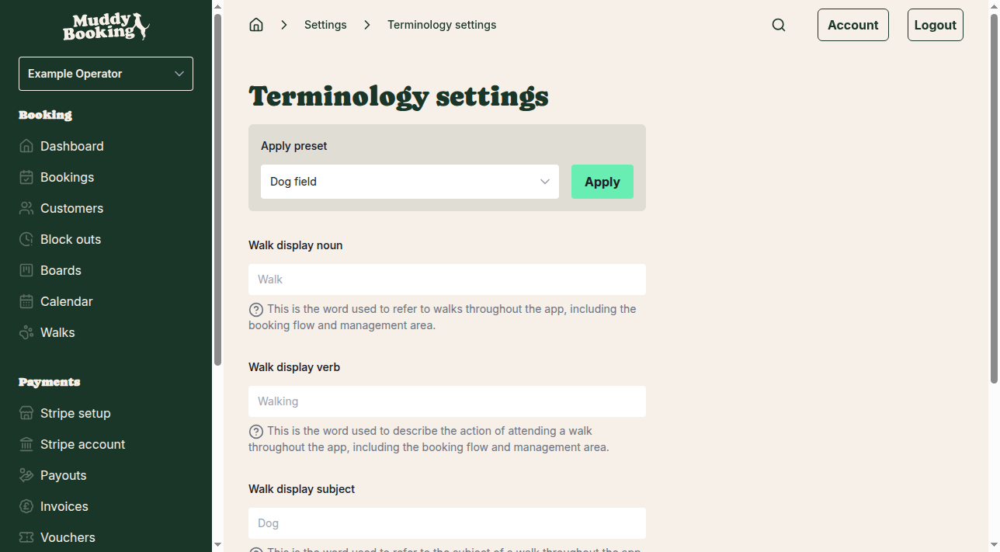
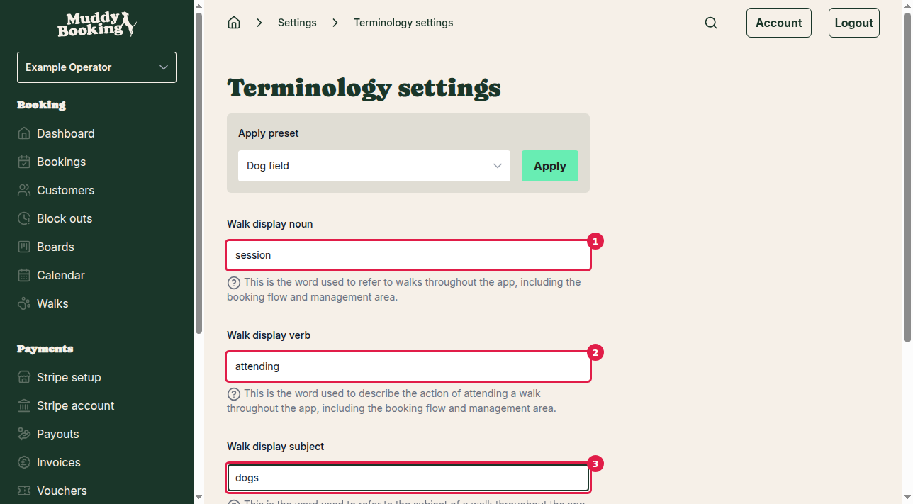

## Why customize terminology?

While Muddy Booking was originally designed for dog walking businesses, you might offer different services like dog training, grooming, or even equine activities. The terminology settings let you change the language throughout the entire app to match your business perfectly.

For example, instead of "walks" you might want to use "sessions", "appointments", or "arena hire". These changes appear everywhere - in your booking form, management area, customer communications, and invoices.

## Getting to terminology settings

1. Click **Settings** in the left navigation
2. Under the Business section, click **Terminology**

## Using preset terminology

The quickest way to customize your terminology is using the presets. These are pre-configured sets of terminology for common business types:

- **Dog field** - For outdoor field-based activities
- **Dog training** - For training sessions and classes  
- **Dog grooming** - For grooming appointments
- **Equine arena hire** - For horse riding and arena bookings

To apply a preset:

1. Click the **Apply preset** dropdown
2. Select your business type from the list
3. Click **Apply**
4. Click **Save** to confirm your changes

## Creating custom terminology

For complete control, you can set your own terminology using the three main fields:

**Walk display noun** **(1)** - This replaces "walk" throughout the app. Examples: "session", "appointment", "class", "hire"

**Walk display verb** **(2)** - This replaces "walking" when describing the activity. Examples: "attending", "training", "grooming", "riding"  

**Walk display subject** **(3)** - This replaces "dog" when referring to what's being booked for. Examples: "dogs", "pets", "horses", "clients"

## Seeing your changes in action

As you type in the fields, watch the example text update in real-time. This shows exactly how your terminology will appear throughout the app:

*"You have a booking for our [noun] with 1 [subject] tomorrow, [verb] professionally or with friends."*

## Saving your terminology

Once you're happy with your terminology:

1. Click **Save** **(4)** at the bottom of the page
2. Your new terminology will be applied across the entire app immediately

## Where terminology appears

Your custom terminology will be used in:

- Customer booking forms
- Booking confirmations and reminders
- Your management dashboard
- Invoice descriptions
- Email and SMS notifications
- Calendar entries

## Tips for choosing terminology

- Keep terms simple and clear for your customers
- Use language your customers already know and expect
- Test different options using the live example before saving
- Consider how terms will read in different contexts (emails, invoices, etc.)

Remember, you can change your terminology anytime by returning to this page.
