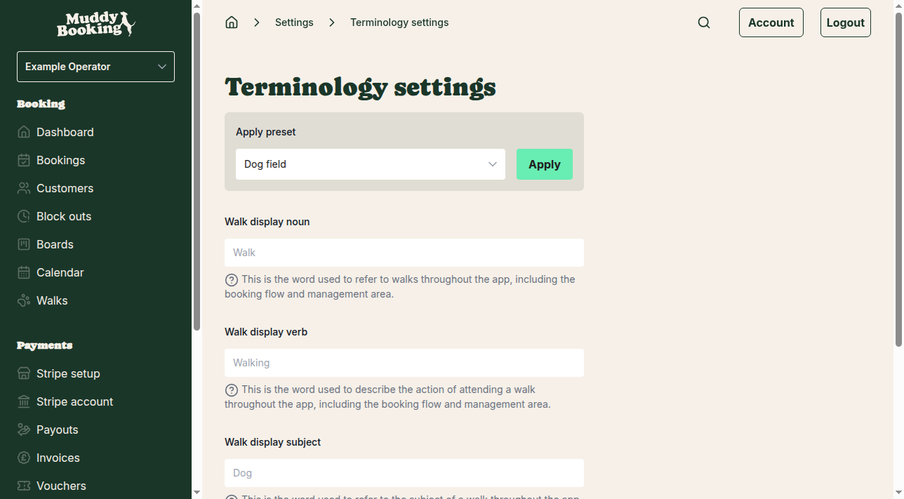
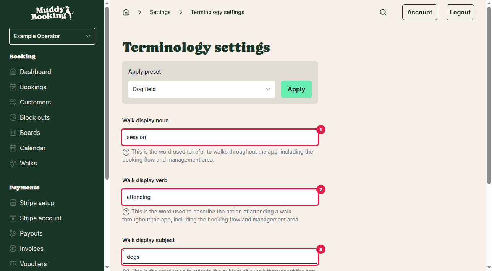

## Why customize terminology?

Muddy Booking was built for dog walking, but you might run training classes, grooming appointments or arena hire. Terminology settings change the words Muddy uses so they fit your business.

For example, you could call your walks "sessions", "appointments" or "arena hire". The new words appear in your booking form, your admin area, customer messages and invoices.

## Getting to terminology settings

1. Click **Settings** in the left-hand menu
2. Under the Business section, click **Terminology**

## Using preset terminology

Presets fill in the words for common business types:

- **Dog field**: field hire and other outdoor field activities
- **Dog training**: training sessions and classes
- **Dog grooming**: grooming appointments
- **Equine arena hire**: riding and arena bookings

To use one:

1. Click the **Apply preset** menu
2. Choose your business type
3. Click **Apply**
4. Click **Save**

## Creating custom terminology

To pick your own words, fill in the three fields:

**Walk display noun** **(1)** replaces "walk", for example "session", "appointment", "class" or "hire".

**Walk display verb** **(2)** replaces "walking", for example "attending", "training", "grooming" or "riding".

**Walk display subject** **(3)** replaces "dog", for example "dogs", "pets", "horses" or "clients".

You can also change these words for a single walk. See [Creating a walk](creating-a-walk.md#display-settings).

## Seeing your changes in action

The example sentence under the fields updates as you type, so you can check how your words read:

*"You have a booking for our [noun] with 1 [subject] tomorrow, [verb] professionally or with friends."*

## Saving your terminology

Click **Save** **(4)** at the bottom of the page. The new words apply straight away.

## Where terminology appears

- Customer booking forms
- Booking confirmations and reminders
- Your admin area
- [Invoice descriptions](invoicing-and-automatic-payments.md)
- [Email and SMS notifications](setting-up-whatsapp-sms-notifications.md)
- Calendar entries

## Tips for choosing terminology

- Use the words your customers already use
- Check the example sentence before saving, and think about how the words will read in emails and on invoices

You can change your terminology at any time.
