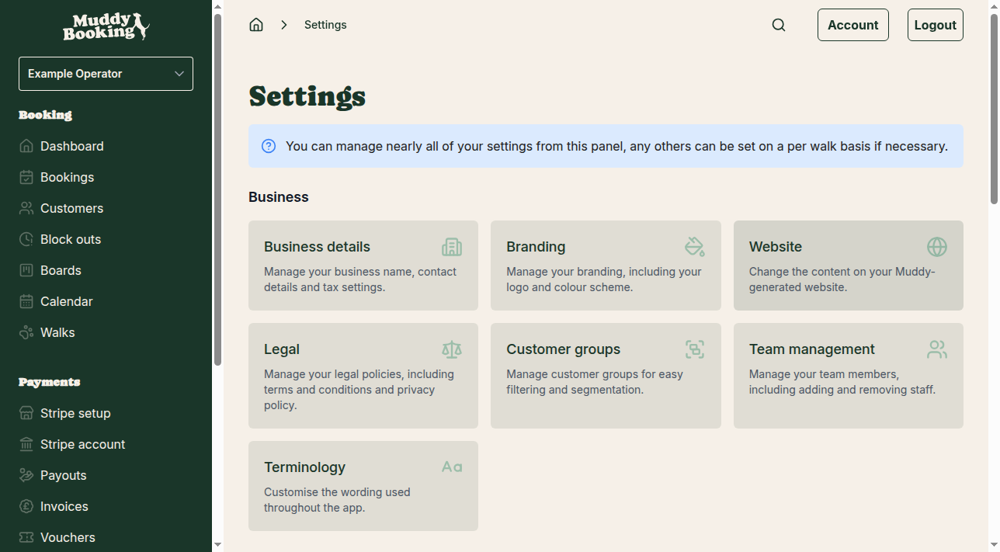
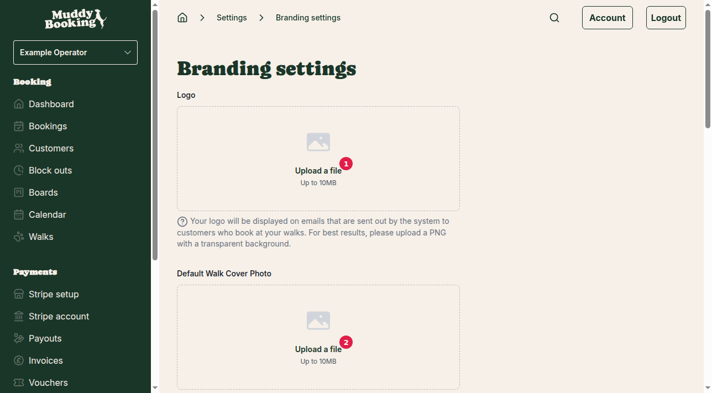
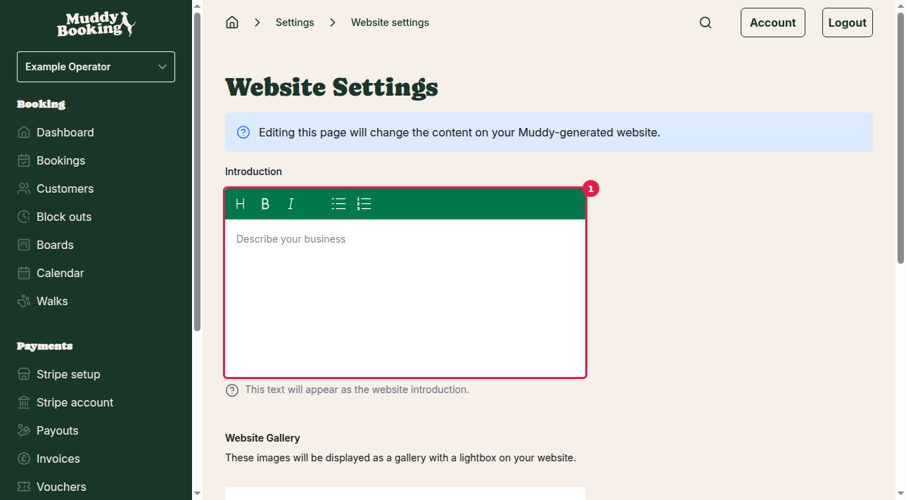

## Overview

Muddy Booking lets you customize your brand appearance and hosted booking website to match your business identity. You can upload your logo, choose from pre-designed color palettes, and add content to your customer-facing website including introduction text, gallery images, and social media links.

## Customizing your branding

Your branding settings control how your business appears in emails and throughout the booking system.

1. From the main menu, click **Settings**
2. In the Business section, click **Branding**

### Uploading your logo

Your logo will appear on all emails sent to customers who book your walks.

1. In the Logo section **(1)**, click **Upload a file**
2. Select your logo file (up to 10MB)
3. For best results, use a PNG file with a transparent background

### Setting a default walk cover photo

This image is used when you haven't uploaded a specific cover photo for a walk.

1. In the Default Walk Cover Photo section **(2)**, click **Upload a file**
2. Select your cover image (up to 10MB)

### Choosing your color palette

Your color palette affects the appearance of your booking forms and admin area.

1. In the Colour palette section **(3)**, select from these options:
   - **Muddy** — Classic earthy tones
   - **Frosty Paws** — Cool blues and whites
   - **Pawsh Pink** — Warm pinks and corals
   - **Red Set Go!** — Bold reds and oranges
   - **Pumpkin Pup** — Autumn oranges and yellows
   - **Bark Mode** — Dark browns and tans
   - **Noble Paws** — Rich purples and golds

2. Click **Save** **(4)** to apply your branding changes

## Customizing your hosted website

Your hosted booking website is where customers can book your services and learn about your business.

1. From the Settings page, click **Website** in the Business section

### Adding introduction text

This text appears as the main introduction on your website, helping customers understand your business.

1. In the Introduction section **(1)**, click in the **Describe your business** text area
2. Write a welcoming introduction that explains:
   - What services you offer
   - Your experience or qualifications
   - What makes your service special
   - Your coverage area

### Creating a website gallery

Gallery images help customers see your work and build trust in your service.

1. In the Website Gallery section, click **Upload files** **(2)**
2. Select multiple images (up to 10MB each) showing:
   - Happy dogs in your care
   - Local walking areas
   - Your team in action
   - Before/after photos of muddy pups

The images will display as a gallery that customers can click through with a lightbox viewer.

### Adding social media links

Connect your social media accounts to help customers find and follow you.

1. In the Facebook URL field **(3)**, enter your complete Facebook page URL
   - Example: `https://www.facebook.com/yourbusiness`

2. In the Instagram handle field **(4)**, enter just your username (the @ symbol is already provided)
   - Example: If your Instagram is @happydogwalker, just enter `happydogwalker`

3. Click **Save** to update your website

## Managing booking URLs

If you've embedded Muddy Booking's booking management component on your own website, you can set the Manage URL in the branding settings. This is where customers will be directed to manage their bookings.

If you don't have your own website, don't worry — customers can still manage their bookings through Muddy Booking's system.

## Tips for effective branding

- **Logo quality**: Use a high-resolution logo with transparent background for the best appearance across different backgrounds
- **Consistent colors**: Choose a color palette that matches your existing business materials and website
- **Professional photos**: Use clear, well-lit photos that showcase happy dogs and clean, safe walking environments
- **Engaging introduction**: Write in a friendly, professional tone that addresses common customer concerns like safety and reliability
- **Social proof**: Use your social media links to showcase customer testimonials and regular updates about your service

Your branding changes will appear immediately on new bookings and in future emails to customers.