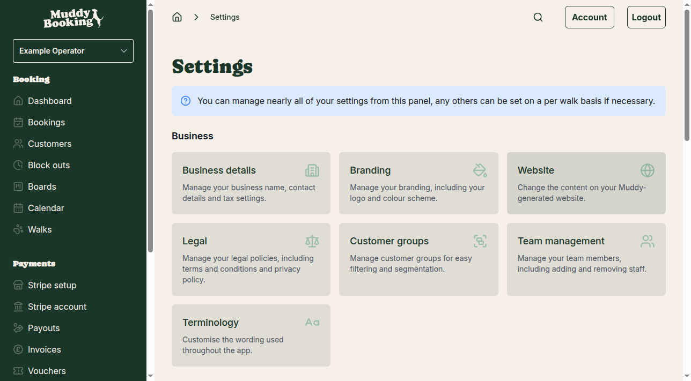
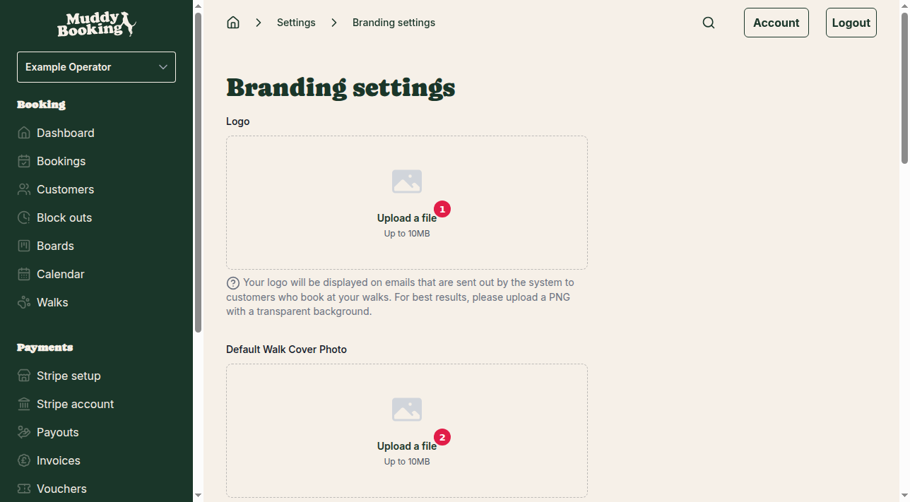
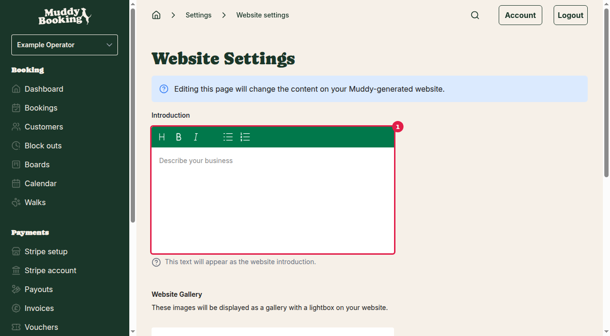

## Overview

You can add your logo, choose a colour palette, and fill your hosted booking website with an introduction, photos and social media links.

## Customizing your branding

Branding controls how your business looks in emails and across the booking system.

1. Click **Settings** in the left-hand menu
2. In the Business section, click **Branding**

### Uploading your logo

Your logo appears on every email sent to customers who book with you.

1. In the Logo section **(1)**, click **Upload a file**
2. Choose your logo file (up to 10MB)

A PNG with a transparent background looks best.

### Setting a default walk cover photo

This photo is used for any walk that doesn't have its own cover photo.

1. In the Default Walk Cover Photo section **(2)**, click **Upload a file**
2. Choose your image (up to 10MB)

### Choosing your color palette

Your [colour palette](changing-system-colour-scheme.md) sets the colours of your booking forms and admin area.

1. In the Colour palette section **(3)**, choose one of:
   - **Muddy**: earthy tones
   - **Frosty Paws**: cool blues and whites
   - **Pawsh Pink**: warm pinks and corals
   - **Red Set Go!**: bold reds and oranges
   - **Pumpkin Pup**: autumn oranges and yellows
   - **Bark Mode**: dark browns and tans
   - **Noble Paws**: rich purples and golds

2. Click **Save** **(4)**

## Customizing your hosted website

Your hosted website is where customers find out about you and book.

1. On the Settings page, click **Website** in the Business section

### Adding introduction text

This is the main introduction on your website.

1. In the Introduction section **(1)**, click in the **Describe your business** box
2. Write a short introduction covering:
   - What you offer
   - Your experience or qualifications
   - What sets you apart
   - The area you cover

### Creating a website gallery

Photos show customers what to expect and help them trust you.

1. In the Website Gallery section, click **Upload files** **(2)**
2. Choose your images (up to 10MB each), such as:
   - Happy dogs in your care
   - The places you walk
   - Your team at work
   - Before and after photos of muddy dogs

Customers can click through the photos on your website.

### Adding social media links

1. In the Facebook URL field **(3)**, enter the full address of your Facebook page, for example **https://www.facebook.com/yourbusiness**
2. In the Instagram handle field **(4)**, enter your username without the @, which is already there. If your Instagram is @happydogwalker, enter **happydogwalker**
3. Click **Save**

## Managing booking URLs

If you've added Muddy's booking management to your own website, enter its address as the Manage URL in your branding settings. Customers will be sent there to manage their bookings.

If you don't have your own website, customers manage their bookings on Muddy instead.

## Tips for effective branding

- Use a high-resolution logo with a transparent background so it looks right on any background
- Pick a colour palette that matches your existing branding
- Use clear, well-lit photos
- Write your introduction in a friendly tone, and answer what customers worry about most, such as safety and reliability

Branding changes show straight away on new bookings and in future emails.
