## Finding your embed code

1. In the Muddy admin area, click **Settings** in the left-hand menu, then click **Website embedding**

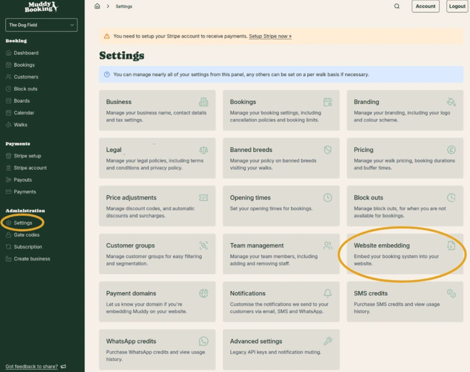

2. Find the booking form you want to add to your site and click the green **Copy HTML** button next to it

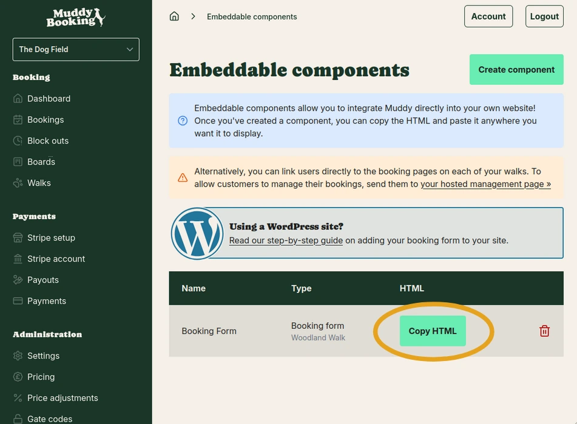

This copies the embed code to your clipboard, ready to paste into Squarespace.

## Adding the form to your Squarespace page

### Step 1: Open your page

Log into Squarespace and go to **Pages**. Open the page where you want the booking form to appear.

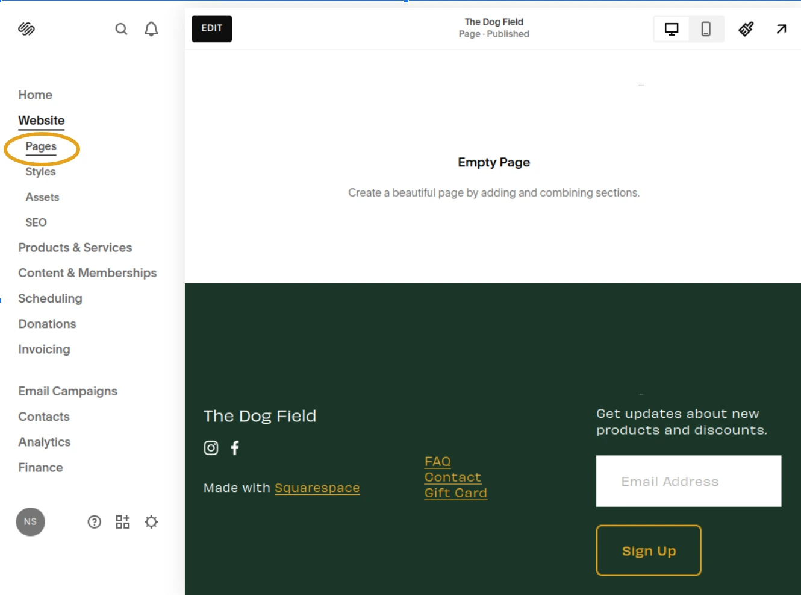

### Step 2: Edit your page

Click **Edit** to open the page editor.

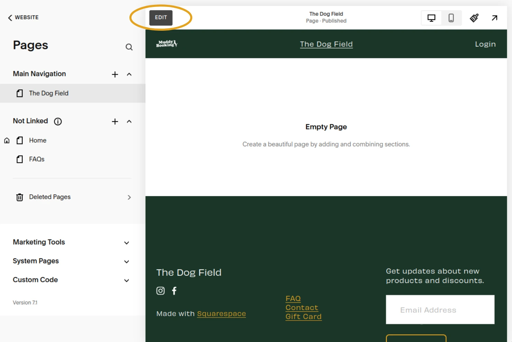

### Step 3: Add a new section

Click to add a new section on your page.

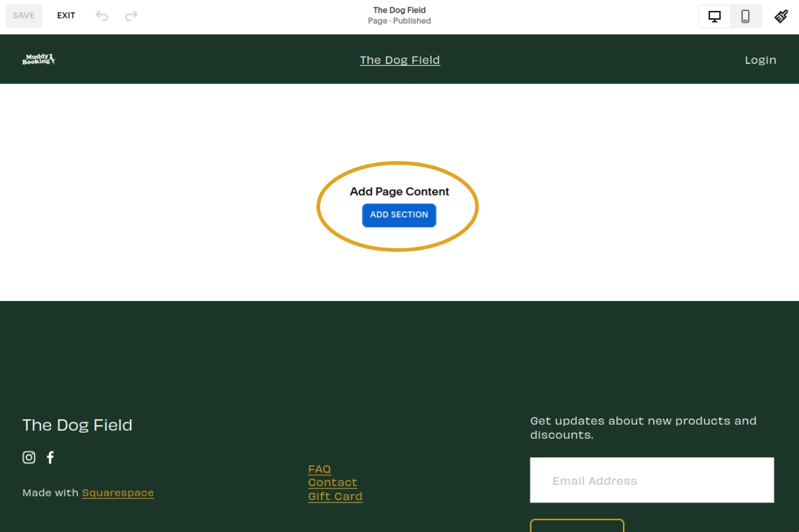

Choose a **Blank section** layout.

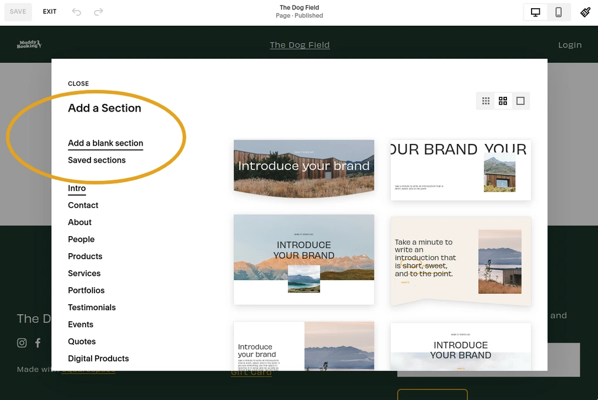

### Step 4: Add an Embed block

Click **Add Block** in your new section.

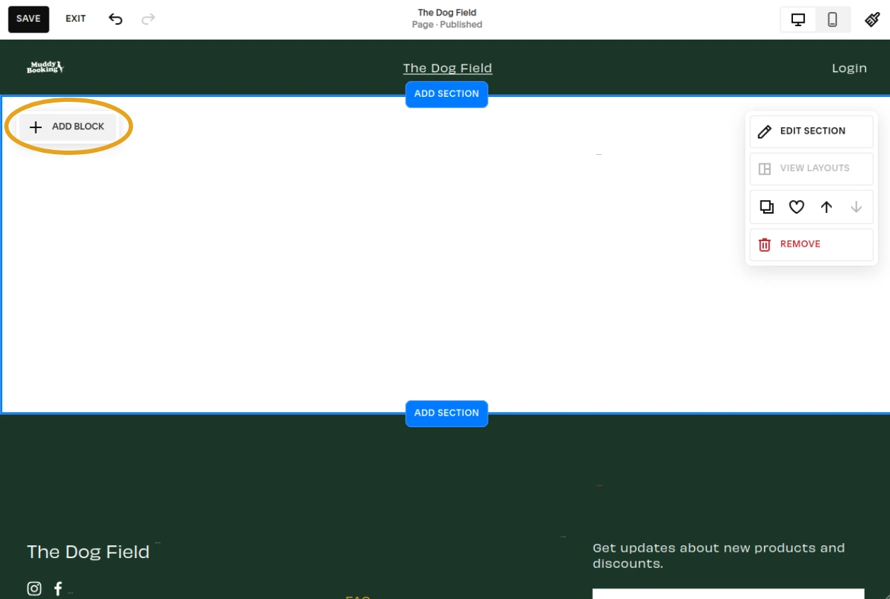

Choose **Embed** (not "Code" — the Code block may be restricted depending on your Squarespace plan).

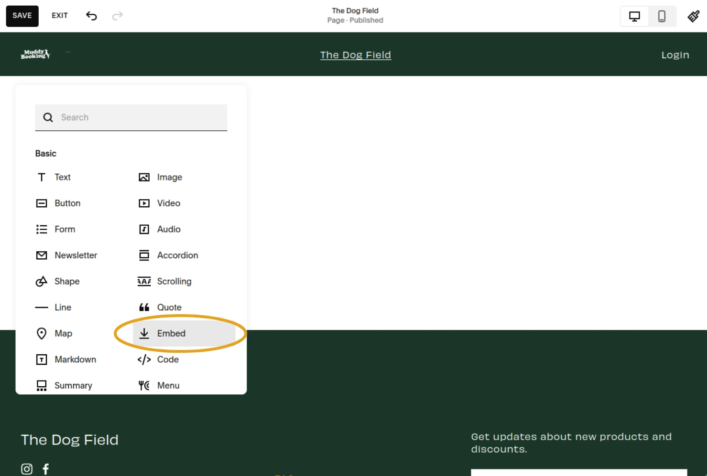

### Step 5: Paste the code

In the Embed block, select **Code Snippet**, then choose **Embed data**.

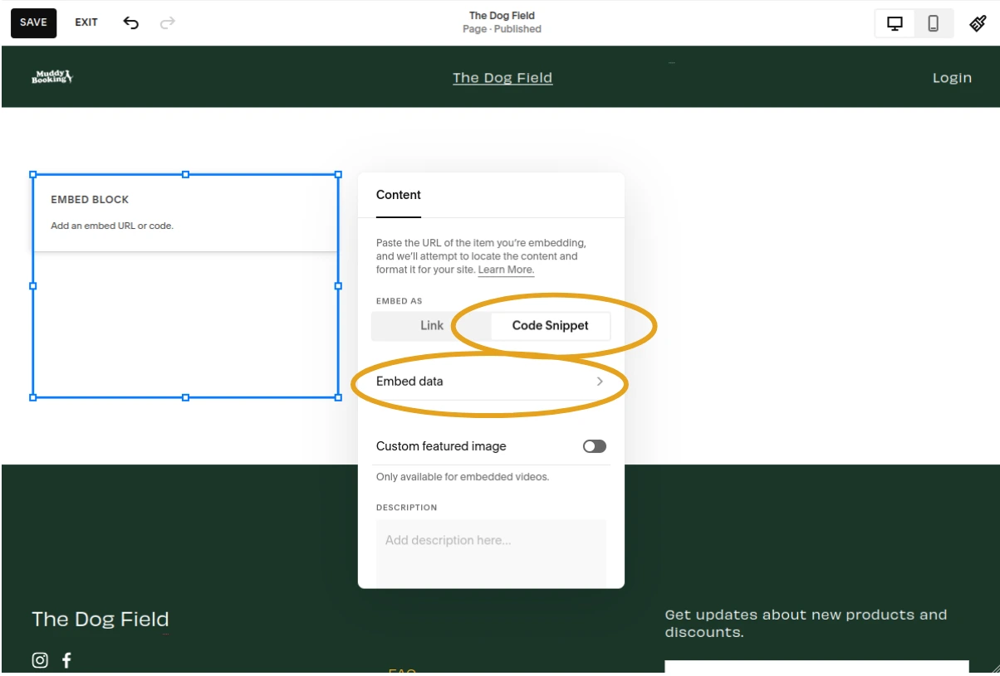

Paste the HTML you copied from the Muddy admin area into the embed field.

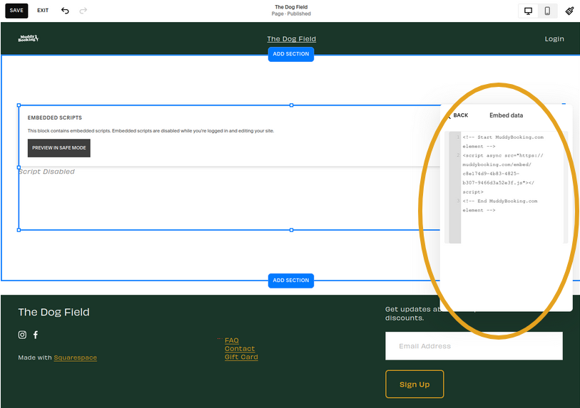

### Step 6: Save your page

Save your changes.

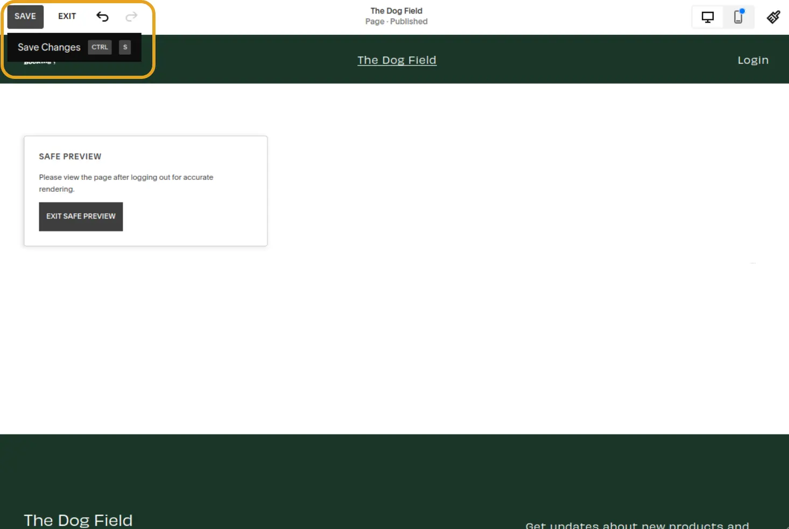

Your customers will now see a **Book now** button on your page, which opens your booking form.

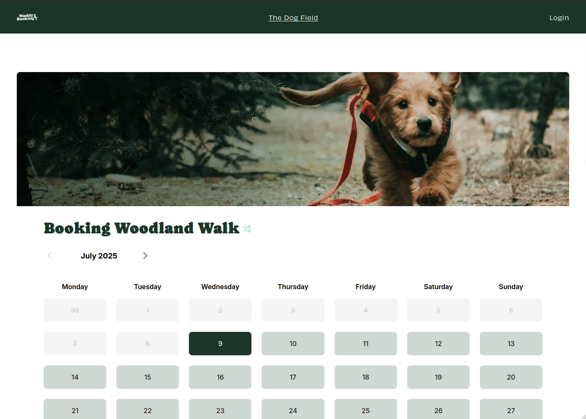
