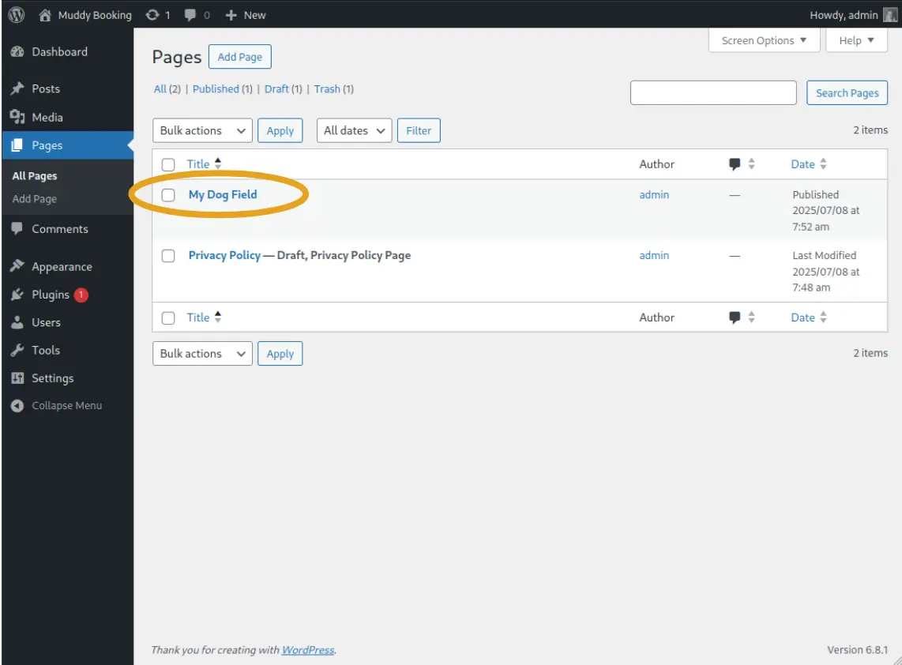
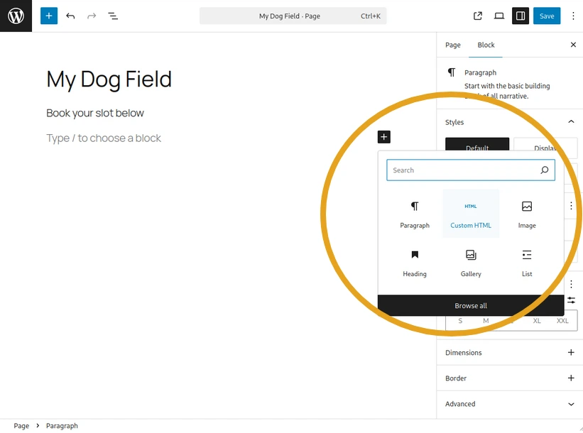
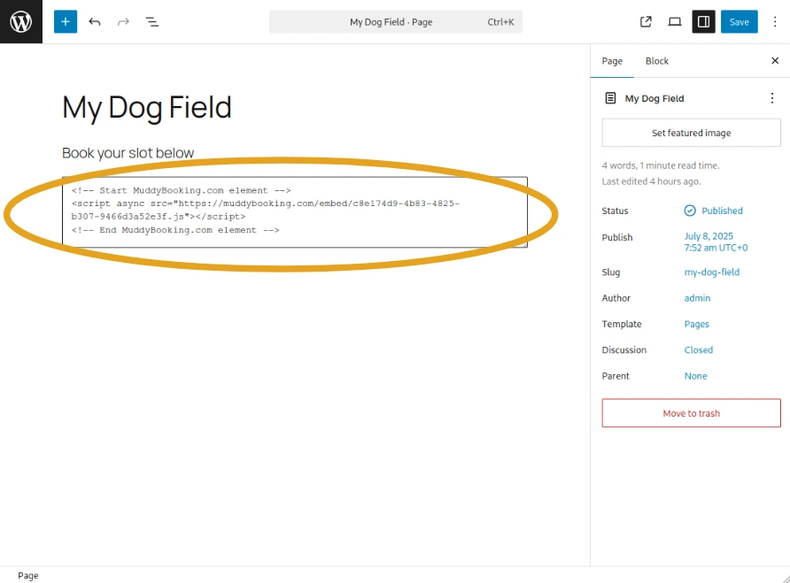
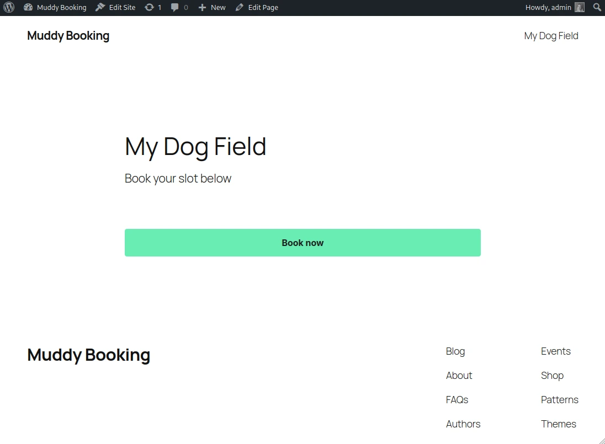

## Finding your embed code

1. In the Muddy admin area, click **Settings** in the left-hand menu, then click **Website embedding**

2. Find the booking form you want to add to your site and click the green **Copy HTML** button next to it

This copies the embed code to your clipboard, ready to paste into WordPress.

## Adding the form to your WordPress page

### Step 1: Open your page

Log into your WordPress site and open the page where you want the booking form to appear. Click **Edit** to open the page editor.

### Step 2: Add a Custom HTML block

In the WordPress block editor, click the **+** button to add a new block. Search for and select **Custom HTML**.

### Step 3: Paste the code

Paste the HTML you copied from the Muddy admin area into the Custom HTML block.

### Step 4: Save your page

Click **Save**, **Update**, or **Publish** to save your changes.

Your customers will now see a **Book now** button on your page, which opens your booking form.

