## How invoicing works

Invoicing lets you bill customers after their bookings have finished, instead of requiring payment upfront. This is useful if you have regular customers — like professional dog walkers — who you'd prefer to invoice on a schedule.

Customers must be logged in to book without paying upfront, and invoices can only be raised for bookings that have already finished.

## Setting up customer groups

Before you can invoice customers, you'll need to create a customer group. This lets you control which customers can book without paying upfront.

### Step 1: Go to customer groups

Click **Settings** in the left-hand menu, then click **Customer groups**.

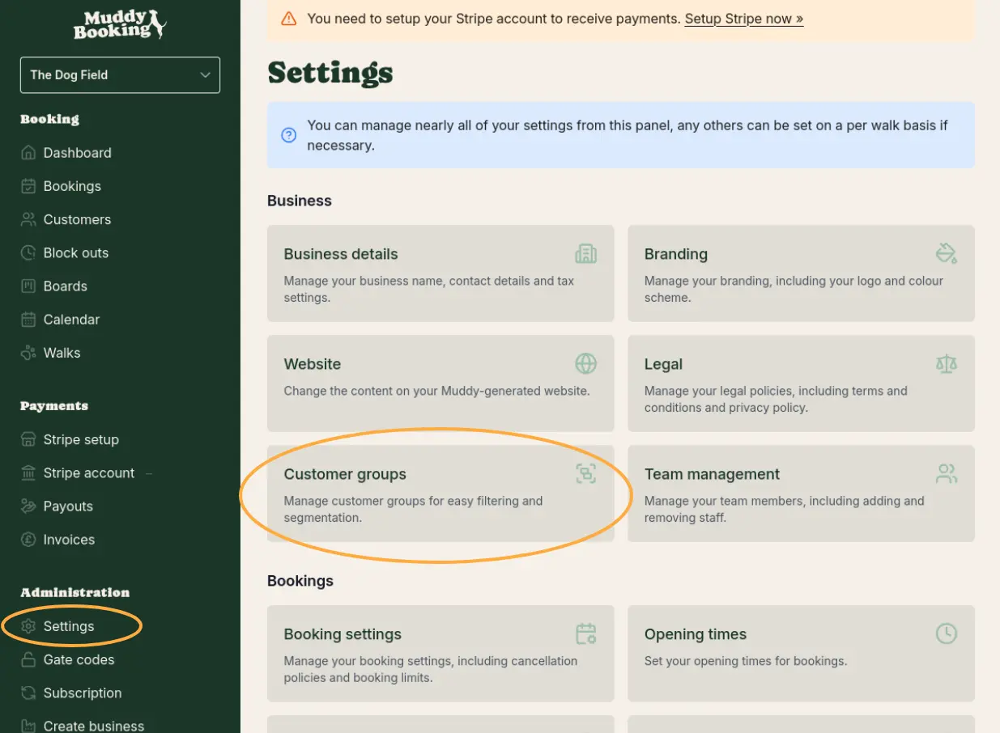

### Step 2: Create a group

Click the **Create** button to add a new customer group. Give it a name that makes sense for your business — for example, "Dog Walkers" for professional dog walkers who visit regularly.

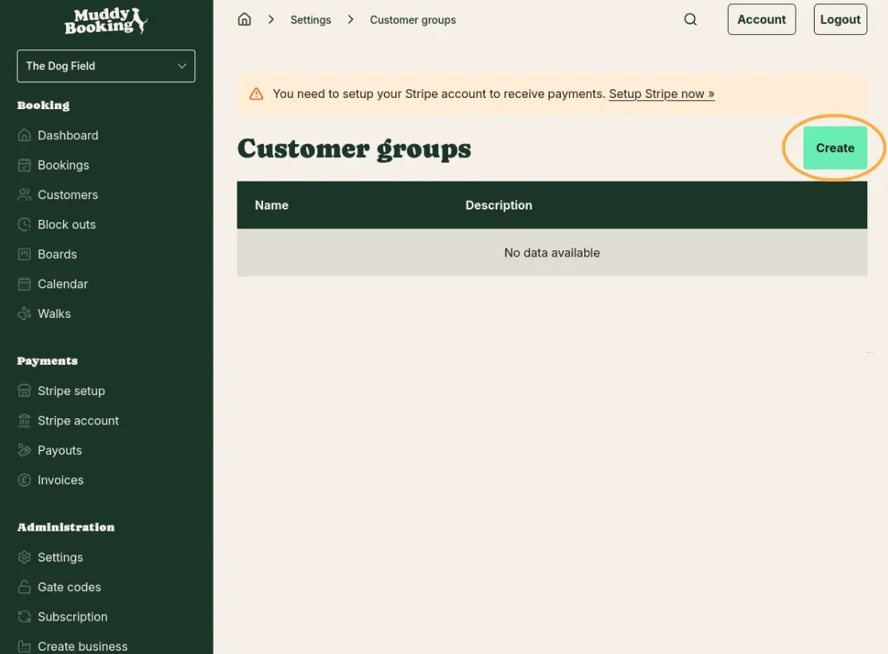

## Adding customers to a group

### Step 3: Create or find a customer

Click **Customers** in the left-hand menu. If you need to add a new customer, click **Create customer** and fill in their name, phone number, and email address.

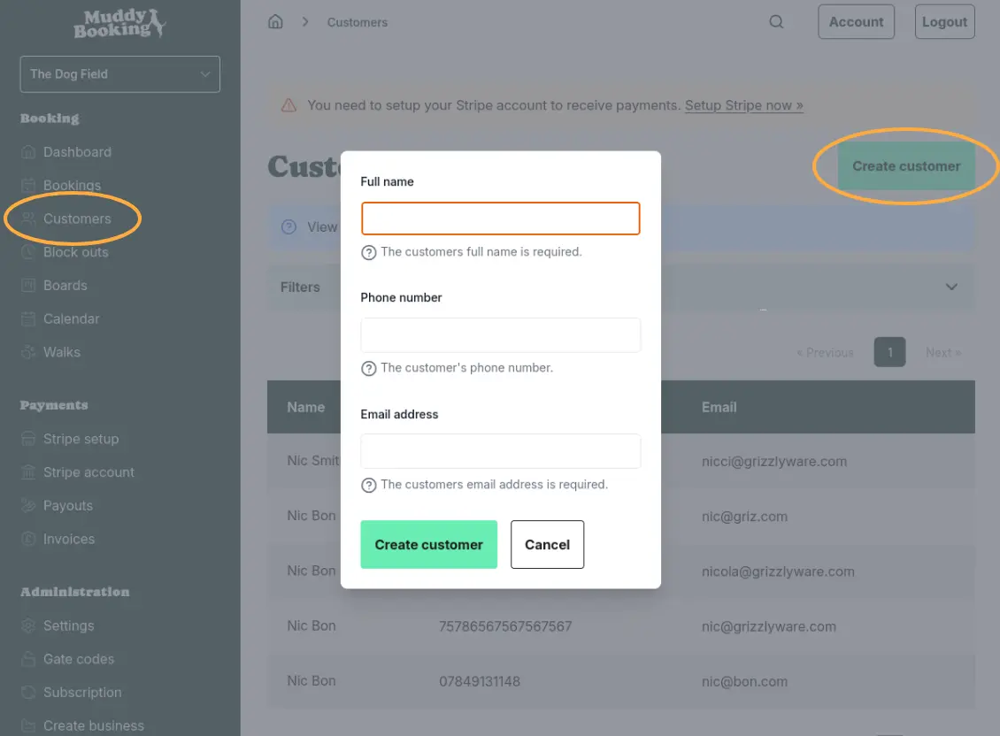

### Step 4: Assign them to a group

Open the customer's profile and click **Change customer groups** at the bottom right. Search for and select the group you created, then click **Save changes**.

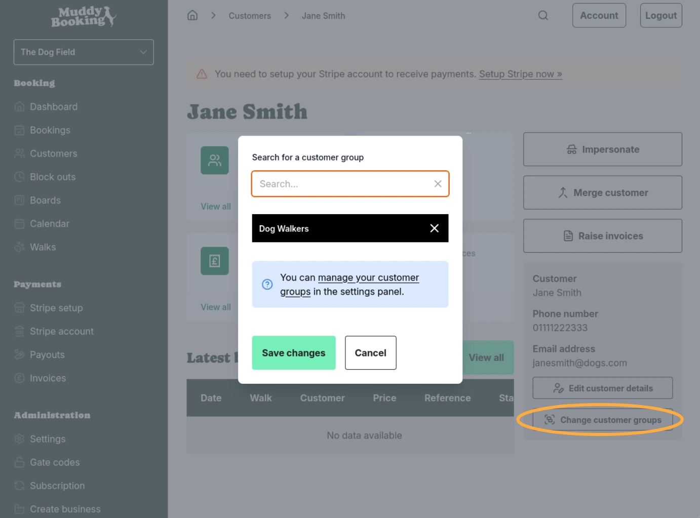

## Allowing customers to book without paying upfront

### Step 5: Open payment settings

Go to **Settings** and click **Payment settings** under the Payments section.

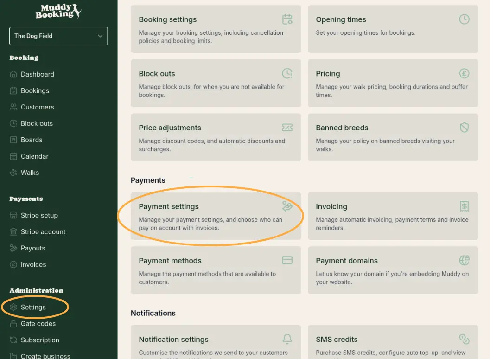

### Step 6: Choose who can book without paying

Under **Upfront payment policy**, select **Exclude specific groups**. Then choose the customer group you created (e.g. "Dog Walkers") from the list below.

This means customers in that group can book without paying upfront. Everyone else will still need to pay at the time of booking.

If you want all customers to be able to book without paying, select **Not required** instead.

Click **Save** when you're done.

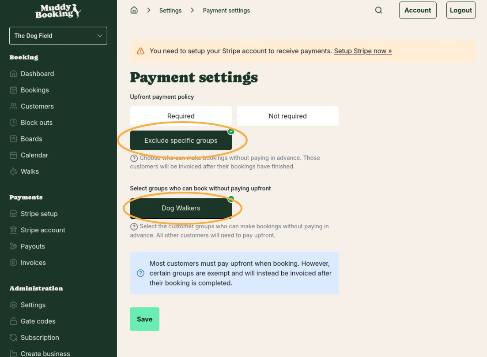

## Booking as a customer (impersonation)

### Step 7: Make a booking on behalf of a customer

If you need to create a booking for a customer, go to their profile and click **Impersonate**. This lets you use the booking form as if you were that customer.

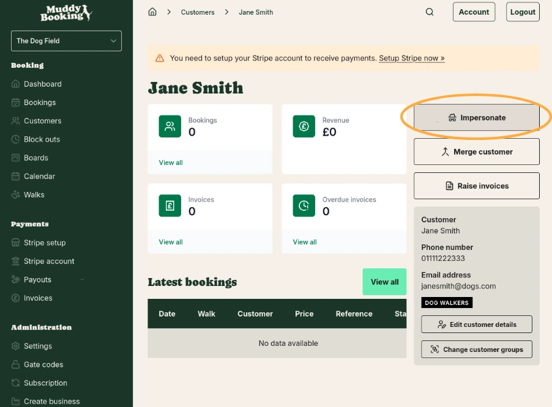

### Step 8: Complete the booking

Choose a walk, pick a date and time, and click **Confirm booking**. Because this customer is in a group that doesn't require upfront payment, they won't be asked to pay.

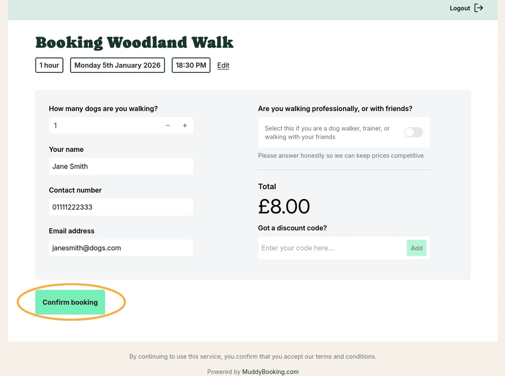

## Raising invoices

Invoices can only be raised for bookings that have already finished. Once a booking is complete:

### Step 9: Raise invoices from the customer profile

Go to the customer's profile and click **Raise invoices**. This will create invoices for all of that customer's completed, uninvoiced bookings.

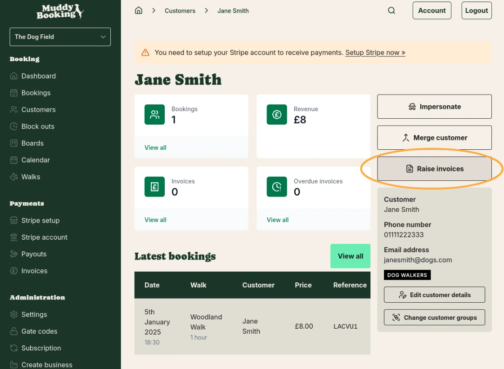

## Configuring invoicing settings

### Step 10: Open invoicing settings

Go to **Settings** and click **Invoicing** under the Payments section.

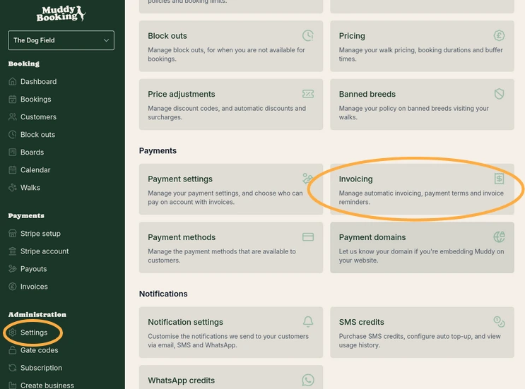

### Step 11: Set your preferences

Here you can configure how invoicing works for your business:

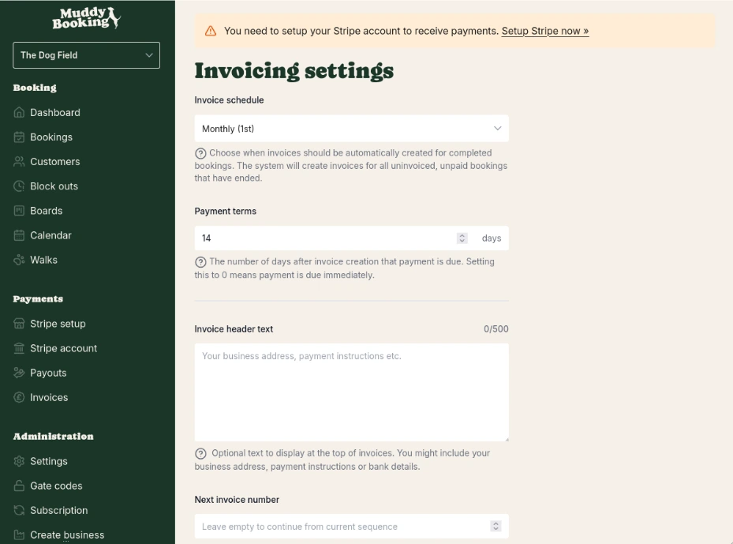

- **Invoice schedule** — Choose when invoices are automatically created for completed bookings (e.g. monthly on the 1st). The system will create invoices for all uninvoiced, unpaid bookings that have ended.
- **Payment terms** — The number of days after invoice creation that payment is due. Setting this to 0 means payment is due immediately.
- **Invoice header text** — Optional text to display at the top of invoices, such as your business address, payment instructions, or bank details.
- **Next invoice number** — Set a custom starting invoice number if you're migrating from another system. Leave empty to continue from the current sequence.

### Step 12: Set up automatic payments and reminders

Further down the page, you can also configure:

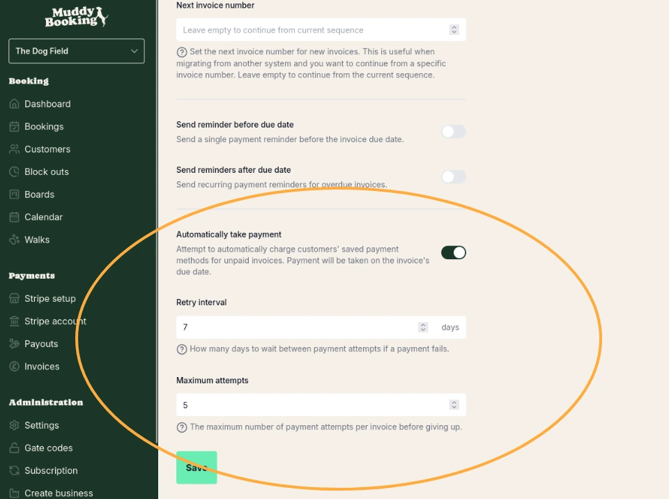

- **Send reminder before due date** — Send a single payment reminder before the invoice due date.
- **Send reminders after due date** — Send recurring payment reminders for overdue invoices.
- **Automatically take payment** — When switched on, the system will attempt to charge customers' saved payment methods for unpaid invoices on the due date.
- **Retry interval** — How many days to wait between payment attempts if a payment fails.
- **Maximum attempts** — The maximum number of payment attempts per invoice before giving up.

Click **Save** when you're done.

## Viewing and managing invoices

### From the invoice page

Click **Invoices** in the left-hand menu to see all your invoices. You can see each invoice's number, date, total, customer, and status.

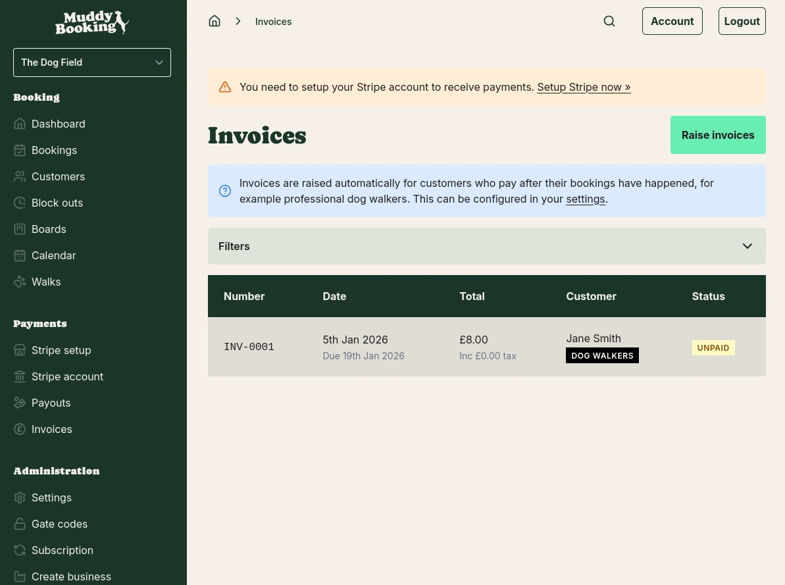

### From an individual invoice

Click on any invoice to view its details. From here you can:

- **Record payment** — Manually record a payment against the invoice
- **Cancel invoice** — Cancel the invoice if it's no longer needed
- **Download PDF** — Download a PDF copy of the invoice
- **Email to customer** — Send the invoice directly to the customer's email

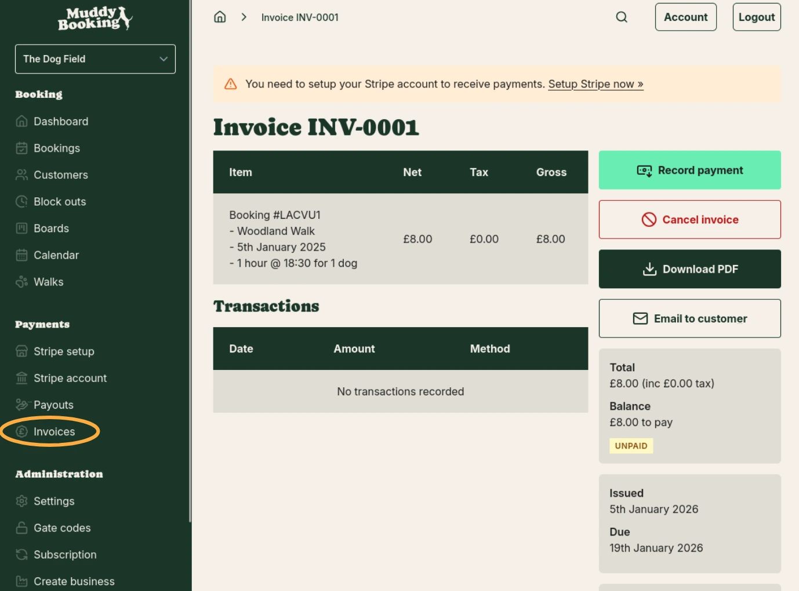
