## How invoicing works

Invoicing lets you bill customers after their bookings instead of taking payment upfront. It suits [regular customers](recurring-bookings.md), such as professional dog walkers, who you'd rather invoice on a schedule.

Customers must be logged in to book without paying upfront, and invoices can only be raised for bookings that have already finished.

## Setting up customer groups

First, create a customer group. This controls which customers can book without paying upfront.

### Step 1: Go to customer groups

Click **Settings** in the left-hand menu, then click **Customer groups**.

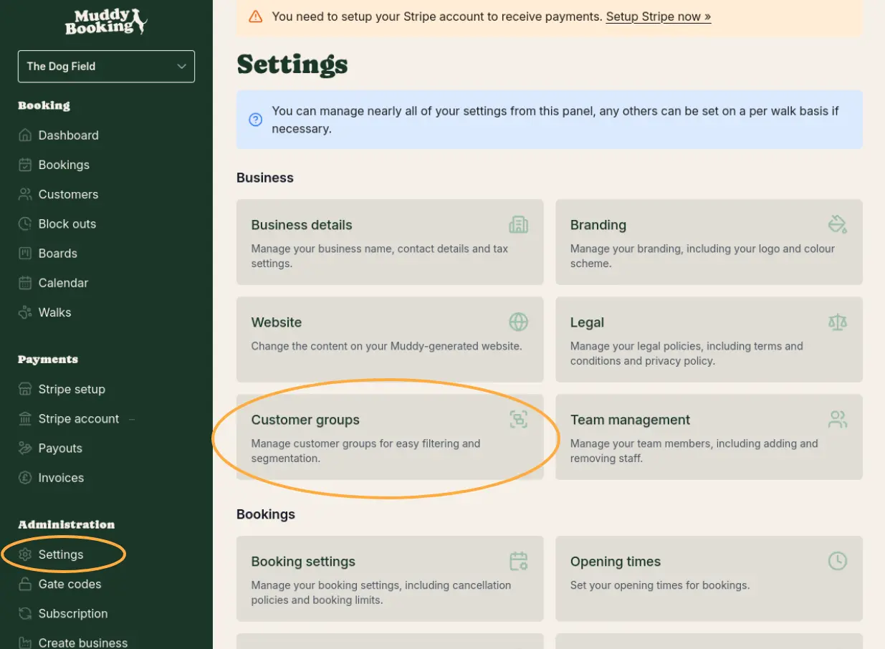

### Step 2: Create a group

Click **Create** and give the group a name, for example "Dog Walkers" for professional walkers who visit regularly.

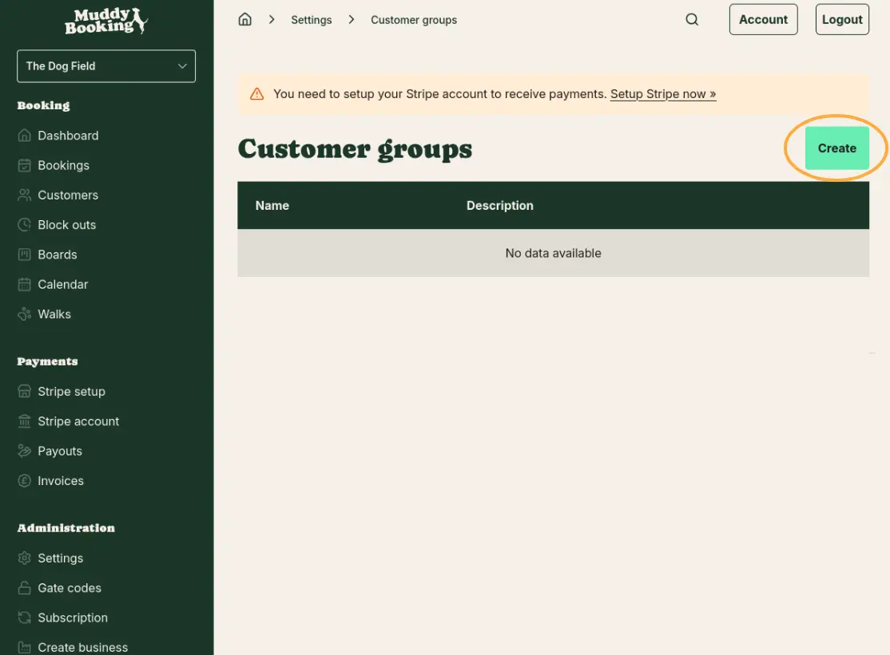

## Adding customers to a group

### Step 3: Create or find a customer

Click **Customers** in the left-hand menu. If you need to add a new customer, click **Create customer** and fill in their name, phone number, and email address.

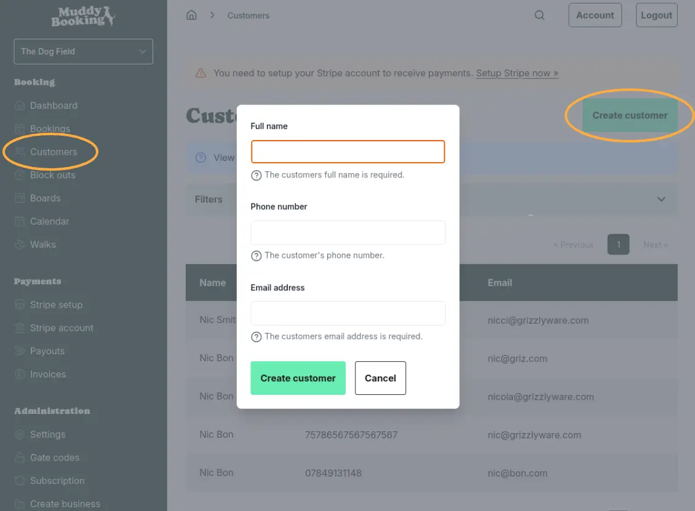

### Step 4: Assign them to a group

Open the customer's profile and click **Change customer groups** at the bottom right. Search for and select the group you created, then click **Save changes**.

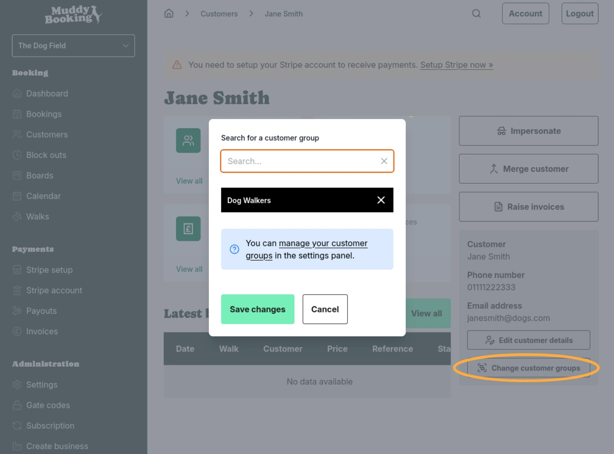

## Allowing customers to book without paying upfront

### Step 5: Open payment settings

Go to **Settings** and click **Payment settings** under the Payments section.

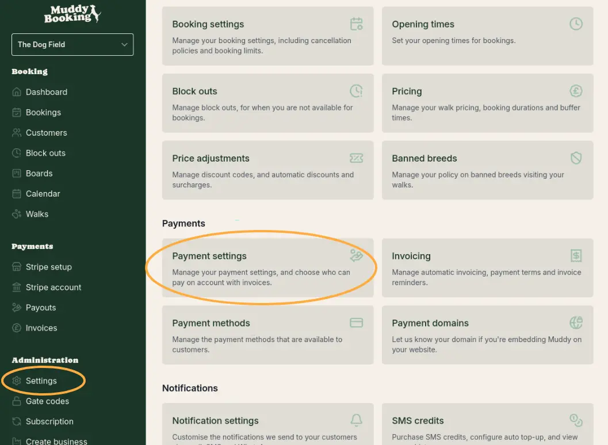

### Step 6: Choose who can book without paying

Under **Upfront payment policy**, select **Exclude specific groups**. Then choose the customer group you created (e.g. "Dog Walkers") from the list below.

Customers in that group can now book without paying upfront. Everyone else still pays when they book.

If you want all customers to be able to book without paying, select **Not required** instead.

Click **Save** when you're done.

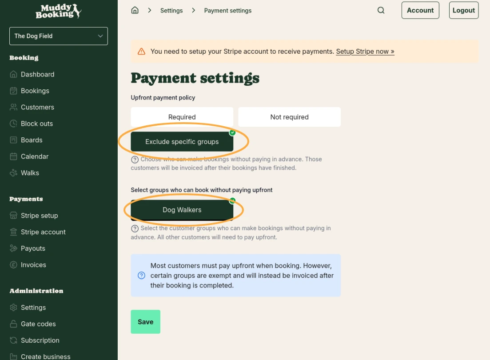

## Booking as a customer (impersonation)

### Step 7: Make a booking on behalf of a customer

To book for a customer, go to their profile and click **Impersonate**. You can then use the booking form as that customer.

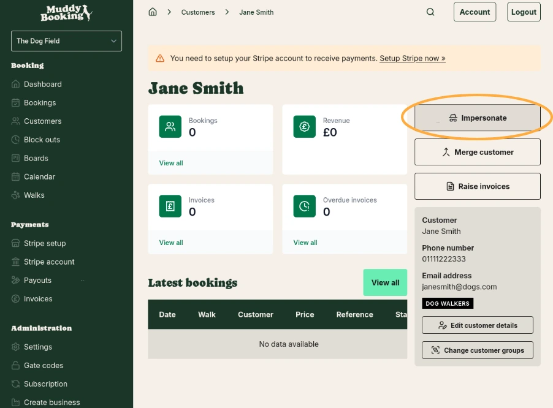

### Step 8: Complete the booking

Choose a walk, pick a date and time, and click **Confirm booking**. Because this customer is in a group that doesn't require upfront payment, they won't be asked to pay.

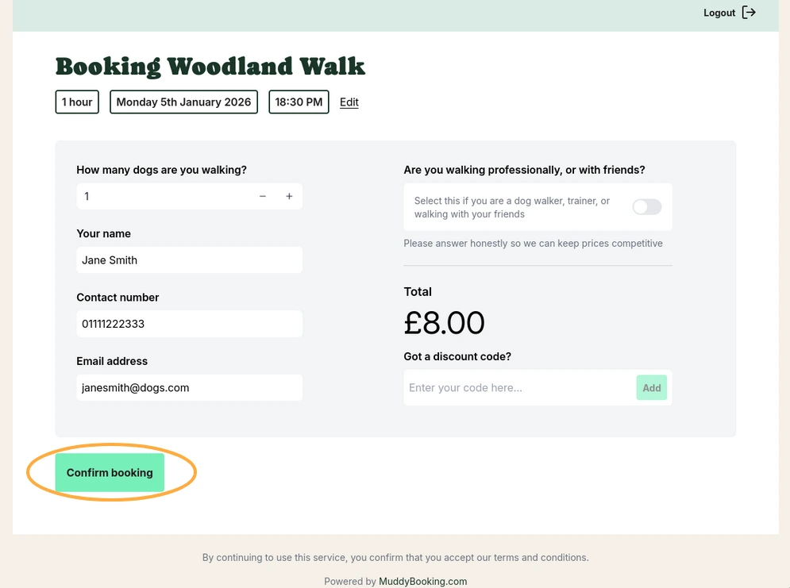

## Raising invoices

You can only raise invoices for bookings that have finished.

### Step 9: Raise invoices from the customer profile

Go to the customer's profile and click **Raise invoices**. This invoices all of the customer's finished bookings that haven't been invoiced yet.

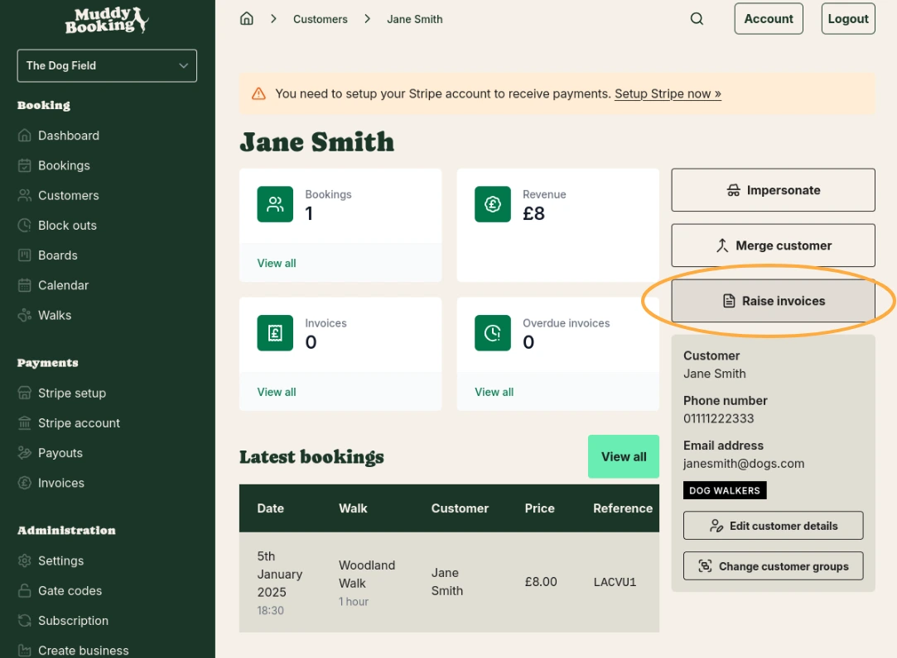

## Configuring invoicing settings

### Step 10: Open invoicing settings

Go to **Settings** and click **Invoicing** under the Payments section.

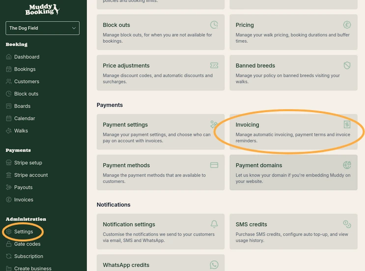

### Step 11: Set your preferences

Choose how invoicing works for your business:

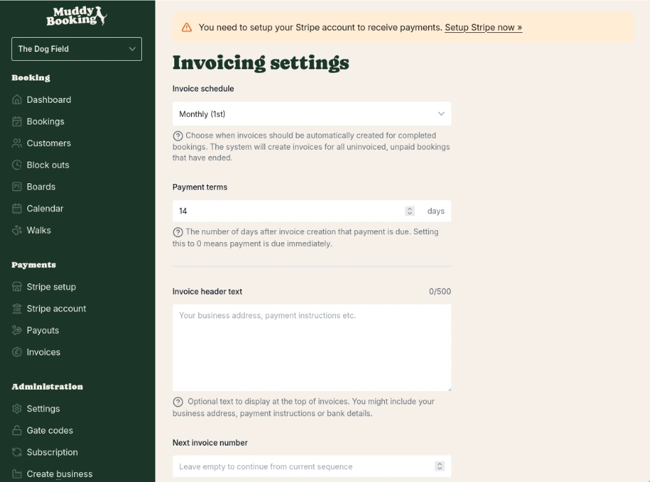

- **Invoice schedule**: when invoices are created automatically, for example monthly on the 1st. Each run invoices every finished booking that hasn't been invoiced or paid.
- **Payment terms**: how many days after the invoice is created payment is due. 0 means it's due immediately.
- **Invoice header text**: optional text at the top of your invoices, such as your address, payment instructions or bank details.
- **Next invoice number**: set this if you're moving from another system and want to carry on its numbering. Leave it empty to continue from the current number.

### Step 12: Set up automatic payments and reminders

Further down the page:

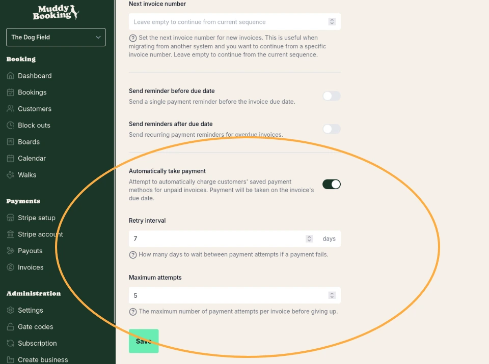

- **Send reminder before due date**: sends one reminder before the invoice is due.
- **Send reminders after due date**: keeps sending reminders while an invoice is overdue.
- **Automatically take payment**: when on, Muddy tries to charge the customer's saved card for an unpaid invoice on its due date.
- **Retry interval**: how many days to wait before trying again after a failed payment.
- **Maximum attempts**: how many times Muddy tries to take payment for an invoice before stopping.

Click **Save** when you're done.

## Viewing and managing invoices

### From the invoice page

Click **Invoices** in the left-hand menu. Each invoice shows its number, date, total, customer and status.

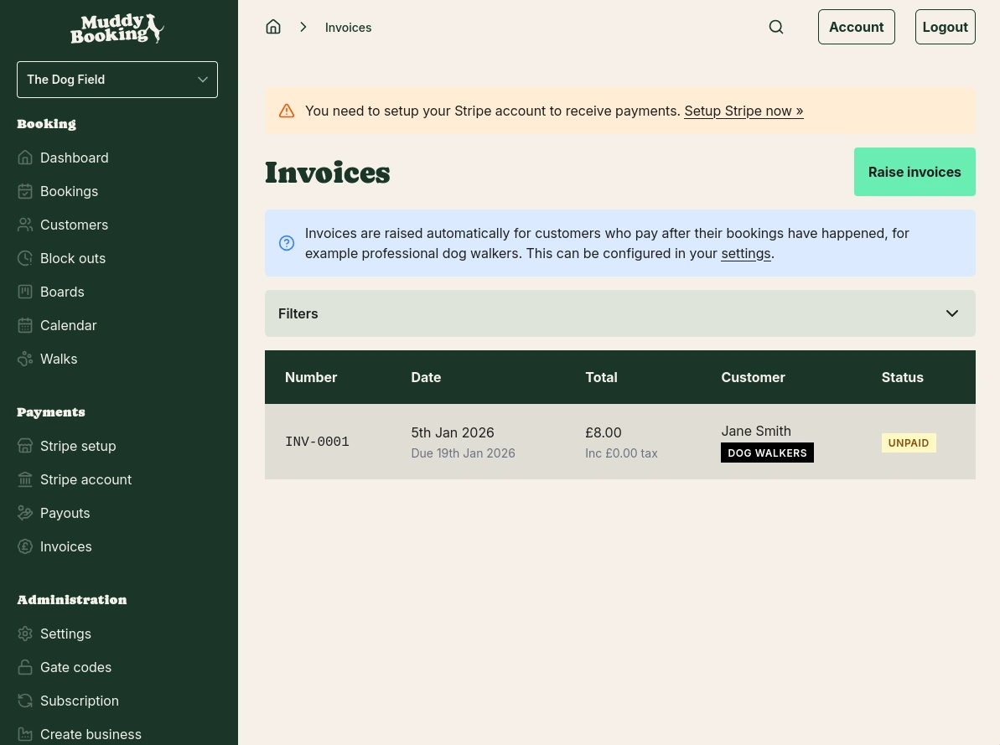

### From an individual invoice

Click an invoice to open it. From there you can:

- **Record payment**: record a payment you've received another way
- **Cancel invoice**: cancel an invoice you no longer need
- **Download PDF**: download a PDF copy
- **Email to customer**: email the invoice to the customer

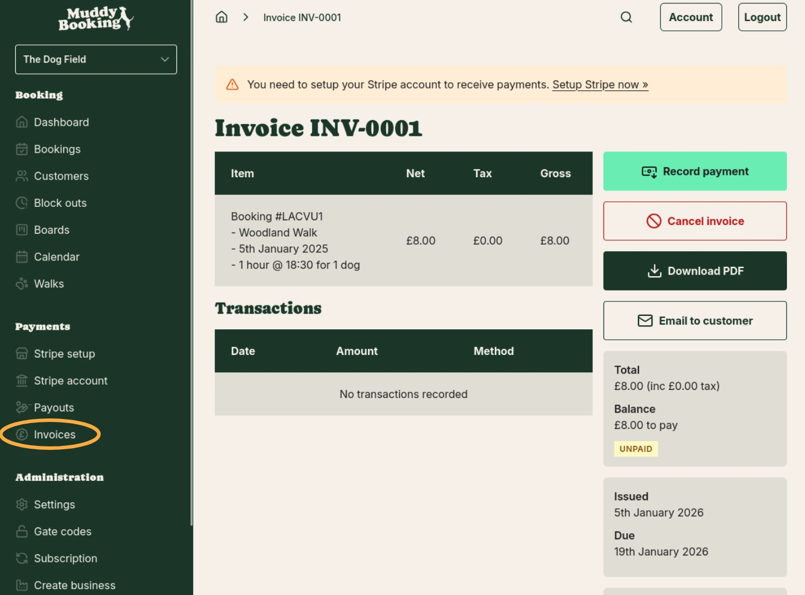
