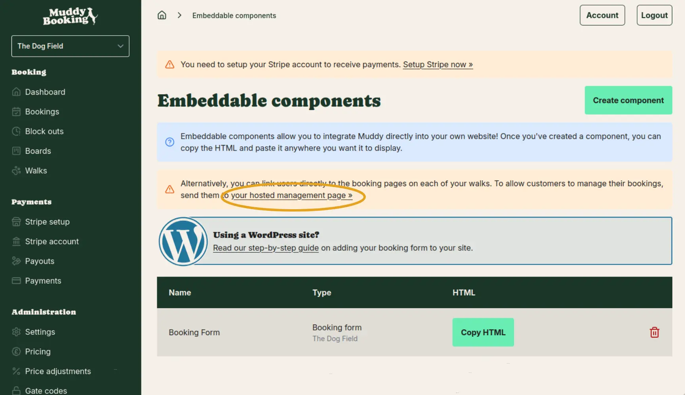
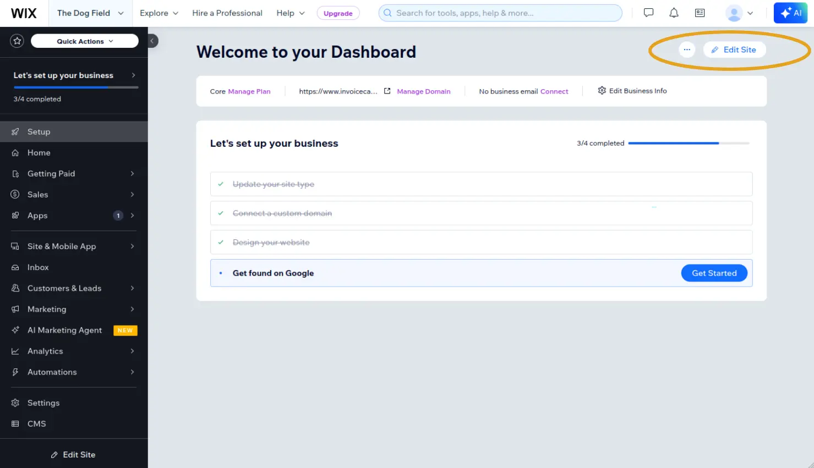
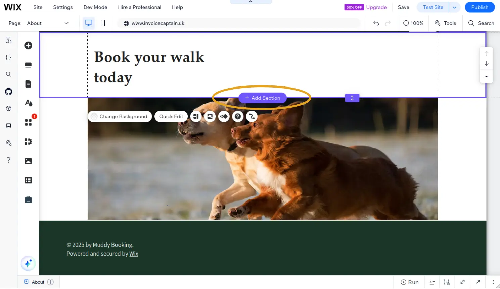
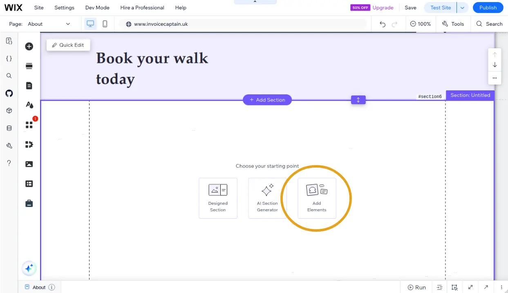
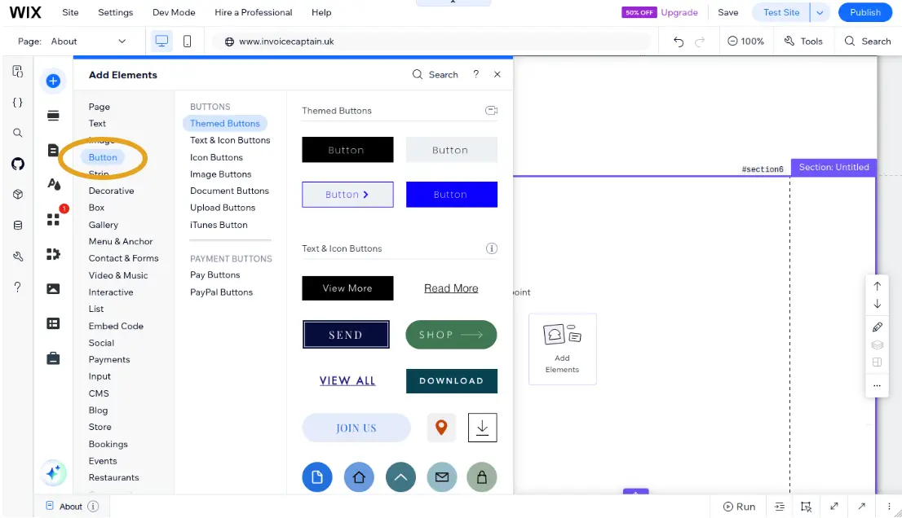
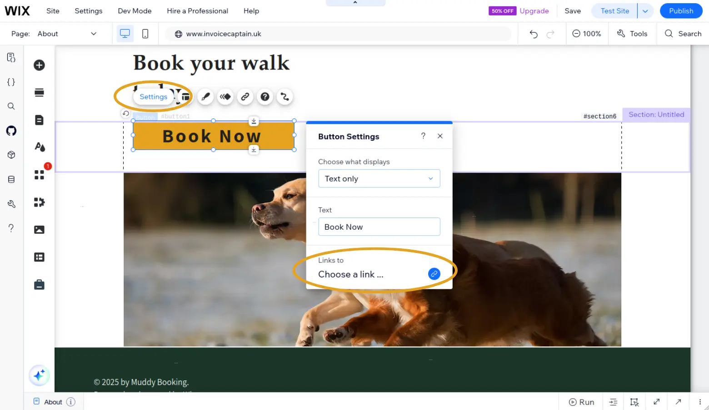
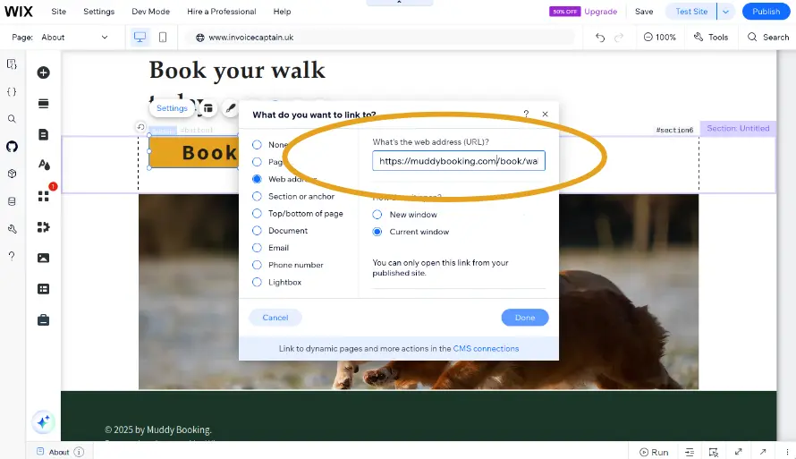
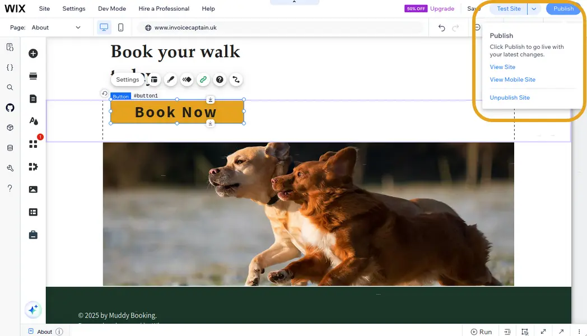
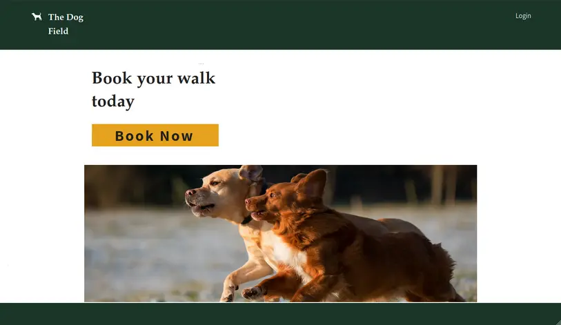

## Why we recommend linking instead of embedding

Due to how Wix handles iframes, we don't recommend embedding your booking form directly onto your Wix site. Instead, we recommend adding a button that links to your hosted booking form. This gives your customers the best experience.

## Finding your booking form link

1. In the Muddy admin area, click **Settings** in the left-hand menu, then click **Website embedding**

2. Find the booking form you want to link to and copy the **hosted booking form URL**

## Adding a booking button to your Wix page

### Step 1: Open your page

Log into Wix and click **Edit Site** to open your site editor.

### Step 2: Add a new section

Add a new section to your page where you'd like the button to appear.

### Step 3: Add an element

Add a new element to the section.

### Step 4: Choose a button

Select a **Button** style that fits your site.

### Step 5: Set the link

Open the button settings and find the link options.

Paste your booking form URL into the address field.

### Step 6: Publish your site

Click **Publish** to make your changes live.

Your customers can now click the button to open your booking form.

