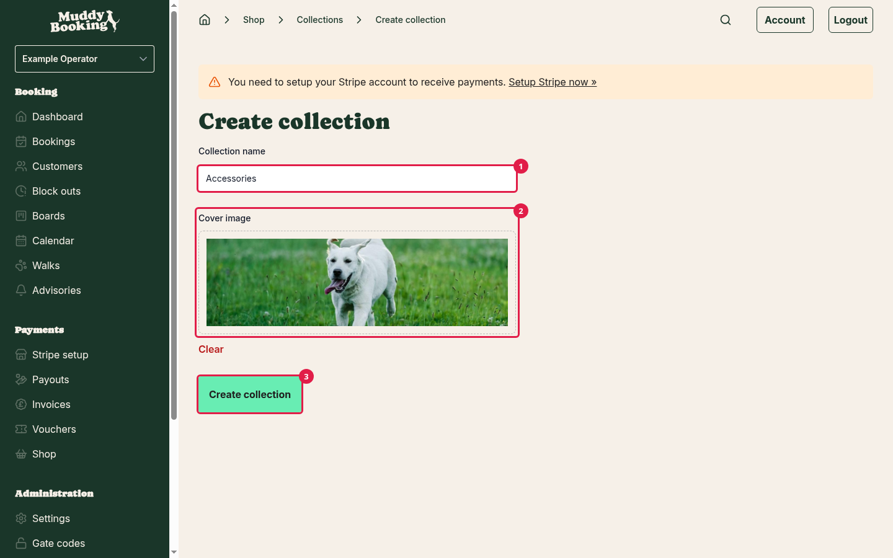
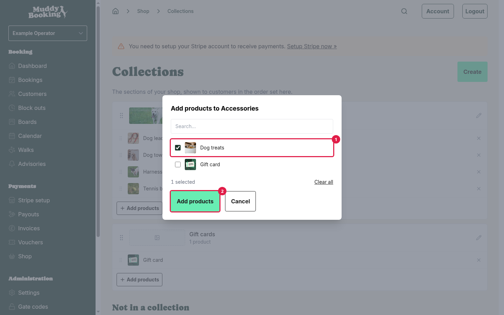
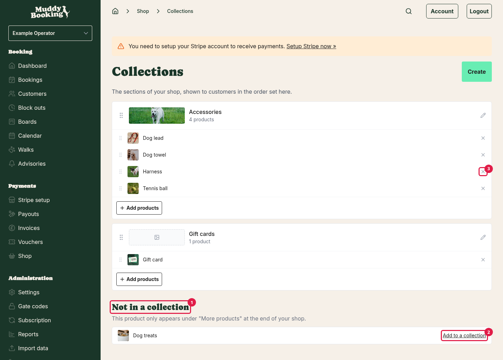
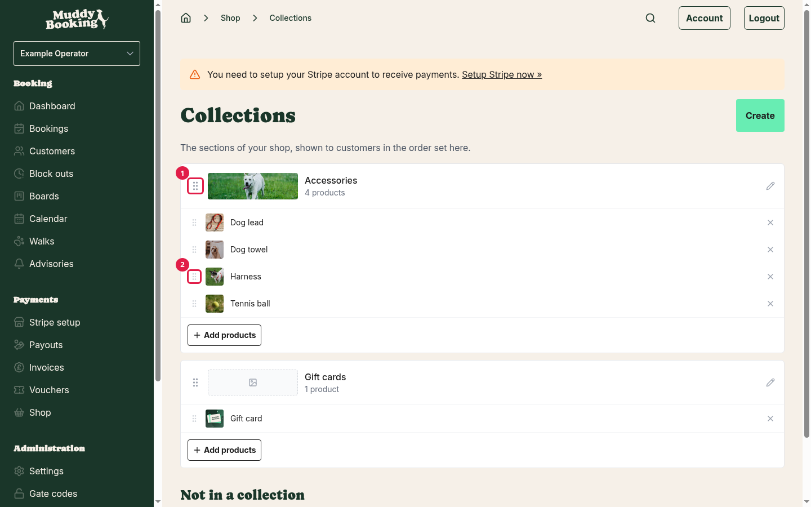
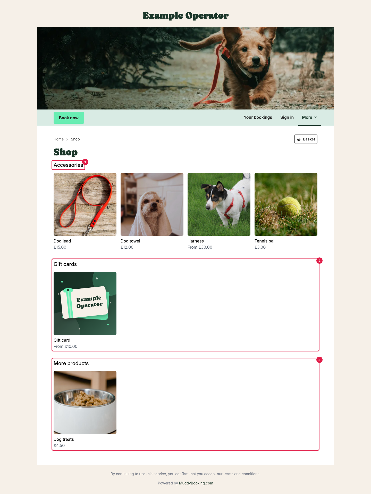
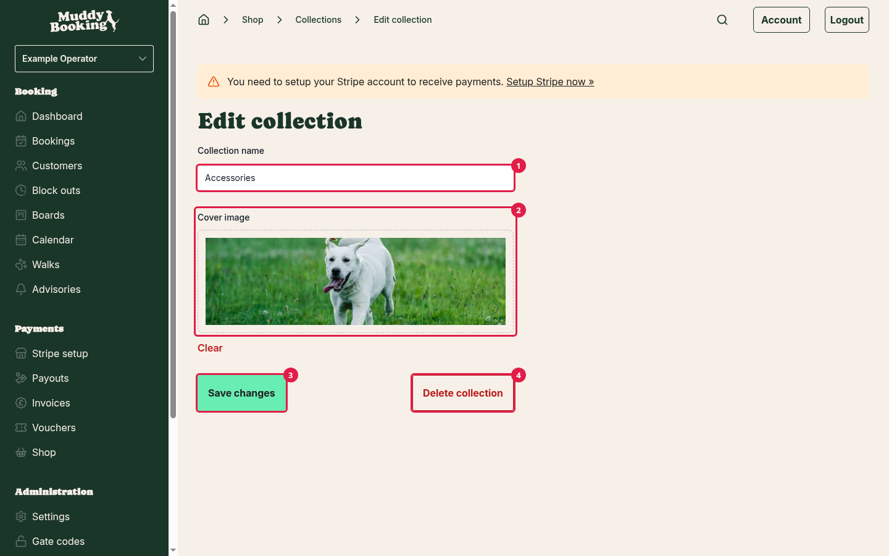

## What collections are

Collections are the sections of your shop front. You might have one for **Treats**, one for **Leads and harnesses** and one for **Gift cards**. Customers see each collection as its own section, in the order you choose.

A product can be in more than one collection. For example, a Christmas treat box could be in both **Treats** and **Christmas gifts**.

**Note:** in the shop, "collection" means a group of products. It's nothing to do with customers collecting an order from you. That's covered in [Setting up delivery and collection](setting-up-shop-delivery.md).

## Getting to your collections

1. Click **Shop** in the left-hand menu.
2. Click **Collections**.

The **Collections** tile appears once your shop is open. Until then, click **Settings** in the left-hand menu, then **Collections**.

Each collection shows as a card with its cover image, its name, how many products it has, and the products themselves.

## Creating a collection

1. On the **Collections** page, click **Create**.
2. Enter a **Collection name** **(1)**. Customers see this as the heading for the section.
3. Add a **Cover image** **(2)** if you'd like one. This is optional.
4. Click **Create collection** **(3)**.

Your new collection starts empty. An empty collection doesn't show in your shop, so add some products next.

## Adding products to a collection

1. On the collection's card, click **Add products**.
2. Pick the products you want to add **(1)**.
3. Click **Add products** **(2)**.

You'll see **Products added to the collection.** when it's done.

You can also add products from the other direction. Products that aren't in any collection are listed below your collections, under **Not in a collection** **(1)**. Until one of your collections has a product in it, this list is headed **Your products** instead. Once you have a collection, click **Add to a collection** **(2)** next to any of them. Tick the collections you want the product in, then click **Save**.

To take a product out of a collection, click the **X** **(3)** next to it on the collection's card. This only removes it from the collection. The product itself isn't deleted.

## Changing the order

The order on the **Collections** page is the order customers see.

- **To move a collection**, drag it by its handle **(1)** to a new position.
- **To move a product within a collection**, drag it by its handle **(2)** to a new position on the card.

Changes save straight away. If your shop is open, customers see the new order immediately.

## How your shop front looks

- Each collection appears as a section **(1)** **(2)**, in the order you set.
- Each section shows its first four products, with a **View all** link if it has more than four.
- A collection's cover image doesn't show on the shop front. It shows at the top of the collection's own page, which the **View all** link opens.
- Collections with no published products are hidden.
- Products that aren't in any collection appear at the end, under **More products** **(3)**.
- If you have no collections, or they're all empty, your shop front shows your first four products, with a **View all** link to the rest.

It's worth putting every product in at least one collection. Products left under **More products** are easy for customers to miss.

## Renaming a collection or changing its image

1. Click the pencil icon on the collection's card.
2. Change the **Collection name** **(1)** or **Cover image** **(2)**.
3. Click **Save changes** **(3)**.

## Deleting a collection

1. Click the pencil icon on the collection's card.
2. Click **Delete collection** **(4)**.
3. Click **Delete it** to confirm.

Deleting a collection doesn't delete the products in it. They stay in your shop. If they aren't in any other collection, they move to **More products**. If that leaves no collection with published products, your shop front shows your products in one list, without a **More products** heading.
