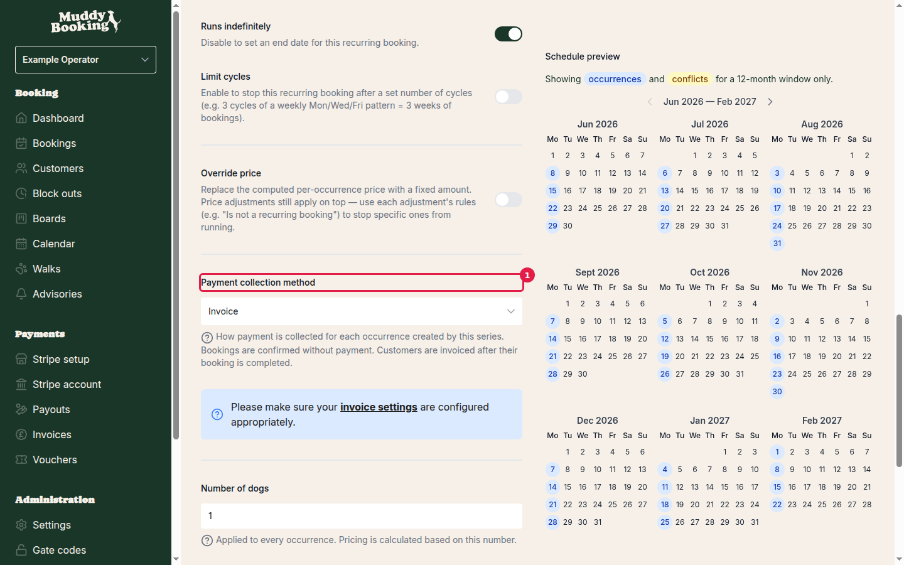
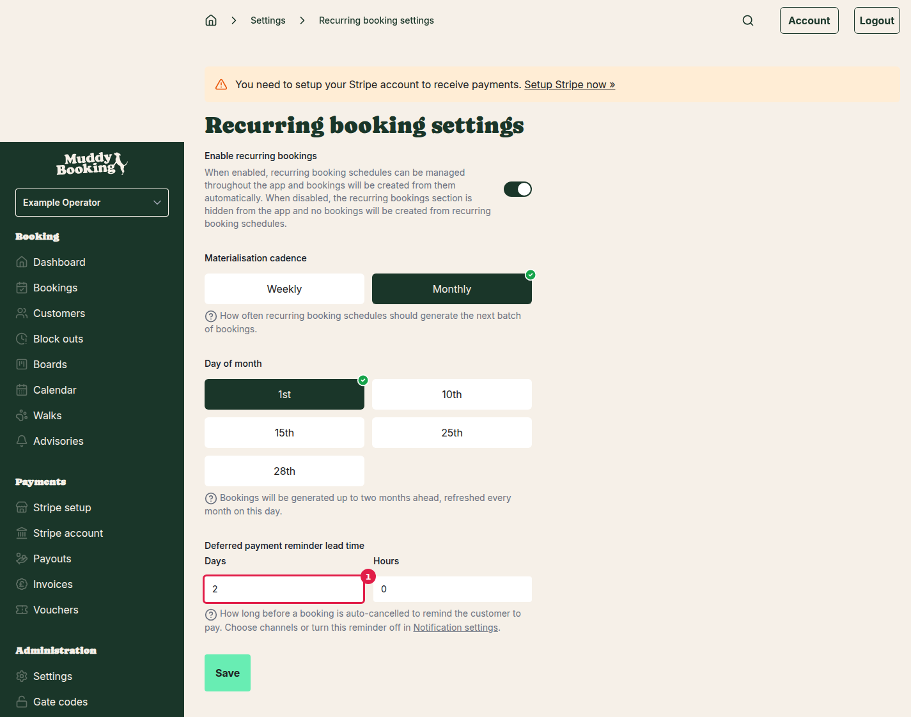

## What is deferred payment?

When you set up a recurring booking, you choose how payment is collected for each occurrence it generates. There are two options:

- **Invoice** — the booking is confirmed without payment, and customers are invoiced after their booking is completed. This is the original method and works the same way as regular invoicing.
- **Deferred** — the booking is confirmed without payment, but the customer is asked to pay before the booking takes place. If they don't pay in time, the booking is automatically cancelled.

Deferred payment is useful when you want customers to pay ahead of each session rather than being invoiced in arrears — for example, if you don't want to wait until after the walk to collect payment, but also don't want to charge through the invoicing cycle.

---

## Step 1 — Set the payment collection method on a recurring booking

When creating or editing a recurring booking, scroll down to the **Payment collection method** field.

Select **Deferred** from the menu **(1)**. The description below will change to: *"Bookings are confirmed without payment. Payment is collected manually after confirmation."*

This setting applies to every booking generated by that recurring schedule.

> **Note:** The **Invoice** option is still available if you prefer to invoice customers after their bookings are completed. Choose whichever method suits your arrangement with the customer.

---

## Step 2 — Configure the deferred payment reminder lead time

When a booking uses deferred payment, Muddy automatically reminds the customer to pay a set time before the booking is auto-cancelled. You control this lead time in the recurring booking settings.

1. Go to **Settings**.
2. Under **Bookings**, click **Recurring bookings**.

The **Deferred payment reminder lead time** **(1)** sets how long before auto-cancellation the reminder is sent. Enter the number of **Days** and **Hours**.

For example: if you set 2 days and 0 hours, the customer receives a reminder 2 days before their booking would be auto-cancelled for non-payment.

Click **Save** when you're done.

---

## Step 3 — Configure the payment reminder notifications

The deferred payment flow uses two notification types. You can choose which channels they're sent through — email, SMS, or WhatsApp.

Go to **Settings**, then click **Notification settings** under Notifications.

- **Unpaid booking reminder** — sent to the customer at the lead time you configured above. Prompts them to pay before their booking is cancelled.
- **Unpaid booking auto-cancelled** — sent when a booking has been cancelled because payment wasn't received.

Click on either notification to turn on or off email, SMS, and WhatsApp delivery for that notification. You can also turn a notification off entirely here if you don't want it to send.

---

## How the flow works for customers

1. A recurring booking generates a new occurrence. The booking is confirmed immediately — no payment is required at this point.
2. At the lead time you've set (e.g. 2 days before auto-cancellation), the customer receives an **Unpaid booking reminder**. The message will include a link for them to pay.
3. If the customer pays, the booking remains confirmed.
4. If the customer does not pay by the deadline, the booking is automatically cancelled, and they receive an **Unpaid booking auto-cancelled** notification.

---

## Choosing between Invoice and Deferred

| | Invoice | Deferred |
|---|---|---|
| When payment is collected | After the booking is completed | Before the booking takes place |
| Auto-cancellation for non-payment | No | Yes |
| Works with invoicing settings | Yes | No — operates independently |
| Suitable for | Billing customers in arrears on a schedule | Collecting payment per session, ahead of time |

---

## Tips

- The reminder lead time is an account-wide setting — it applies to all deferred-payment recurring bookings, not just one.
- You can mix methods across different recurring bookings. One customer might be on **Invoice**, another on **Deferred** — set it per schedule when you create or edit the recurring booking.
- Make sure you have a saved payment method on file for the customer, or that they can pay via the link in the reminder notification.
- If you're using invoicing for other bookings, deferred payment recurring bookings are separate — they won't appear on your regular invoice run.
