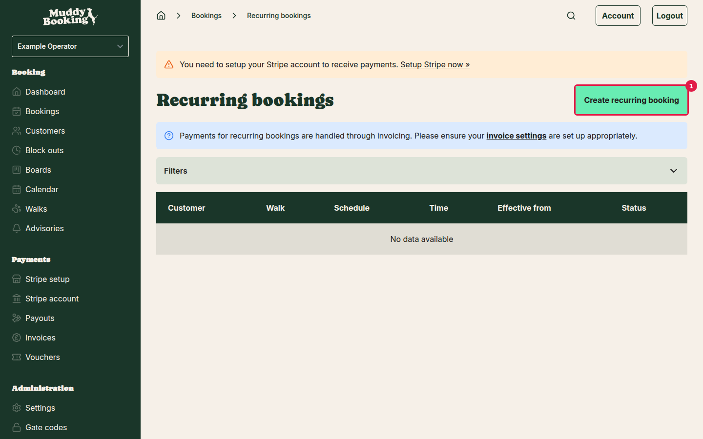
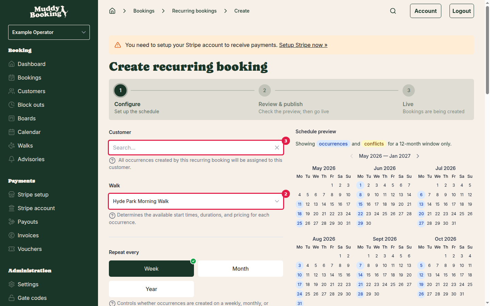
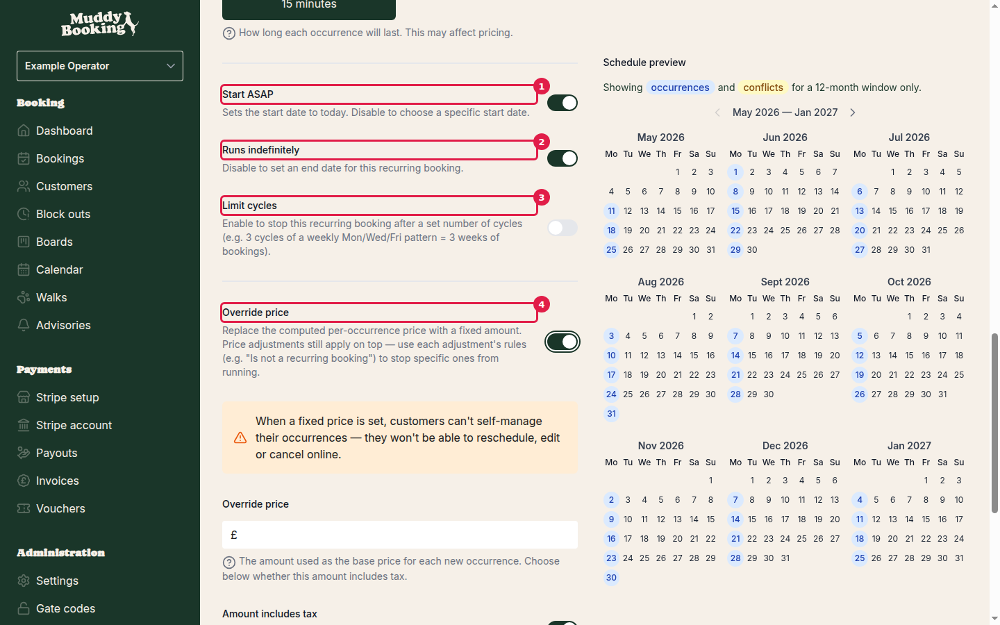

## What is a recurring booking?

A recurring booking is a schedule you set up once for a customer. The platform then automatically generates real, confirmed bookings ahead of time on a repeating cadence — weekly, monthly, or yearly. Each generated booking is treated like any other booking: it's confirmed at creation and included in your normal invoices.

This is not a subscription. There's no separate billing arrangement — bookings are simply invoiced on whatever schedule you already run your invoices. Because payment goes through invoicing, **make sure your invoicing settings are configured before you publish a recurring booking** (go to **Settings**, then **Invoicing**).

---

## Step 1 — Enable recurring bookings in Settings

Before you can create any recurring booking, you need to turn the feature on for your account.

1. Go to **Settings**.
2. Under the **Bookings** section, click **Recurring bookings**.

You'll see three settings:

### Enable recurring bookings **(1)**

This master switch turns the feature on or off for your whole account. When enabled, the recurring bookings section appears throughout the app and the platform will automatically generate bookings from your schedules. When disabled, the section is hidden and no bookings will be generated — even from existing schedules.

### Materialisation cadence **(2)**

This controls **how often the platform looks ahead and creates the next batch of bookings**. Choose either:

- **Weekly** — the platform runs roughly once a week and keeps approximately two weeks of bookings created ahead of time.
- **Monthly** — the platform runs roughly once a month and keeps approximately two months of bookings created ahead.

> **Important:** This is an account-wide setting about *when the platform generates bookings*. It is separate from each individual schedule's frequency (how often a customer's bookings actually happen). A customer can have a daily or weekly booking schedule regardless of whether your materialisation cadence is weekly or monthly.

### Day of month (when cadence is set to Monthly)

If you choose **Monthly**, you can pick which day of the month the platform does its generation run. Options are the **1st, 10th, 15th, 25th, or 28th**. The options stop at the 28th to avoid edge cases at the end of shorter months.

Click **Save** to apply your settings.

---

## Step 2 — Create a recurring booking

You can start a new recurring booking from two places:

- From the main **Recurring bookings** page (accessible from the left-hand menu under **Bookings**) — click **Create recurring booking**.
- From a **customer's detail page** — scroll to the **Recurring bookings** section and click **Create**.

When you start from a customer's page, the customer is pre-filled automatically.

### The creation form

The form has three steps shown at the top: **Configure**, **Review & publish**, and **Live**. Most of the setup happens in the Configure step.

#### Customer **(1)**

Search for and select the customer this schedule belongs to. All bookings generated by this schedule will be assigned to them.

#### Walk (or your equivalent service) **(2)**

Choose which of your services this schedule is for. This determines the available start times, durations, and pricing for every occurrence.

#### Repeat every **(3)**

Choose how often bookings are created:

- **Week** — bookings repeat on a weekly cycle. You'll then choose which days of the week and the interval (e.g. every 1 week, every 2 weeks).
- **Month** — bookings repeat on a monthly cycle. See monthly options below.
- **Year** — bookings repeat annually. You'll choose the month, then set a day-of-month or day-of-week pattern within that month.

**Weekly options:**
- **Interval** — how many weeks between each cycle (e.g. 2 = fortnightly).
- **Days of the week** — select one or more days. A booking will be created on each selected day per cycle.

**Monthly and yearly options — schedule type:**
- **Day of month** — pick a specific date (1st through 31st, or Last day). For months with fewer days than the chosen date, the booking falls on the last day of that month.
- **Day of week** — pick a position in the month (1st, 2nd, 3rd, 4th, 5th, Last, or 2nd to last) and a day of the week. For example, "2nd Tuesday" means the booking falls on the second Tuesday of each month.

#### Start time

The time all occurrences will be scheduled to start.

#### Duration

How long each occurrence lasts. This may affect pricing.

### Effective dates, end conditions, and cycles

#### Start ASAP **(1)**

When switched on, the schedule starts from today. Switch it off to choose a specific start date.

#### Runs indefinitely **(2)**

When switched on, the schedule has no end date. Switch it off to choose a specific end date — the schedule will stop generating bookings after that date.

#### Limit cycles **(3)**

Switch this on to set a maximum number of cycles. For example, 3 cycles of a weekly Monday/Wednesday/Friday schedule means 3 weeks of bookings (9 bookings total), after which the schedule stops.

---

## Step 3 — Pricing and customer permissions

#### Override price **(4)**

By default, each generated booking uses your standard pricing (based on the walk, duration, number of animals, and any price adjustments you have configured).

Switch on **Override price** to set a fixed amount for every occurrence instead. When enabled:

- Enter the fixed **Override price** amount in the field that appears.
- Set whether the amount **includes tax** (gross) or excludes it (net) using the **Amount includes tax** switch.

> **Note on price adjustments:** Any price adjustments you have configured will still apply on top of the override price. If you want to stop a specific price adjustment from applying to recurring bookings, use that adjustment's own rules (e.g. set a rule "Is not a recurring booking").

**When you set a price override, the three customer self-service switches are automatically turned off and locked:**

The platform shows a notice: *"When a fixed price is set, customers can't self-manage their occurrences — they won't be able to reschedule, edit or cancel online."*

This is intentional: a fixed-price arrangement is a commitment between you and the customer. Allowing the customer to change details mid-schedule could undermine the pricing agreement. Remove the price override to unlock these switches again.

#### Customer self-service switches (available without price override)

When no price override is set, you can individually control what your customers can do with their own occurrences:

| Switch | What it controls |
|---|---|
| **Allow customer to reschedule** | When off, only you can move an occurrence to a different slot. |
| **Allow customer to edit** | When off, only you can change a single occurrence's details. |
| **Allow customer to cancel** | When off, only you can cancel an occurrence. |
| **Release slots when occurrences are cancelled or rescheduled** | When off, the series holds the time slot even if the customer cancels or reschedules — useful if you want to keep the slot reserved for that customer. |

> Every customer action listed above is off by default unless you explicitly turn it on. Don't assume your customers can self-manage — check these settings for each schedule.

#### Number of animals

Applied to every occurrence. Pricing is calculated based on this number. If a price override is set, this field is used for reporting only and won't change the price.

---

## Step 4 — Review the schedule preview and publish

Before saving, scroll down to the **Schedule preview** section. This shows a calendar covering a 12-month window with all the planned occurrences marked. Any dates that would clash with existing bookings, block-outs, or service closures are flagged here — so you can spot problems before the schedule goes live.

Review the preview carefully. If something looks wrong, adjust your schedule settings above.

When you're happy:

- Click **Save as draft** to save without publishing. You can come back to edit or delete a draft at any time.
- Or proceed to **Review & publish** and confirm to publish the schedule. **Once published, only pricing and customer permission settings can be changed** — the schedule itself (dates, frequency, walk) is locked.

---

## Managing an existing recurring booking

### The recurring bookings list

Go to **Recurring bookings** in the left-hand menu to see all your schedules. You can filter by customer, walk (or your equivalent service), schedule pattern, time, effective date, and status.

### The detail page calendar view

Click any recurring booking to open its detail page. The calendar view shows:

- **Successfully created bookings** — confirmed occurrences that have already been generated.
- **Future scheduled occurrences** — dates the platform will generate bookings on the next generation run.
- **Failures** — dates where a booking couldn't be created (for example, a slot conflict, the service was closed, or a block-out was in place). Each failure shows the reason, and you can **retry** failed occurrences directly from here.

### Lifecycle summary

| Stage | What you can do |
|---|---|
| **Draft** | Edit anything — schedule, customer, walk, pricing, permissions. Or delete it entirely. |
| **Published** | Edit pricing and customer permission switches only. Schedule details are locked. |
| **Cancelling a published schedule** | When you cancel, you'll be offered the option to also cancel any upcoming (not-yet-past) bookings that have already been generated. |

> **Cancelling is not reversible.** If you cancel a published recurring booking, the schedule stops and cannot be restarted. You would need to create a new schedule.

---

## Payment and invoicing

Recurring bookings are **always paid through invoicing**. Bookings are never charged automatically at the point of creation. Each generated booking is confirmed and added to your invoice queue to be included when you next run invoices — on whatever cadence you have configured.

**Before publishing any recurring booking, make sure your invoicing settings are set up.** Go to **Settings**, then **Invoicing** to configure your invoicing cadence, payment terms, and other invoice options. See the [Invoicing and automatic payments](invoicing-and-automatic-payments.md) guide for details.

---

## Notifications

Both you and your customer receive email notifications at key events. These use your existing notification templates and channels (email, SMS, WhatsApp) as configured in your Notifications settings.

### When a batch of bookings is generated successfully

- **Your customer receives:** Subject — *Your recurring bookings*. The email lists the new bookings, their references, and the period covered.
- **You receive:** Subject — *N occurrence(s) scheduled*. The email lists the same detail.

### When some bookings in a batch couldn't be created

(For example: a slot was already taken, the service was closed, or a block-out was in place.)

- **Your customer receives:** Subject — *There was an issue with your recurring bookings*. The email includes an **Unavailable dates** section listing the failures.
- **You receive:** Subject — either *N could not be scheduled* (if all failed) or *N scheduled, M could not be scheduled* (if some succeeded). The email includes the failure reasons.

### When a recurring booking is cancelled

- **Your customer receives:** Subject — *Your recurring booking has been cancelled*. The email lists the schedule and any upcoming bookings that were also cancelled.
- **You receive:** Subject — *Recurring booking cancelled*. Same detail.

---

## Tips and things to watch out for

- **Terminology:** Your account may use different words for walks and dogs (for example, "sessions" and "cats"). The labels you see in the app reflect any customisations you've made in **Settings → Terminology**.
- **Price adjustments and recurring bookings:** If you have price adjustments configured, check whether they should apply to recurring bookings. Each price adjustment has its own rule options — use them to include or exclude recurring bookings as needed.
- **The materialisation cadence is account-wide.** It's not per-schedule. All your recurring booking schedules generate on the same cadence.
- **Drafts are safe to leave.** A draft schedule does nothing — no bookings are generated and no notifications are sent until you publish.
