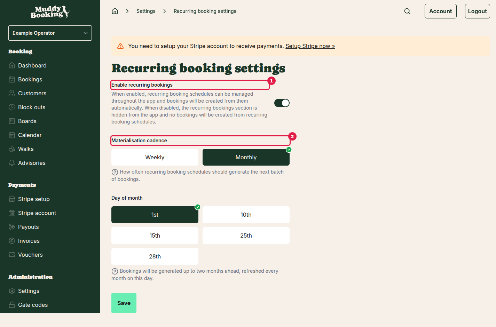
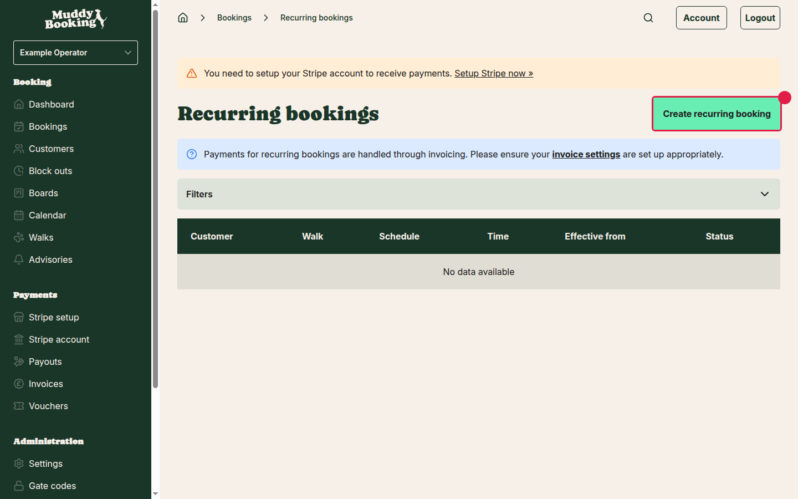
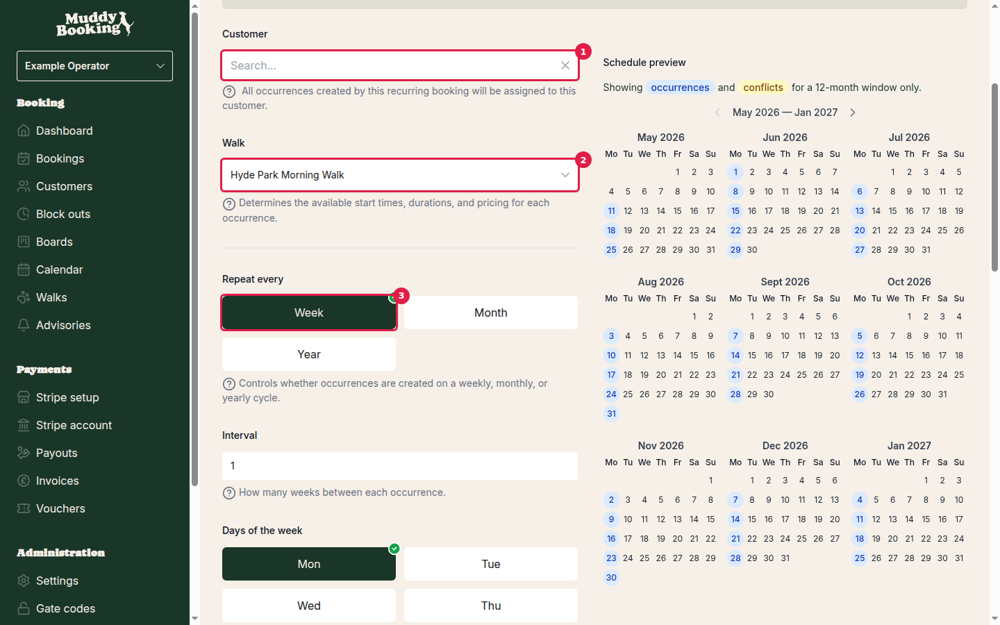
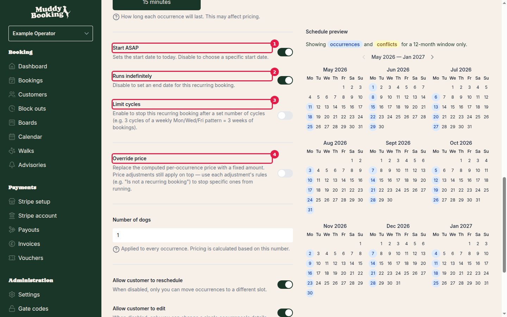

## What's a recurring booking?

A recurring booking is a schedule you set up once for a customer. Muddy then creates real bookings from it — weekly, monthly, or yearly — ahead of time, on a repeating cadence. Each booking it generates is just a normal booking: confirmed at creation, and pulled into your invoices like everything else.

It's not a subscription. There's no separate billing arrangement — bookings get invoiced on whatever cadence you already use. Because payment runs through invoicing, **make sure your invoicing settings are set up before you publish a recurring booking** (head to **Settings**, then **Invoicing**).

---

## Step 1 — Switch on recurring bookings

Recurring bookings are off by default, so the first job is to turn them on for your account.

1. Go to **Settings**.
2. Under **Bookings**, click **Recurring bookings**.

There are three things to look at on this page.

### Enable recurring bookings **(1)**

The master switch. When it's on, recurring bookings show up across the app and Muddy starts creating bookings from your schedules. When it's off, the section is hidden and nothing gets generated — even from schedules you've already set up.

### Materialisation cadence **(2)**

This controls **how often Muddy looks ahead and creates the next batch of bookings** for you. Pick one:

- **Weekly** — runs roughly once a week, keeps about two weeks of bookings created in advance.
- **Monthly** — runs roughly once a month, keeps about two months in advance.

**Heads up:** this is an account-wide setting about *when bookings are generated*. It's nothing to do with how often a customer's bookings actually happen. A customer can have a daily or weekly schedule regardless of whether you generate weekly or monthly.

### Day of month (only when cadence is set to Monthly)

If you choose **Monthly**, pick which day of the month the run happens — **1st, 10th, 15th, 25th, or 28th**. We stop at the 28th to avoid awkward edge cases at the end of shorter months.

Click **Save** and you're done with setup.

---

## Step 2 — Create a recurring booking

You can start a new recurring booking from two places:

- The main **Recurring bookings** page (in the left-hand menu under **Bookings**) — click **Create recurring booking**.
- Straight from a **customer's page** — scroll to the **Recurring bookings** section and click **Create**. The customer is filled in for you.

### The form

The form has three steps along the top: **Configure**, **Review & publish**, and **Live**. Most of the work happens in **Configure**.

#### Customer **(1)**

Search for and pick the customer this schedule is for. Every booking it generates will be assigned to them.

#### Walk **(2)**

Choose the service. (Your account might call it something else — see *Tips* below.) This sets the available start times, durations, and pricing for every occurrence.

#### Repeat every **(3)**

How often bookings should repeat:

- **Week** — repeats on a weekly cycle. Pick the days of the week and the interval (e.g. every 1 week, every 2 weeks).
- **Month** — repeats monthly. See the monthly options below.
- **Year** — repeats annually. Pick the month, then a day-of-month or day-of-week pattern within that month.

**Weekly options**
- **Interval** — how many weeks between cycles (2 = fortnightly, and so on).
- **Days of the week** — pick one or more days. A booking is created for each selected day per cycle.

**Monthly and yearly options — schedule type**
- **Day of month** — pick a specific date (1st through 31st, or Last day). For months that don't have the chosen date, the booking falls on the last day of that month.
- **Day of week** — pick a position (1st, 2nd, 3rd, 4th, 5th, Last, or 2nd to last) and a day of the week. For example, "2nd Tuesday" lands on the second Tuesday of every month.

#### Start time

The time every occurrence starts.

#### Duration

How long each occurrence lasts. Can affect pricing.

### Dates, cycles, and pricing

#### Start ASAP **(1)**

On = the schedule starts today. Off = pick a specific start date.

#### Runs indefinitely **(2)**

On = no end date. Off = pick a specific end date, after which no more bookings are generated.

#### Limit cycles **(3)**

On = stop after a fixed number of cycles. For example, 3 cycles of a weekly Mon/Wed/Fri schedule means 3 weeks of bookings (9 in total), then it stops.

#### Override price **(4)**

By default, every generated booking uses your normal pricing (based on the walk, duration, number of animals, and any price adjustments you've set up).

Switch on **Override price** to lock every occurrence to a fixed amount instead. When it's on:

- Enter the amount in **Override price**.
- Use the **Amount includes tax** switch to choose whether that amount is gross (includes tax) or net (excludes tax).

**Price adjustments still apply.** If you don't want a particular adjustment to apply to recurring bookings, set up an "Is not a recurring booking" rule on the adjustment itself.

**When you set a fixed price, the customer self-service switches turn off and lock automatically.** You'll see a notice on the page: *"When a fixed price is set, customers can't self-manage their occurrences — they won't be able to reschedule, edit or cancel online."*

This is on purpose. A fixed-price arrangement is a commitment between you and the customer; letting them change occurrences mid-schedule could undermine that. Remove the override to unlock the switches again.

#### Customer self-service (when there's no override)

If you're not using an override price, you can pick what your customers can do with their own occurrences:

- **Allow customer to reschedule** — when off, only you can move an occurrence to a different slot.
- **Allow customer to edit** — when off, only you can change a single occurrence's details.
- **Allow customer to cancel** — when off, only you can cancel an occurrence.
- **Release slots when occurrences are cancelled or rescheduled** — when off, the slot stays held even if the customer cancels or reschedules. Handy if you want to keep that time reserved for them.

All of these are off by default. Don't assume customers can self-serve — set them per schedule.

#### Number of animals

Applied to every occurrence, and used to calculate the price. If you're using an override price, this number is just for reporting and won't change the amount charged.

---

## Step 3 — Check the preview and publish

Before saving, scroll to the **Schedule preview**. It shows a 12-month calendar with every planned occurrence marked. Anything that would clash with an existing booking, a block-out, or a service closure gets flagged here, so you can spot problems before going live.

If something looks off, scroll back up and tweak the schedule.

When you're happy:

- Click **Save as draft** to park it without publishing. You can come back and edit or delete a draft any time.
- Or move on to **Review & publish** and confirm. **Once it's published, only the pricing and customer permissions can be changed** — the schedule itself (dates, frequency, walk) is locked in.

---

## Managing an existing recurring booking

### The list

Open **Recurring bookings** from the left-hand menu to see all your schedules. You can filter by customer, walk, schedule pattern, time, effective date, and status.

### The detail page

Click any recurring booking to open its detail page. The calendar there shows:

- **Successfully created bookings** — confirmed occurrences that have already been generated.
- **Future scheduled occurrences** — dates that'll be generated on the next run.
- **Failures** — dates where a booking couldn't be created (e.g. a slot conflict, the service was closed, or a block-out was in the way). Each one shows the reason, and you can **retry** failed occurrences right from here.

### What you can do at each stage

- **Draft** — edit anything: schedule, customer, walk, pricing, permissions. Or delete it entirely.
- **Published** — edit pricing and customer permissions only. The schedule itself is locked.
- **Cancelling a published schedule** — when you cancel, you'll be asked whether you also want to cancel any upcoming bookings that have already been generated.

**Cancelling can't be undone.** A cancelled recurring booking can't be restarted — you'd have to set up a new one.

---

## Payment and invoicing

Recurring bookings are **always paid through invoicing** — never charged automatically at the moment a booking is created. Each booking gets confirmed and added to your invoice queue, ready to be picked up the next time you run invoices on whatever cadence you've configured.

**Before publishing your first recurring booking, take a minute to check your invoicing settings.** Go to **Settings**, then **Invoicing** to set your cadence, payment terms, and other invoice options. The [Invoicing and automatic payments](https://muddybooking.com/help/payments/invoicing-and-automatic-payments) guide has the details.

---

## Notifications

You and your customer both get notified at the key moments. These use your existing notification templates and channels (email, SMS, WhatsApp) as configured in **Notifications** settings.

### When a batch of bookings is generated successfully

- **Your customer gets:** *Your recurring bookings* — a list of the new bookings, their references, and the period covered.
- **You get:** *N occurrence(s) scheduled* — same details.

### When some bookings in the batch couldn't be created

(For example: the slot was already taken, the service was closed, or a block-out was in the way.)

- **Your customer gets:** *There was an issue with your recurring bookings*, with an **Unavailable dates** section listing the failures.
- **You get:** *N could not be scheduled* (if everything failed) or *N scheduled, M could not be scheduled* (if some succeeded), with the reasons.

### When a recurring booking is cancelled

- **Your customer gets:** *Your recurring booking has been cancelled*, listing the schedule and any upcoming bookings that were also cancelled.
- **You get:** *Recurring booking cancelled* — same details.

---

## Tips and things to watch out for

- **Your account might use different words.** Walks and dogs are the defaults — your account might say "sessions" and "cats", for example. The labels in the app come from **Settings → Terminology**.
- **Check your price adjustments.** If you've got any set up, decide whether they should apply to recurring bookings. Each one has its own rule options.
- **Materialisation cadence is account-wide.** It's not per schedule — every recurring booking on the account generates on the same cadence.
- **Drafts are safe to leave.** A draft does nothing — no bookings, no notifications — until you publish it.
