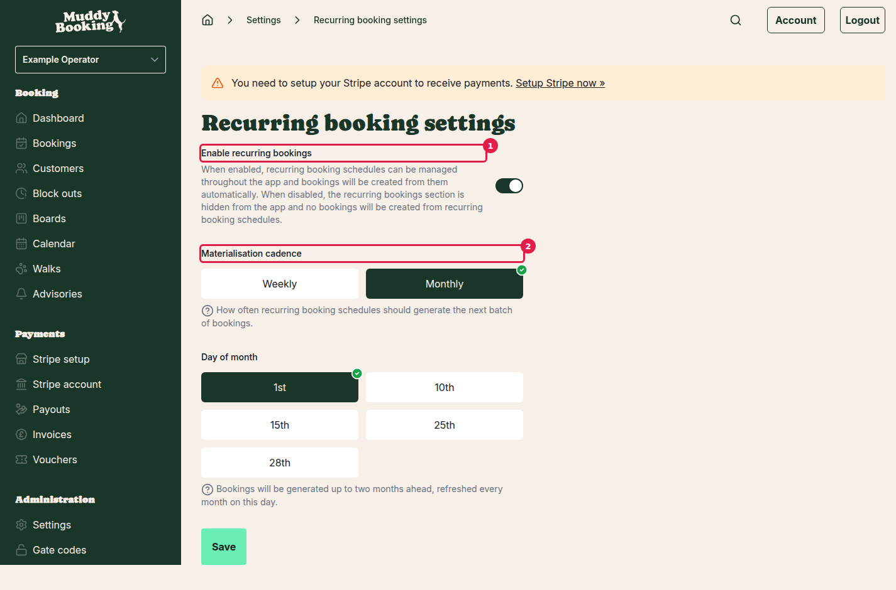
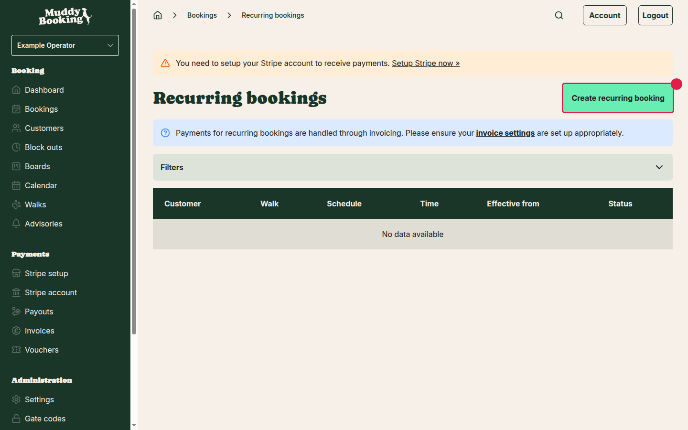
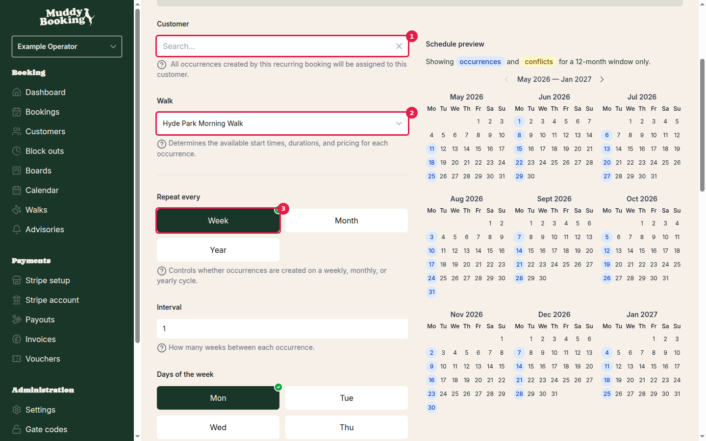
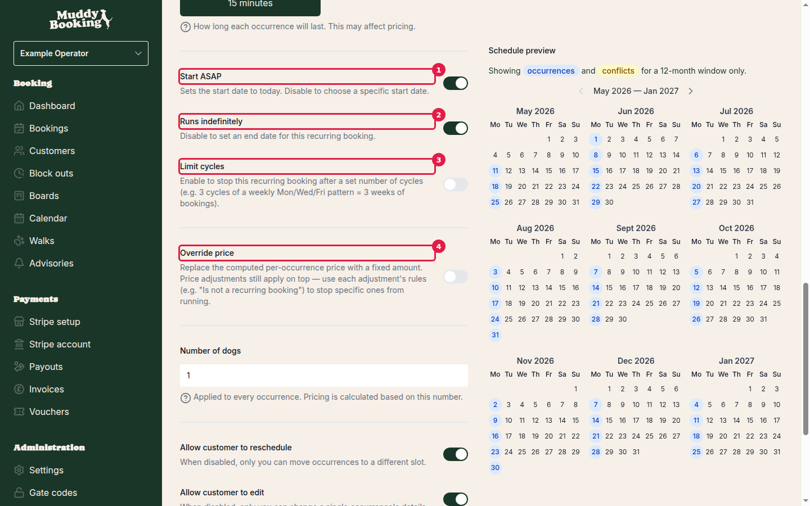

## What's a recurring booking?

A recurring booking is a schedule you set up once for a customer. Muddy uses it to create bookings ahead of time, repeating weekly, monthly or yearly. Each one is a normal booking: confirmed when it's created and invoiced like any other.

It isn't a subscription and has no billing of its own. The bookings are invoiced on whatever schedule you already use, so **set up your [invoicing settings](invoicing-and-automatic-payments.md#configuring-invoicing-settings) before you publish a recurring booking** (go to **Settings**, then **Invoicing**).

---

## Step 1: Switch on recurring bookings

Recurring bookings are off by default.

1. Go to **Settings**.
2. Under **Bookings**, click **Recurring bookings**.

### Enable recurring bookings **(1)**

The main switch. When it's on, recurring bookings appear across the app and Muddy creates bookings from your schedules. When it's off, they're hidden and no bookings are created, even from schedules you've already set up.

### Materialisation cadence **(2)**

How often Muddy creates the next batch of bookings:

- **Weekly**: runs about once a week and keeps roughly two weeks of bookings created ahead.
- **Monthly**: runs about once a month and keeps roughly two months ahead.

This only controls *when bookings are created*, and applies to your whole account. It has nothing to do with how often a customer's bookings happen. A customer can have a weekly schedule whichever cadence you pick here.

### Day of month (only when cadence is set to Monthly)

For **Monthly**, pick the day the run happens: **1st, 10th, 15th, 25th or 28th**. It stops at the 28th so every month has the day.

Click **Save**.

---

## Step 2: Create a recurring booking

You can start one from:

- The **Recurring bookings** page (in the left-hand menu under **Bookings**), by clicking **Create recurring booking**
- A **customer's page**, by scrolling to **Recurring bookings** and clicking **Create**. The customer is filled in for you

### The form

The form has three steps along the top: **Configure**, **Review & publish** and **Live**. Most of the work is in **Configure**.

#### Customer **(1)**

The customer the schedule is for. Every booking it creates is theirs.

#### Walk **(2)**

The [walk](creating-a-walk.md) to book. It sets the start times, durations and prices available. Your account might use a different word for walks (see [Tips](#tips-and-things-to-watch-out-for)).

#### Repeat every **(3)**

How often bookings repeat:

- **Week**: pick the days of the week and the interval, such as every week or every 2 weeks.
- **Month**: see the monthly options below.
- **Year**: pick the month, then a day of the month or day of the week within it.

**Weekly options**
- **Interval**: the number of weeks between cycles. 2 means fortnightly.
- **Days of the week**: one or more days. A booking is created for each day you pick, every cycle.

**Monthly and yearly options**
- **Day of month**: a date from the 1st to the 31st, or Last day. In months without that date, the booking falls on the last day of the month.
- **Day of week**: a position (1st, 2nd, 3rd, 4th, 5th, Last or 2nd to last) and a day. For example, "2nd Tuesday" is the second Tuesday of every month.

#### Start time

When each booking starts.

#### Duration

How long each booking lasts. This can affect the price.

### Dates, cycles, and pricing

#### Start ASAP **(1)**

On: the schedule starts today. Off: pick a start date.

#### Runs indefinitely **(2)**

On: no end date. Off: pick the date after which no more bookings are created.

#### Limit cycles **(3)**

On: stop after a set number of cycles. For example, 3 cycles of a weekly Mon/Wed/Fri schedule is 3 weeks and 9 bookings.

#### Override price **(4)**

Normally each booking uses your usual pricing, based on the walk, duration, number of animals and any price adjustments.

Switch on **Override price** to charge a fixed amount for every booking instead:

- Enter the amount in **Override price**.
- Use **Amount includes tax** to say whether the amount includes tax.

**Price adjustments still apply.** To stop an adjustment applying to recurring bookings, add an "Is not a recurring booking" rule to it.

**A fixed price switches off customer self-service.** Customers can't reschedule, edit or cancel any of the bookings online, and the switches below are locked. This is deliberate: a fixed price is an agreement between you and the customer, and letting them change bookings partway through could undo it. Remove the override to unlock the switches.

#### Customer self-service (when there's no override)

Without an override price, you choose what customers can do with their bookings:

- **Allow customer to reschedule**: when off, only you can move a booking.
- **Allow customer to edit**: when off, only you can change a booking's details.
- **Allow customer to cancel**: when off, only you can cancel a booking.
- **Release slots when occurrences are cancelled or rescheduled**: when off, the slot stays held for the customer after they cancel or reschedule.

All of these are off by default, so set them for each schedule.

#### Number of animals

Used for every booking and to work out the price. With an override price it's only for your records and doesn't change the amount.

---

## Step 3: Check the preview and publish

Scroll down to **Schedule preview**. It's a 12-month calendar with every planned booking marked. Any that clash with an existing booking, a [block out](adding-block-outs.md) or a closure are flagged, so you can fix them before going live.

When you're happy:

- Click **Save as draft** to keep it without publishing. You can edit or delete a draft at any time.
- Or go to **Review & publish** and confirm. **Once published, you can only change the pricing and customer permissions.** The dates, frequency and walk are fixed.

---

## Managing an existing recurring booking

### The list

Click **Recurring bookings** in the left-hand menu. You can filter by customer, walk, schedule pattern, time, effective date and status.

### The detail page

Click a recurring booking to open it. Its calendar shows:

- **Successfully created bookings**: bookings that have been created and confirmed.
- **Future scheduled occurrences**: dates that will be created on the next run.
- **Failures**: dates where a booking couldn't be created, for example because the slot was taken, you were closed or a block out was in the way. Each shows the reason, and you can **retry** it from here.

### What you can do at each stage

- **Draft**: change anything, or delete it.
- **Published**: change the pricing and customer permissions only.
- **Cancelling**: you'll be asked whether to cancel the upcoming bookings it has already created as well.

**Cancelling can't be undone.** To start again, you'll need to set up a new recurring booking.

---

## Payment and invoicing

Recurring bookings are **always paid by invoice**, never charged when the booking is created. Each booking is confirmed and waits to be picked up by your next invoice run.

**Check your invoicing settings before publishing your first recurring booking.** Go to **Settings**, then **Invoicing**, to set your schedule, payment terms and other options. See [Invoicing and automatic payments](invoicing-and-automatic-payments.md) for details.

---

## Notifications

You and your customer are both notified at the points below, using your notification templates and the [channels (email, SMS, WhatsApp)](setting-up-whatsapp-sms-notifications.md) set up in **Notifications** settings.

### When a batch of bookings is generated successfully

- **Your customer gets** *Your recurring bookings*, listing the new bookings, their references and the period covered.
- **You get** *N occurrence(s) scheduled*, with the same details.

### When some bookings in the batch couldn't be created

For example, because the slot was taken, you were closed or a block out was in the way.

- **Your customer gets** *There was an issue with your recurring bookings*, with an **Unavailable dates** section listing the failures.
- **You get** *N could not be scheduled* if all failed, or *N scheduled, M could not be scheduled* if some worked, with the reasons.

### When a recurring booking is cancelled

- **Your customer gets** *Your recurring booking has been cancelled*, listing the schedule and any upcoming bookings cancelled with it.
- **You get** *Recurring booking cancelled*, with the same details.

---

## Tips and things to watch out for

- **Your account might use different words.** Walks and dogs are the defaults, but your account might say "sessions" and "cats". To change them, go to **Settings**, then **Terminology**. See [Customizing app terminology](customizing-app-terminology.md).
- **Check your price adjustments.** Decide whether each one should apply to recurring bookings.
- **The materialisation cadence is account-wide.** Every recurring booking is created on the same cadence.
- **Drafts are safe to leave.** A draft creates no bookings and sends no notifications until you publish it.
