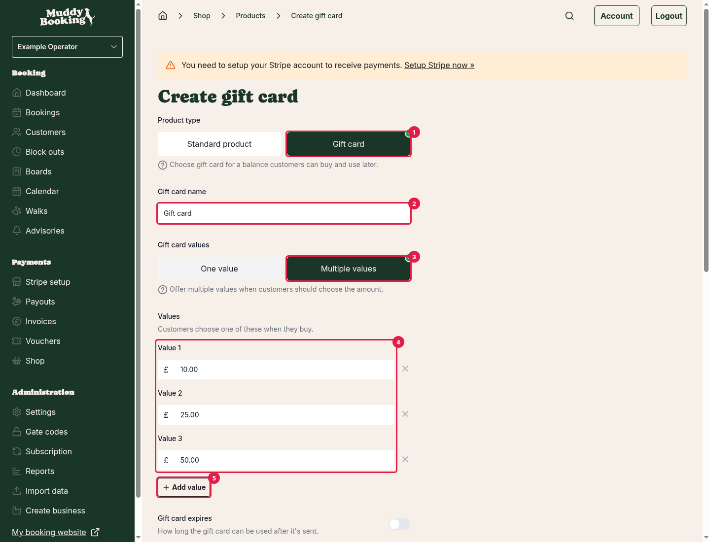
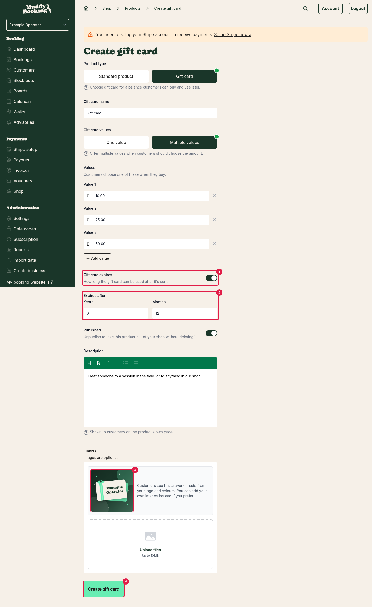
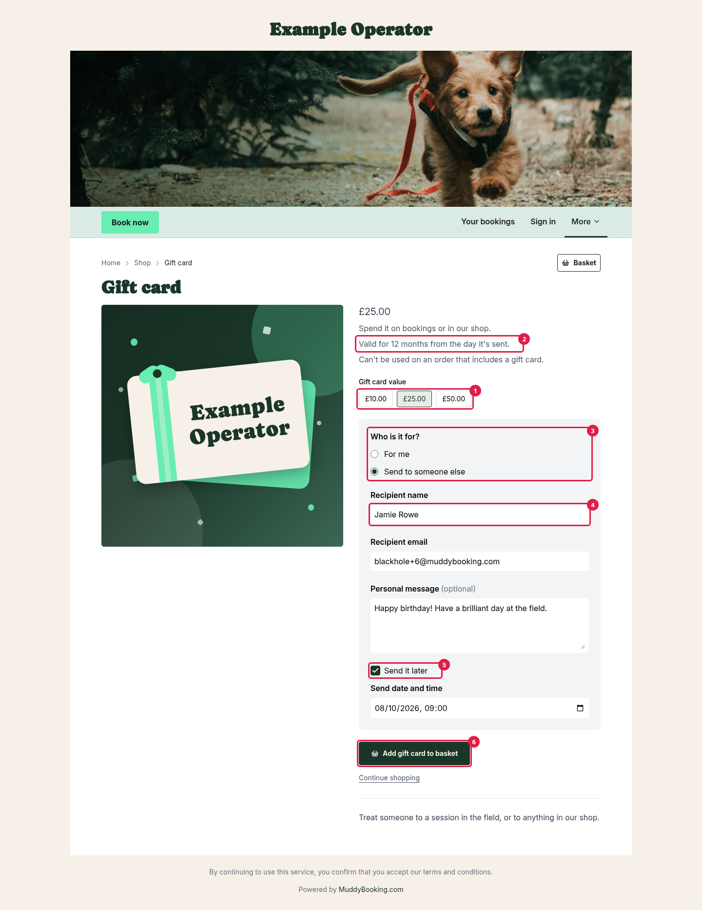

## How gift cards work

A gift card is a product in your shop that customers buy for a set amount, like £25. Once they've paid, Muddy turns it into a **voucher** with that balance and emails the code out. The code can then be spent on bookings or in your shop, just like any other voucher.

Customers can buy a gift card for themselves, or send it to someone else, either straight away or on a date they choose, such as a birthday.

Gift cards don't need delivering and don't need stock. You don't need to do anything when one is sold.

## Creating a gift card

1. Click **Shop** in the left-hand menu.
2. Click **Products**.
3. Click **Create**.
4. Under **Product type**, choose **Gift card** **(1)**.

If you haven't opened your shop yet, the **Shop** page shows your setup steps instead. Click **Add a product** there, or click **Review products** and then **Create** if you've already added a product. See [Setting up your shop for the first time](setting-up-your-shop.md#setting-up-your-shop-for-the-first-time).

Then fill in the details below.

### Gift card name

What customers see in your shop. Muddy fills in a name for you **(2)**, but you can change it, for example to **Christmas gift card**.

### Gift card values

Choose how much the gift card is worth:

- **One value**: the gift card is sold at a single amount. Enter it under **Gift card value**.
- **Multiple values** **(3)**: customers choose from amounts you set, such as £10, £25 and £50. Enter each amount under **Values** **(4)**, and click **Add value** **(5)** for more. You need at least two, and each one must be different.

The customer pays exactly the value of the gift card, and the voucher they get is worth the same.

### Gift card expires

Switch this on **(1)** if the gift card should only be usable for a set time. Then choose how long under **Expires after** **(2)**, in months or years. The time starts from the day the gift card is sent, not the day it's bought.

Muddy starts with your usual voucher expiry, which you can change under **Settings** then **Vouchers**. Switch this off if the gift card never expires.

Customers see the expiry on the gift card's page before they buy.

### Published

Leave this on to show the gift card in your shop.

### Description

Shown on the gift card's page in your shop. It's a good place to explain what the gift card can be spent on.

### Images

Adding images is optional. If you don't add any, customers see artwork Muddy makes for you **(3)**, using your logo (or business name) and your [brand colours](changing-system-colour-scheme.md). You can add your own images instead if you prefer.

When you're done, click **Create gift card** **(4)**. If you're still setting up your shop, the button says **Save and continue** and takes you to the next setup step.

**Tip:** put your gift cards in their own collection, such as **Gift cards**, so they're easy to find. See [Organising your shop with collections](organising-shop-collections.md).

## What customers fill in

On the gift card's page, customers choose a **Gift card value** **(1)** if you've set more than one, and see how long the gift card lasts **(2)**.

When a customer buys a gift card, they're asked **Who is it for?** **(3)**

- **For me**: the gift card is emailed to the customer once they've paid.
- **Send to someone else**: the customer enters the **Recipient name** **(4)**, **Recipient email** and, if they like, a **Personal message**.

If they're sending it to someone else, they can also choose **Send it later** **(5)** and pick a **Send date and time**. This can be up to six months ahead. Otherwise, the gift card is emailed as soon as payment is complete.

To buy, the customer clicks **Add gift card to basket** **(6)**. Each gift card goes in the basket on its own line, so each one can have its own recipient and message. To buy three, they add three separate gift cards.

## After a gift card is sold

Once the order is paid, Muddy:

1. Creates a voucher with a code starting **GFT**, worth the gift card's value.
2. Emails the code to the customer or the recipient, at the time they chose.

You'll find the voucher on your **Vouchers** page, alongside any you've created yourself. You can check its balance and see when it's used, just like any other voucher. See [Creating vouchers](creating-vouchers.md#managing-existing-vouchers).

If a signed-in customer bought the gift card for themselves, the voucher is linked to their customer record.

## Things to know

- **Vouchers can't be used to buy gift cards.** If a basket contains a gift card, the customer can't pay with a voucher.
- **Discounts don't reduce the price of gift cards**, unless you switch on **Include gift cards** on the discount. Even then, the gift card keeps its full value. The customer just pays less for it. See [Discounts in the shop](shop-discounts.md).
- **If you cancel an order** that contains a gift card, the gift card is cancelled too. You can't cancel it once any of the gift card's balance has been spent.
