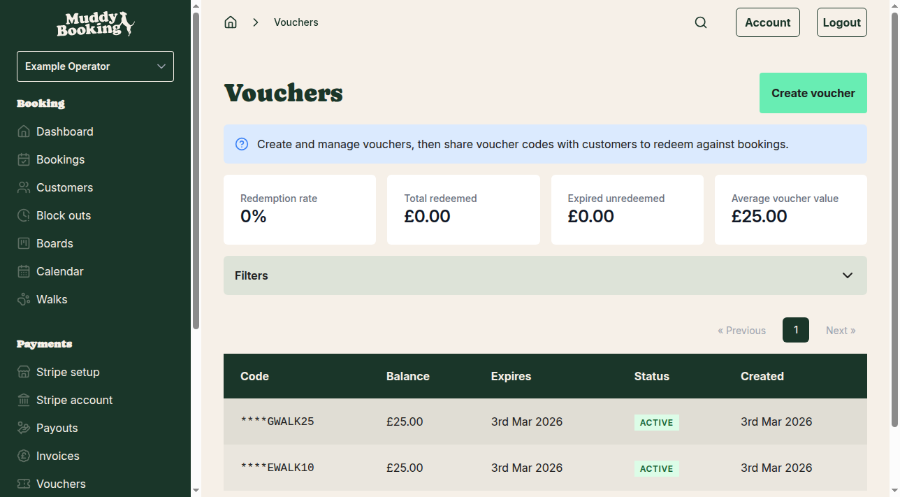
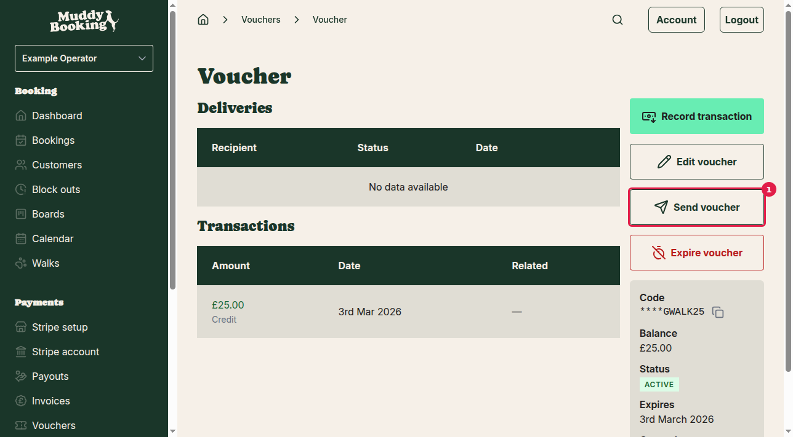
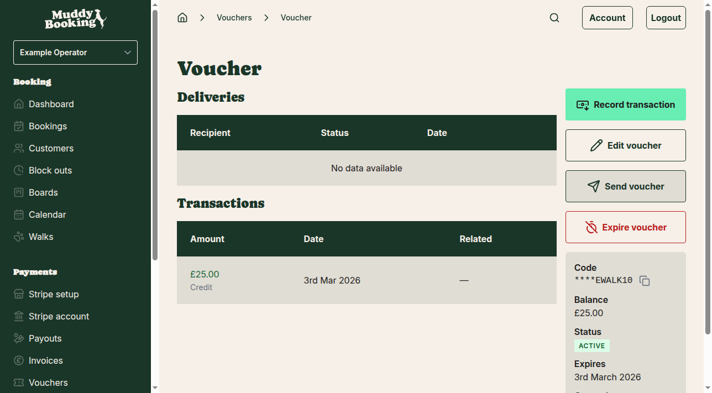

## Accessing your vouchers

First, you'll need to navigate to your vouchers from the main navigation menu. Click **Vouchers** in the left-hand menu to see all your existing vouchers.

From this page, you can see all your vouchers with their codes, balances, expiry dates, and status. To send a voucher to a customer, you'll need to click on the specific voucher you want to send.

## Finding the voucher to send

Click on any voucher row to open the individual voucher details page. This shows you all the information about that specific voucher, including its full code, balance, and transaction history.

On this page, you'll see several action buttons including **Send voucher** **(1)**. This is what you'll use to email the voucher code to your customer.

## Sending the voucher

Click the **Send voucher** button to open the sending form. A pop-up window will appear with fields for you to complete.

The sending form contains two fields:

- **Email address** — Enter your customer's email address where you want to send the voucher code
- **Message** — Add a personal message to accompany the voucher code (this is optional)

You can customize the message to make it more personal for your customer. For example, you might write something like "Here's your voucher for your dog walking service. Use this code when booking your next walk!"

## Completing the send process

Once you've filled in the email address and added your message (if desired), click the **Send** button to email the voucher to your customer.

The voucher code will be automatically included in the email along with your message. Your customer will receive an email with:
- The voucher code they need to enter when booking
- Your personalized message
- Instructions on how to use the voucher

## Tracking voucher deliveries

After sending a voucher, you can track all the emails you've sent from the individual voucher page. The **Deliveries** section shows:

- **Recipient** — The email address where the voucher was sent
- **Status** — Whether the email was successfully delivered
- **Date** — When the voucher email was sent

This helps you keep track of which vouchers have been sent to which customers and when.

## Tips for sending vouchers

- **Double-check the email address** — Make sure you've entered the correct email address for your customer
- **Add a personal message** — A friendly message makes the voucher feel more personal and explains what it's for
- **Keep records** — The Deliveries section helps you track what you've sent, but you might also want to note in your own records which customer received which voucher
- **Send promptly** — If you've promised a customer a voucher, send it as soon as possible while the booking is fresh in their mind

Remember that customers will need to enter the voucher code exactly as shown when they make their booking, so make sure they understand how to use it when you send it to them.