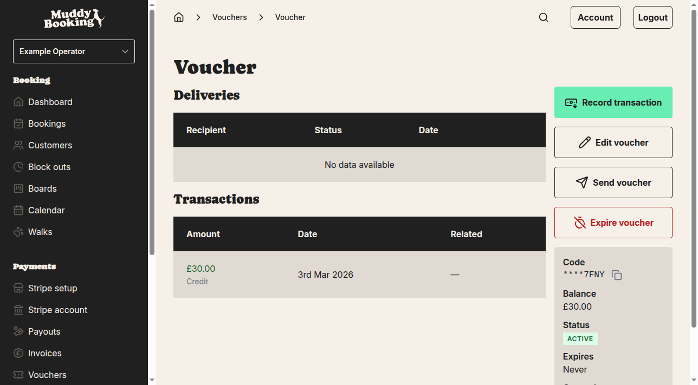

## Accessing voucher management

To send vouchers to customers, you'll need to navigate to your vouchers and select the specific voucher you want to send.

1. Go to **Vouchers** from the main sidebar menu
2. Click on the voucher code you want to send from the list

This opens the individual voucher page where you can see the voucher details including its code, balance, expiry date, and status.

## Sending a voucher

From the voucher detail page, you can send the voucher code to a customer via email.

1. Click the **Send voucher** button on the voucher detail page
2. A pop-up window will appear with a form to send the voucher

The send voucher form contains:
- **Email address** field — Enter the customer's email address where they'll receive the voucher code
- **Message** text area — Add a custom message to include with the voucher email (this is optional)
- **Send** button to send the email
- **Cancel** button to close the pop-up without sending

## Completing the send process

To send the voucher:

1. Enter the customer's email address in the **Email address** field
2. Optionally add a personal message in the **Message** text area
3. Click **Send** to email the voucher code to the customer

The customer will receive an email containing their voucher code and any custom message you included.

## Tracking voucher deliveries

After sending vouchers, you can track all deliveries in the **Deliveries** section on the voucher detail page.

The deliveries table shows:
- **Recipient** — The email address the voucher was sent to
- **Status** — Whether the email was successfully delivered
- **Date** — When the voucher email was sent

This helps you keep track of which customers have received voucher codes and when they were sent.

## Important notes

- Each voucher can be sent to multiple customers if needed
- The same voucher code can be used by any customer who receives it
- Voucher deliveries are tracked separately from voucher usage
- Customers will need the exact voucher code to redeem the voucher during booking
- If a voucher has an expiry date, make sure to send it with enough time for the customer to use it

## Managing multiple vouchers

You can send different vouchers to different customers, or send the same voucher code to multiple customers. The voucher balance will be shared between all customers who have the code — when one customer uses part of the voucher, the remaining balance is available to others who have the same code.

For individual customer vouchers, create separate vouchers for each customer rather than sharing the same code.