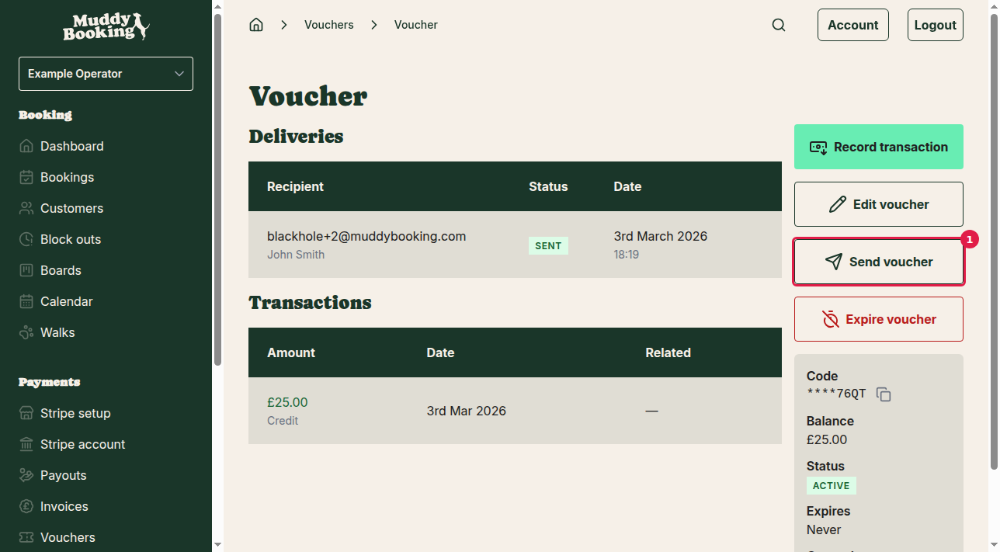
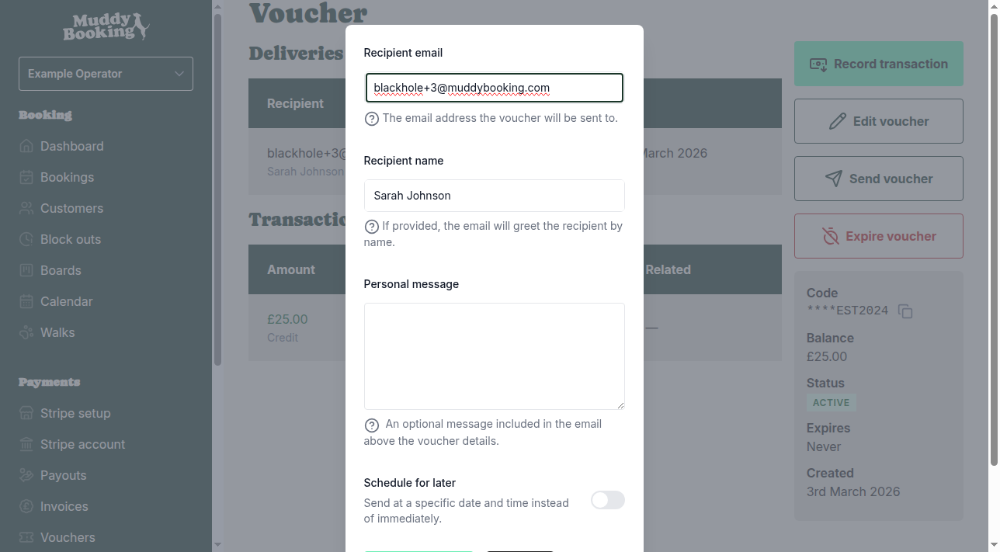
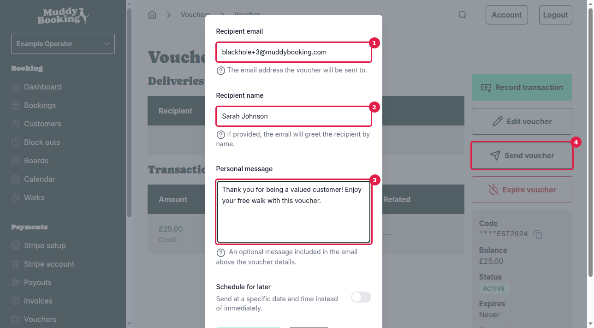
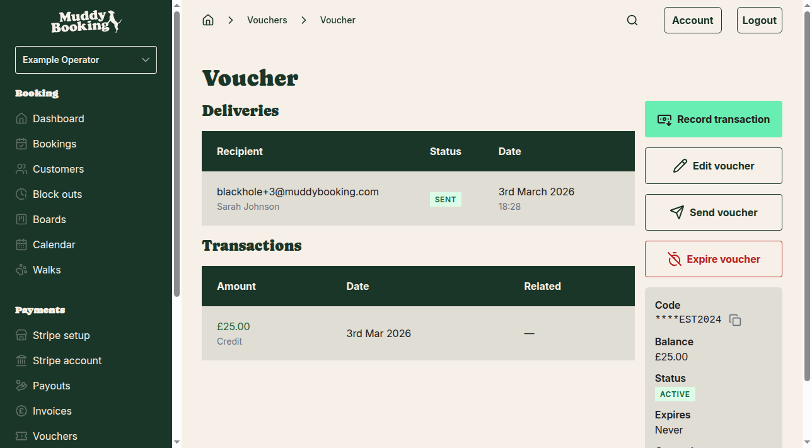

## Finding your voucher

Before you can send a voucher to a customer, you'll need to navigate to the specific voucher you want to send.

1. Go to **Vouchers** in the left-hand menu
2. Click on the voucher you want to send from the list

You'll see the voucher details page showing the voucher code, balance, status, and any previous deliveries.

## Sending the voucher

1. Click **Send voucher** **(1)** on the voucher details page

A pop-up form will appear where you can configure how the voucher is sent to your customer.

## Filling in the recipient details

The send voucher form contains several fields to personalize the voucher email:

1. **Recipient email** **(1)** — Enter the customer's email address where the voucher will be sent. This field is required.

2. **Recipient name** **(2)** — Add the customer's name to personalize the greeting in the email. This field is optional but recommended.

3. **Personal message** **(3)** — Include a custom message that will appear above the voucher details in the email. Use this to add context about why you're sending the voucher or any special instructions.

4. **Schedule for later** — Enable this option if you want to send the voucher at a specific date and time instead of immediately. When enabled, you can select the exact date and time for delivery.

5. Click **Send voucher** **(4)** to send the email immediately, or at the scheduled time if you've set one up.

## After sending

Once you've sent the voucher, you'll return to the voucher details page where you can see the delivery confirmation.

The **Deliveries** section will show:
- The recipient's email address and name
- The delivery status (SENT for successful deliveries)
- The date and time when the voucher was sent

## Important notes

- **Multiple recipients**: You can send the same voucher to multiple customers — just click **Send voucher** again to add more recipients
- **Voucher remains active**: Sending a voucher doesn't affect its balance or status — customers can still redeem it for bookings
- **Delivery tracking**: All voucher deliveries are logged in the Deliveries section, so you can keep track of who received each voucher
- **Email delivery**: Vouchers are sent immediately unless you use the "Schedule for later" option

The customer will receive an email containing the voucher code and any personal message you included, along with instructions on how to use the voucher when making a booking.