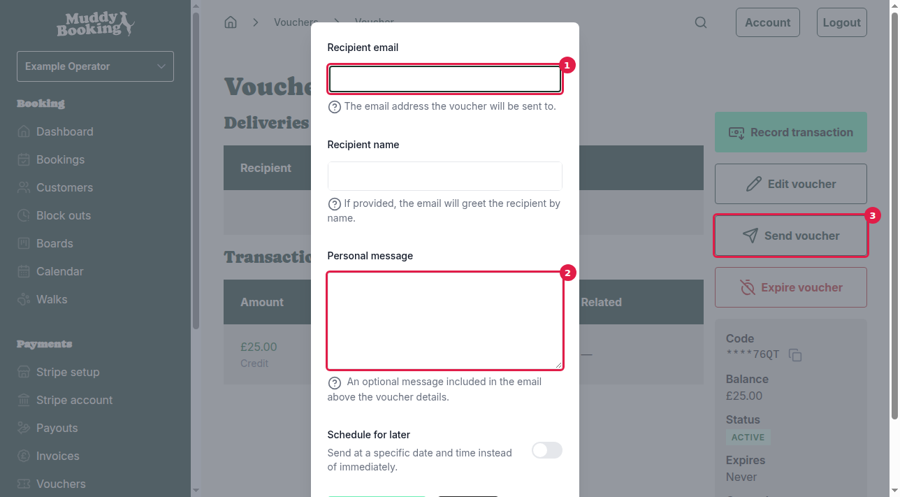
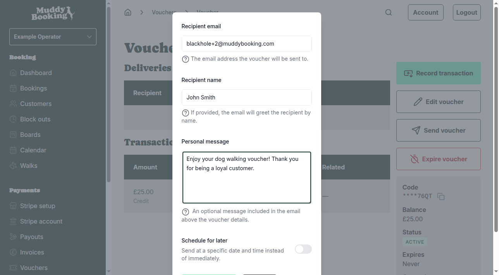

## Accessing vouchers

To send a voucher to a customer, first go to **Vouchers** in the left-hand menu.

You'll see a list of all your vouchers with their codes, balances, expiry dates, and status.

## Opening a voucher

Click on any voucher from the list to view its details. On the voucher page, you'll see:

- The voucher code (partially hidden for security)
- Current balance and status
- Any previous deliveries to customers
- Transaction history

Click **Send voucher** **(1)** to start the process of sending this voucher to a customer.

## Sending the voucher

When you click **Send voucher**, a pop-up will appear with the following fields:

### Required information

**Recipient email** **(1)** — Enter the customer's email address where the voucher will be sent. This field is required.

### Optional information

**Recipient name** — If you provide a name, the email will include a personalised greeting for the customer.

**Personal message** **(2)** — Add a custom message that will appear in the email above the voucher details. This is useful for adding context like "Happy Birthday!" or "Thank you for being a loyal customer!"

**Schedule for later** — If you want to send the voucher at a specific date and time instead of immediately, enable this option.

### Sending the voucher

Fill in the details and click **Send voucher** **(3)** to send the email immediately, or at your scheduled time.

## After sending

Once sent, the pop-up will close and you'll return to the voucher page. The new delivery will appear in the **Deliveries** section **(1)** showing:

- The recipient's email address and name
- Delivery status (initially **PENDING**, then **SENT** once delivered)
- The date and time it was sent

The voucher remains **ACTIVE** and can be sent to additional customers if needed. Each delivery is tracked separately in the Deliveries section.

## Important notes

- Vouchers can be sent to multiple customers — each delivery is tracked separately
- The voucher code in the email will show the full code (not the masked version you see in the dashboard)
- Customers can use the voucher code at checkout to apply the credit to their booking
- The voucher balance will only decrease when customers actually redeem it for bookings