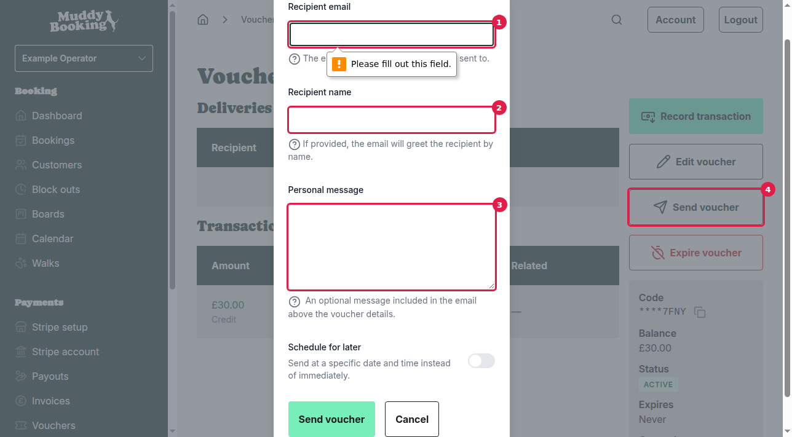
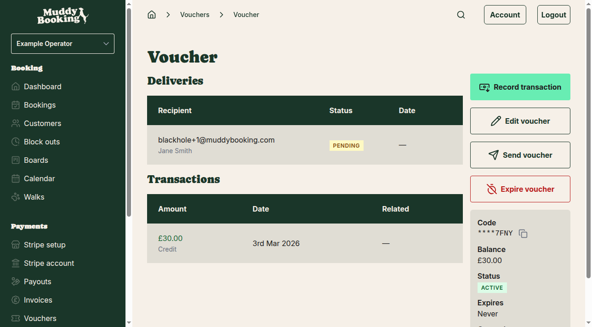

## Accessing your vouchers

Start by navigating to your vouchers from the left-hand menu. You'll see an overview of all your vouchers with their codes, balances, expiry dates, and current status.

## Opening an existing voucher

Click on any voucher from the list to open its individual page. Here you can see detailed information about the voucher including its full code, balance, status, and any previous deliveries or transactions.

From this page, you'll see several action buttons including **Send voucher** **(1)**.

## Sending a voucher to a customer

1. Click **Send voucher** to open the sending form

A pop-up will appear with several fields to customize how your voucher is sent:

2. Fill in the **Recipient email** **(1)** - this is the email address where the voucher will be sent

3. Optionally add a **Recipient name** **(2)** - this will personalize the email greeting

4. Add a **Personal message** **(3)** if you want to include a custom note above the voucher details

5. Click **Send voucher** **(4)** to send the email immediately

### Optional scheduling

If you don't want to send the voucher right away, you can use the **Schedule for later** option to choose a specific date and time for delivery.

## After sending

Once you click **Send voucher**, the pop-up will close and you'll return to the voucher page. You'll immediately see confirmation that the voucher has been queued for delivery in the **Deliveries** section.

The delivery will show:
- The recipient's email address and name
- Status (initially **PENDING** while the email is being sent)
- The date it was sent

## Important notes

- You can send the same voucher to multiple customers - each delivery is tracked separately
- The voucher remains active and can still be used for bookings regardless of how many times it's been sent
- Customers will receive an email with the voucher code and instructions on how to use it
- You can track all deliveries in the **Deliveries** section of each voucher