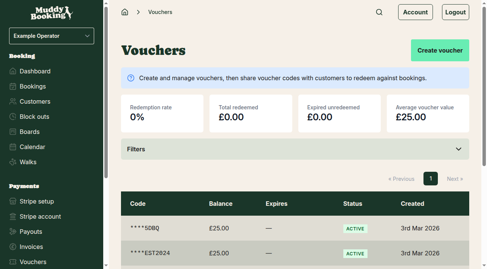
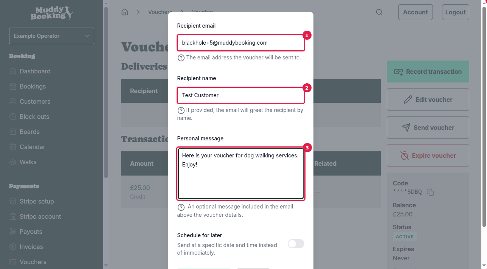

## Accessing the send voucher feature

Once you've created a voucher, you can send it to customers by email. To access the send feature:

1. Go to **Vouchers** in the left-hand menu

2. Click on any voucher from your list to view its details
3. Click the **Send voucher** button

## Filling out the send voucher form

When you click **Send voucher**, a form will appear at the top of the page with the following fields:

- **Recipient email** **(1)** — Enter the customer's email address where the voucher will be sent (required)
- **Recipient name** **(2)** — Add the customer's name to personalise the greeting in the email (optional)
- **Personal message** **(3)** — Include a custom message that will appear above the voucher details in the email (optional)
- **Schedule for later** — Choose to send the voucher at a specific date and time instead of immediately (optional)

## Sending the voucher

1. Fill in at least the **Recipient email** field with the customer's email address
2. Add any optional information like the customer's name or a personal message
3. Click **Send voucher** **(4)** to send the email immediately

## After sending

Once the voucher is sent, you'll return to the voucher details page where you can see:

- The **Deliveries** section **(1)** now shows the sent voucher with:
  - The recipient's email and name
  - Status (starts as PENDING, then changes to SENT)
  - The date and time when it was sent

## Important notes

- You can send the same voucher to multiple customers — each will get their own copy
- The voucher remains ACTIVE and can be used by any recipient who has the code
- Vouchers can be sent immediately or scheduled for later delivery
- All delivery attempts are tracked in the Deliveries section of each voucher