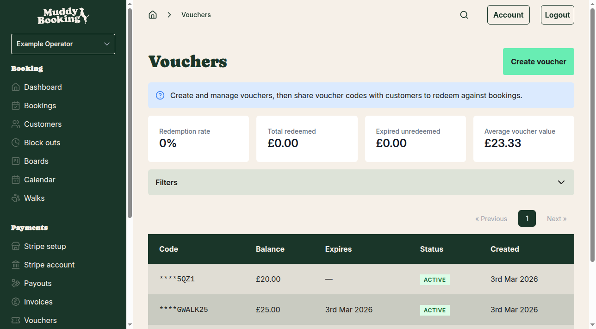
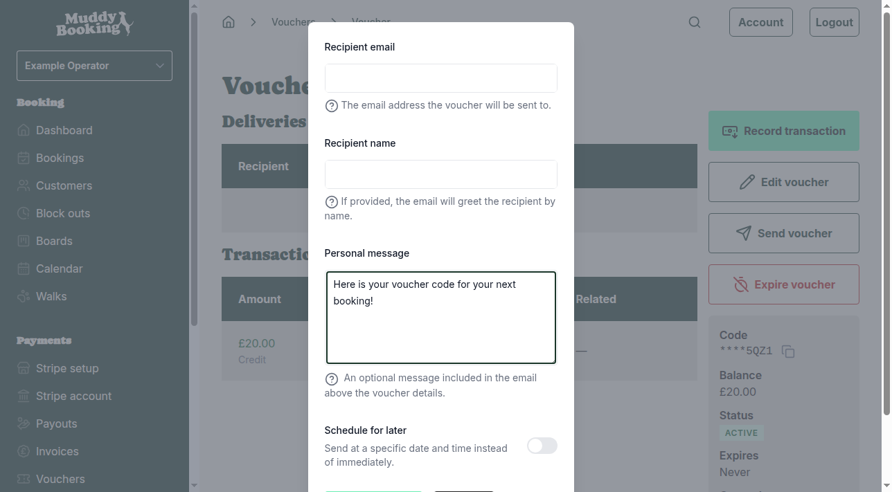
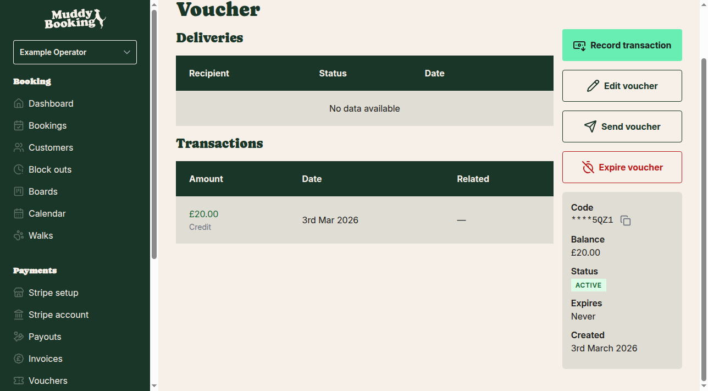

## Sending a voucher to a customer

Once you've created a voucher, you can send the code directly to a customer via email. This is useful when you want to offer discounts for special occasions, customer loyalty rewards, or promotional campaigns.

## How to send a voucher

1. Go to **Vouchers** in the left-hand menu

2. Click on the voucher code you want to send to view its details

3. Click **Send voucher** **(1)** to open the sending options

4. A pop-up will appear where you can enter the customer's details and customize your message

5. Enter the customer's email address in the **Email address** field

6. Add a personal message in the **Message** field — this will be included in the email alongside the voucher code

7. Click **Send** **(1)** to email the voucher to the customer

8. You'll see a confirmation message when the voucher has been sent successfully

## What happens after sending

- The customer receives an email with their voucher code and your custom message
- The voucher remains active and ready to be redeemed
- You can track when vouchers were sent by checking the **Deliveries** section on each voucher's page
- If needed, you can send the same voucher to multiple customers

## Tips for sending vouchers

- **Personalize your message** — include the customer's name and explain what the voucher is for (birthday discount, loyalty reward, etc.)
- **Clear instructions** — let customers know how to use the code when booking
- **Expiry reminders** — if your voucher expires, mention the deadline in your message
- **Save the email address** — the system remembers previously used addresses for future sends