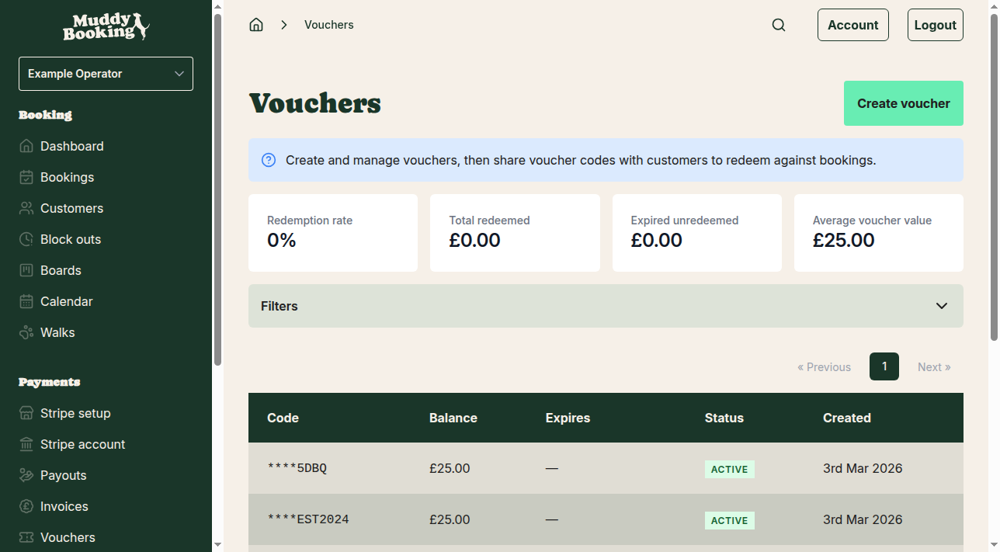
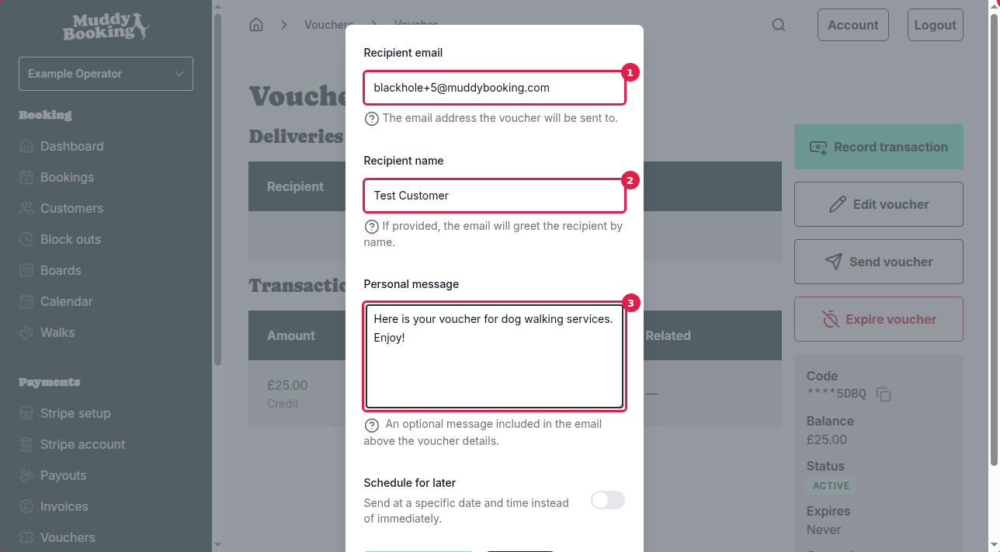
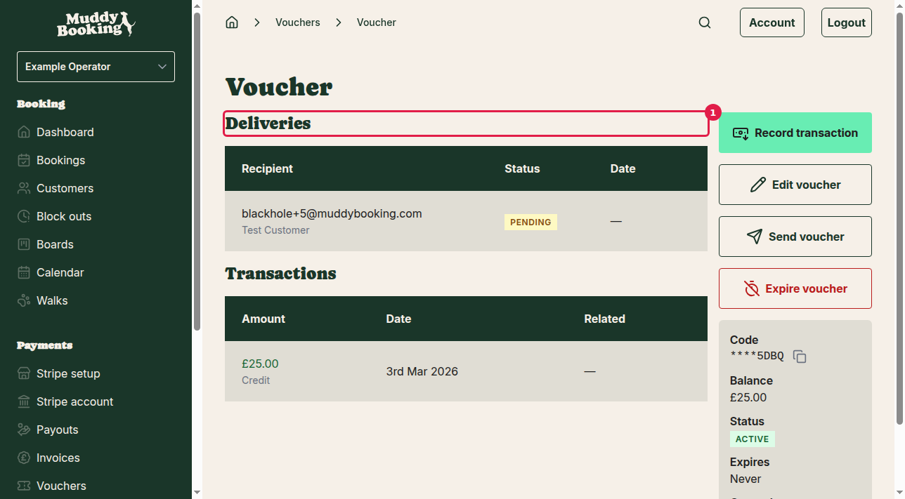

## Accessing the send voucher feature

Once you've [created a voucher](creating-vouchers.md), you can email it to a customer.

1. Go to **Vouchers** in the left-hand menu

2. Click the voucher you want to send
3. Click **Send voucher**

## Filling out the send voucher form

A form appears at the top of the page:

- **Recipient email** **(1)** (required): where to send the voucher
- **Recipient name** **(2)** (optional): used in the email's greeting
- **Personal message** **(3)** (optional): shown above the voucher details in the email
- **Schedule for later** (optional): send it at a set date and time instead of now

## Sending the voucher

1. Enter the customer's email in **Recipient email**
2. Add their name or a message if you like
3. Click **Send voucher** **(4)**

## After sending

You'll be back on the voucher's page.

The **Deliveries** section **(1)** lists the email with:
- The recipient's email and name
- Its status, which starts as PENDING and changes to SENT
- When it was sent

## Important notes

- You can send the same voucher to several people. Each gets their own email, but they all share the same code and balance
- Anyone with the code can use the voucher while it's ACTIVE
- Every send is listed in the voucher's Deliveries section
