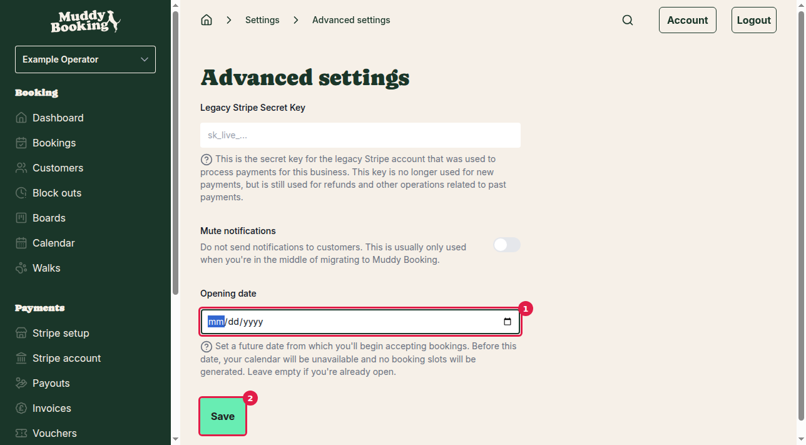
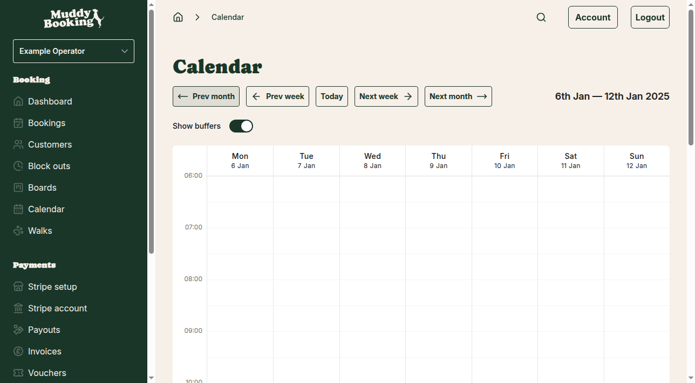
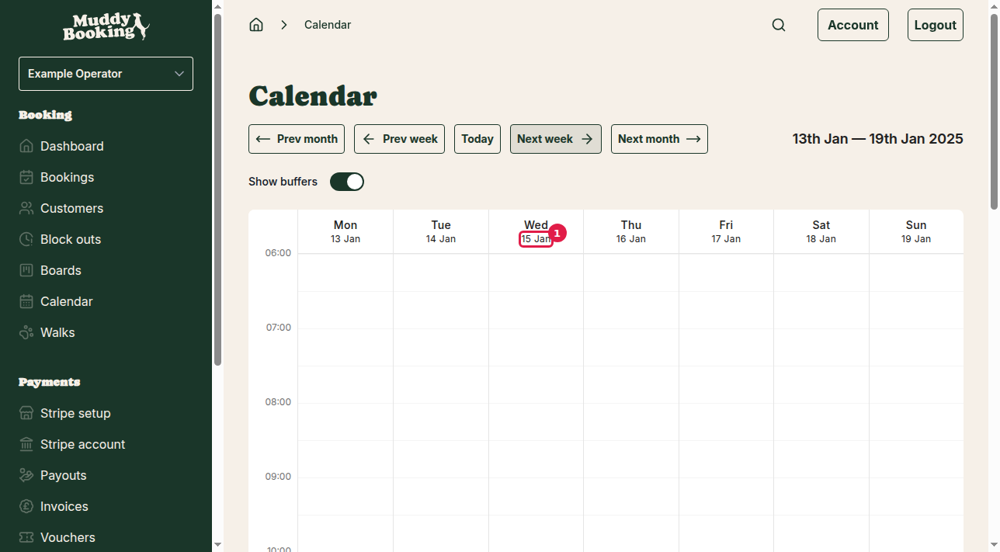

## What is an opening date

The opening date feature allows you to set a future date from which your business will start accepting bookings. Before this date, your booking calendar will be completely unavailable and no booking slots will be generated for customers.

This is particularly useful if you're setting up your Muddy Booking account in advance but aren't ready to accept bookings yet.

## Finding the opening date setting

The opening date setting is located in the Advanced settings section.

1. Click **Settings** in the left-hand menu
2. Scroll down to the **Advanced** section  
3. Click **Advanced settings**

## Setting your opening date

On the Advanced settings page, you'll see several options including the opening date field.

The opening date field includes helpful text explaining: "Set a future date from which you'll begin accepting bookings. Before this date, your calendar will be unavailable and no booking slots will be generated. Leave empty if you're already open."

1. Click in the **Opening date** field **(1)**
2. Enter your desired opening date in the format YYYY-MM-DD (for example: 2025-01-15)
3. Click **Save** **(2)** to apply the setting

## How the opening date affects your calendar

Once you've set an opening date, it immediately affects your booking calendar. Dates before your opening date will show no available booking slots.

### Dates before the opening date

Here's how the calendar appears for dates before the opening date (January 6-12, 2025, when opening date is set to January 15, 2025):

You can see that the calendar displays normally but contains no bookings or available slots during this period.

### Around the opening date

This view shows the week that includes the opening date (January 15, 2025 **(1)**):

The opening date creates a clear boundary - dates before January 15th remain unavailable, while dates from January 15th onwards can have booking slots generated according to your normal opening times and walk schedules.

## Important considerations

**Immediate effect**: The opening date setting takes effect immediately after saving. Your calendar will update right away to reflect the new availability rules.

**Customer impact**: Customers visiting your booking website will not see any available slots before your opening date. The booking form will simply show no available times for those dates.

**Leave empty when ready**: Once you're ready to accept bookings, simply return to the Advanced settings, clear the opening date field, and save. This will make all dates available according to your normal booking rules and opening times.

**Cannot be in the past**: The opening date should be set to a future date. If you're already accepting bookings and want to disable them temporarily, consider using block outs instead.

The opening date is perfect for businesses that want to set up their Muddy Booking account completely before going live with customer bookings.