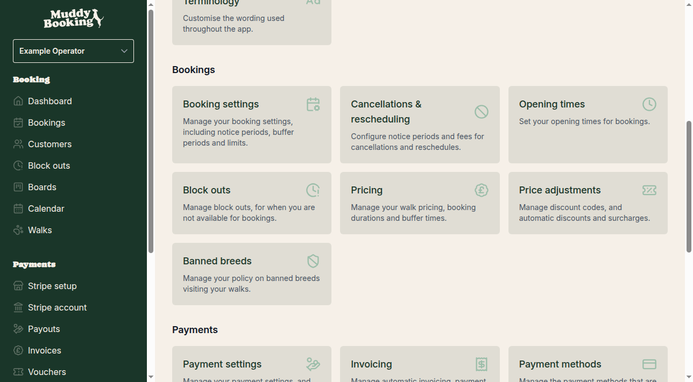
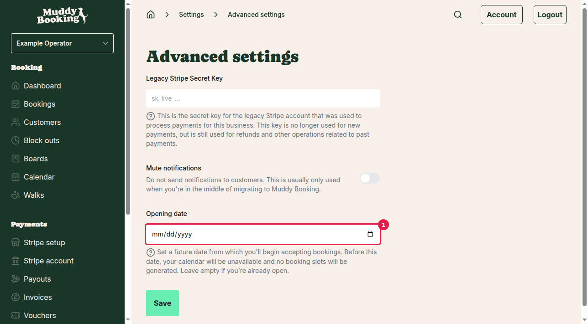
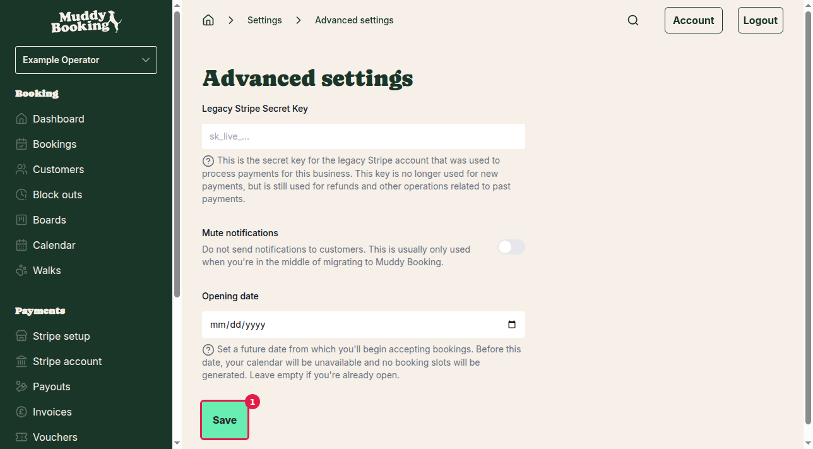
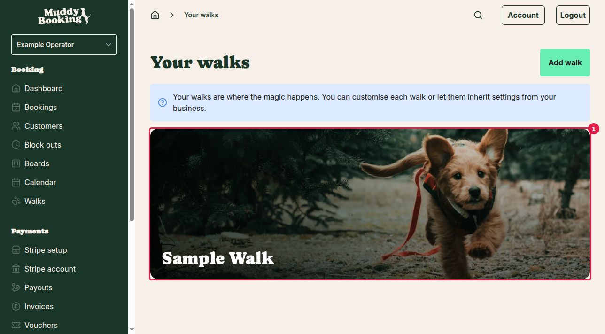
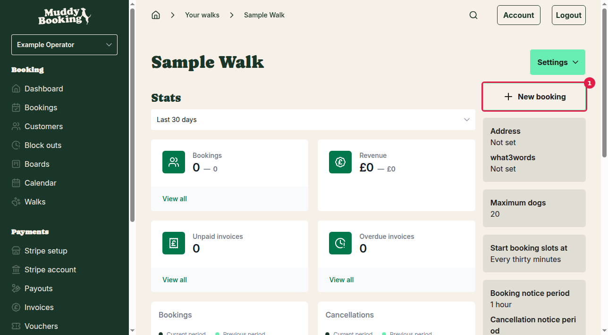
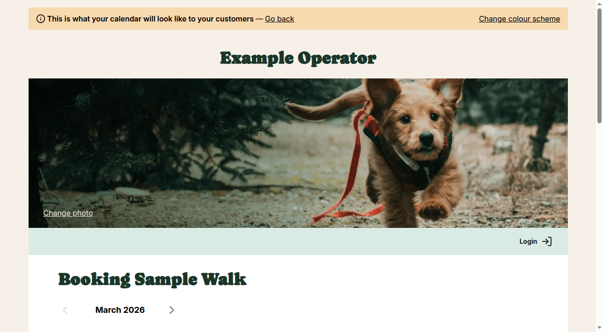

## What is an opening date?

An opening date lets you set a future date from which you'll start accepting bookings. Before this date, your calendar will be unavailable and customers won't be able to book any walks. This is useful if you're setting up your business but aren't ready to start taking bookings yet.

## How to set your opening date

### Step 1: Go to Advanced settings

From your dashboard, click **Settings** in the left menu, then scroll down to the **Advanced** section and click **Advanced settings** **(1)**.

### Step 2: Enter your opening date

On the Advanced settings page, find the **Opening date** field **(1)**. This field includes a helpful explanation: "Set a future date from which you'll begin accepting bookings. Before this date, your calendar will be unavailable and no booking slots will be generated. Leave empty if you're already open."

Click in the date field and enter your opening date. Use the format YYYY-MM-DD (for example, 2026-03-20 for 20th March 2026).

### Step 3: Save your changes

Click the **Save** button **(1)** to apply your opening date setting.

## How the opening date affects customer bookings

Once you've set an opening date, customers will see the restriction when they try to book walks. Here's how it works:

### Step 1: Access the booking calendar

To see how the opening date affects customer bookings, go to **Walks** in the left menu and click on one of your walks **(1)**.

Then click the **New booking** button **(1)** to open the customer booking calendar.

### Step 2: Dates before opening date are unavailable

The booking calendar will open showing your walk's availability. You'll notice that:

- Dates before your opening date appear greyed out and cannot be selected **(1)**
- Your opening date and later dates are available for booking **(2)**

### Step 3: Entire months before opening date are blocked

If you navigate to months before your opening date, you'll see that all dates in those months are unavailable. For example, if your opening date is 20th March 2026, the entire February 2026 calendar will be greyed out.

### Step 4: Months after opening date are available

Conversely, months that come after your opening date will have all their dates available for booking (subject to your other availability settings like opening times and block-outs).

## Important notes

- **Removing the opening date**: If you're ready to start taking bookings immediately, simply delete the date from the opening date field and click **Save**. This will make your calendar available from today onwards.

- **Past dates**: You cannot set an opening date in the past. The setting is designed for future launch dates only.

- **Other availability rules still apply**: Even after your opening date, customers will only see available time slots based on your opening times, existing bookings, and any block-outs you've set up.

- **Existing bookings**: If you change your opening date to be earlier than previously set, any existing bookings before the new date will remain unaffected.