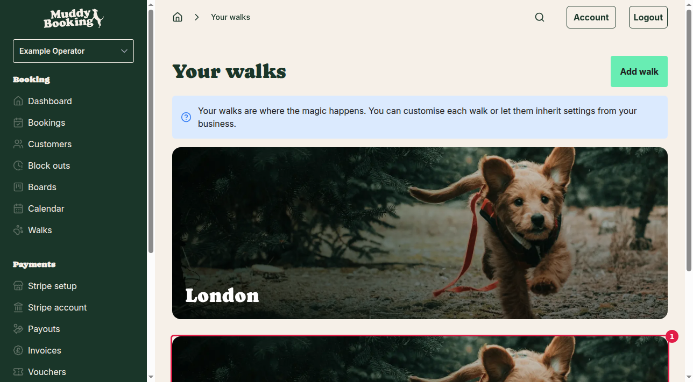
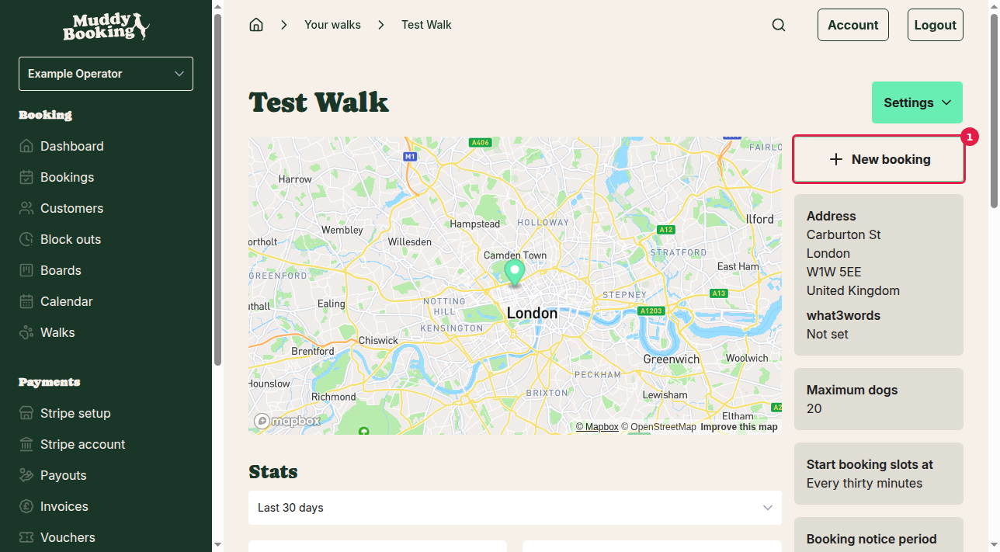
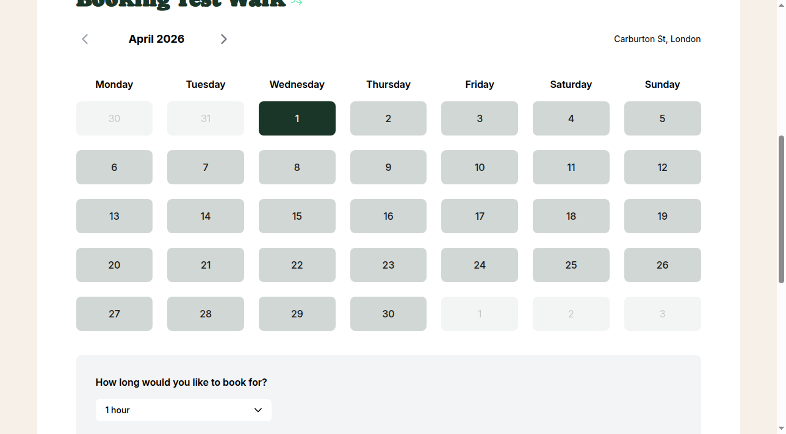
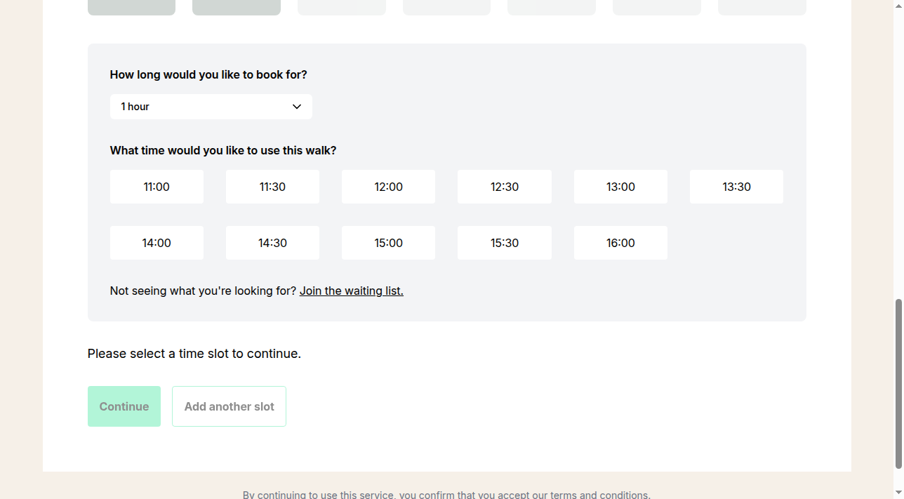
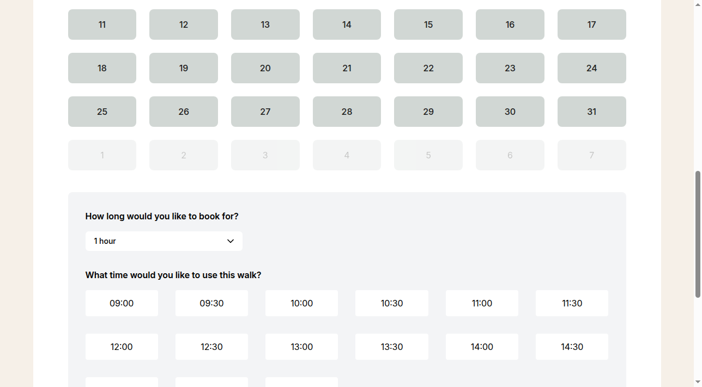

## What is an opening date?

An opening date lets you set a future date from which you'll start accepting bookings. Before this date, your calendar will be unavailable and customers won't be able to book any walks. This is useful if you're setting up your business but aren't ready to start taking bookings yet.

## How to set your opening date

### Step 1: Go to Advanced settings

From your dashboard, click **Settings** in the left menu, then scroll down to the **Advanced** section and click **Advanced settings** **(1)**.

### Step 2: Enter your opening date

On the Advanced settings page, find the **Opening date** field **(1)**. This field includes a helpful explanation: "Set a future date from which you'll begin accepting bookings. Before this date, your calendar will be unavailable and no booking slots will be generated. Leave empty if you're already open."

Click in the date field and enter your opening date. Use the format YYYY-MM-DD (for example, 2026-03-20 for 20th March 2026).

### Step 3: Save your changes

Click the **Save** button to apply your opening date setting.

## How the opening date affects customer bookings

Once you've set an opening date, customers will see the restriction when they try to book walks. Here's how it works:

### Step 1: Access the booking calendar

To see how the opening date affects customer bookings, go to **Walks** in the left menu and click on one of your walks **(1)**.

Then click the **New booking** button **(1)** to open the customer booking calendar.

### Step 2: View the booking calendar with opening date restrictions

The booking calendar will open showing your walk's availability. When you scroll down to see the full calendar display, you'll see the March 2026 calendar clearly with all the dates properly visible.

The calendar interface shows:
- The month navigation at the top
- A clear grid of dates for the entire month
- Available time slots and booking options
- Your opening date restrictions are applied to dates before your set opening date

### Step 3: Earlier months are completely blocked

If you navigate to months before your opening date (such as February 2026), you'll see how the calendar appears for months that fall before the March 20th opening date. The calendar displays with all dates properly visible when scrolled down.

### Step 4: Later months are fully available

Conversely, months that come after your opening date (such as April 2026) will have their dates available for booking, subject to your other availability settings like opening times and block-outs. Again, scrolling down shows the full calendar view with all dates clearly visible.

## Important notes

- **Removing the opening date**: If you're ready to start taking bookings immediately, simply delete the date from the opening date field and click **Save**. This will make your calendar available from today onwards.

- **Past dates**: You cannot set an opening date in the past. The setting is designed for future launch dates only.

- **Other availability rules still apply**: Even after your opening date, customers will only see available time slots based on your opening times, existing bookings, and any block-outs you've set up.

- **Existing bookings**: If you change your opening date to be earlier than previously set, any existing bookings before the new date will remain unaffected.

## Tips for viewing the booking calendar

When testing how your opening date affects the customer experience:

- Always scroll down in the booking calendar to ensure you can see the full month view and date grid
- Use the left and right navigation arrows to move between months and see how the opening date restriction affects different time periods
- The calendar interface is responsive, so the dates and restrictions will be clearly visible when properly scrolled into view
- The calendar shows a complete month grid with all dates properly laid out for easy viewing