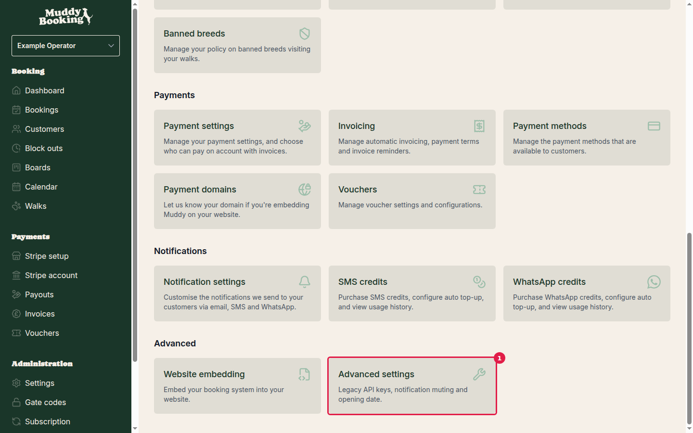
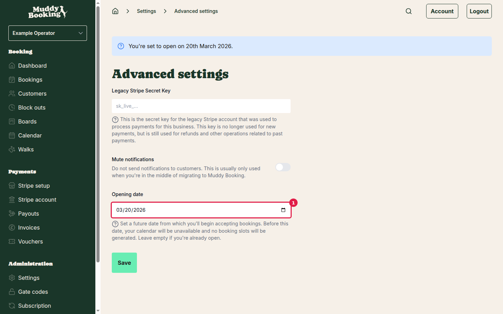
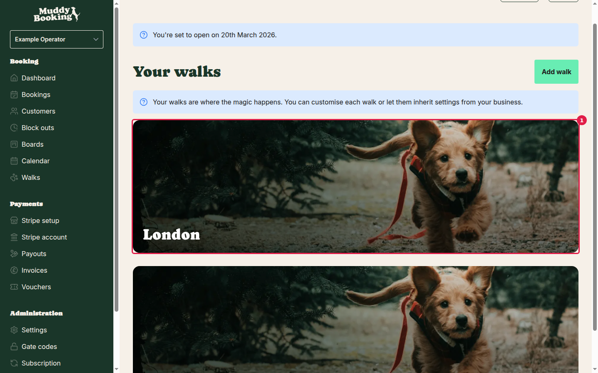
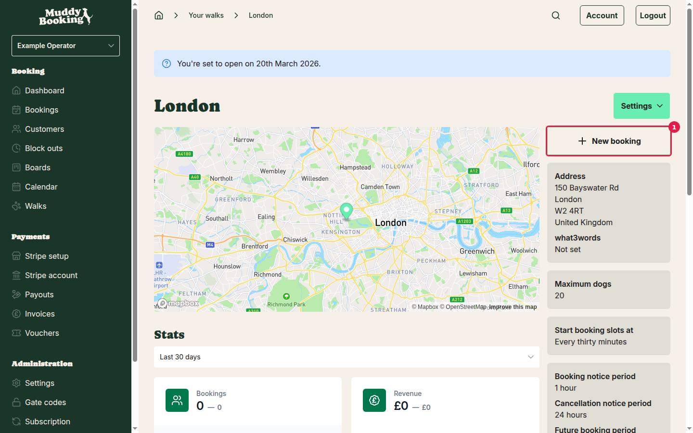
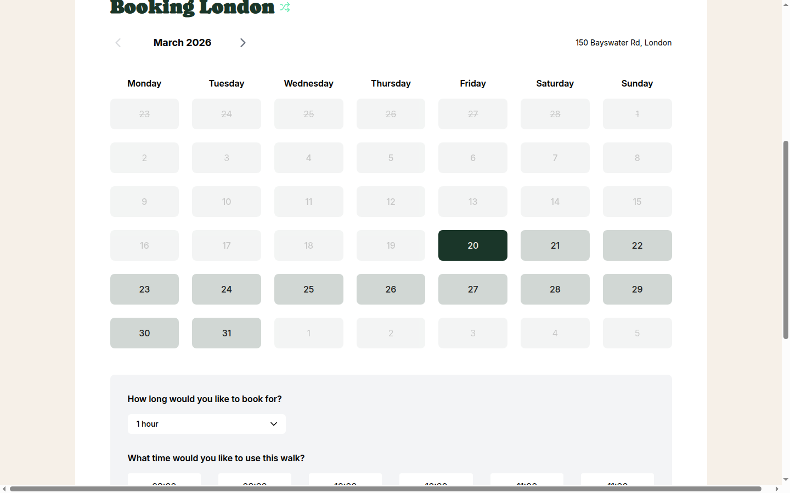
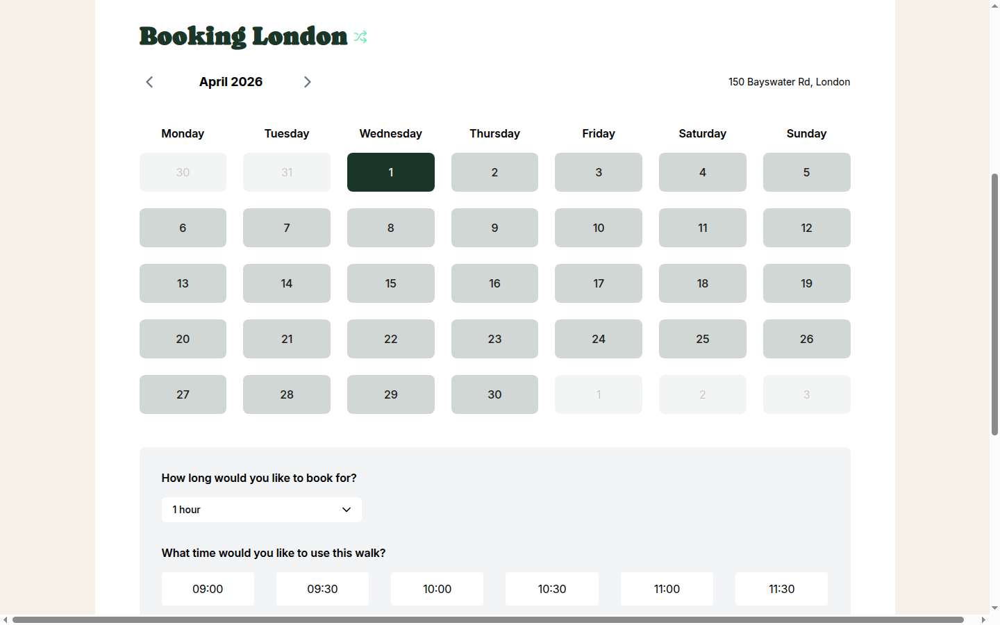

## What is an opening date?

An opening date lets you set a future date from which you'll start accepting bookings. Before this date, your calendar will be unavailable and customers won't be able to book any walks. This is useful if you're setting up your business but aren't ready to start taking bookings yet.

## How to set your opening date

### Step 1: Go to Advanced settings

From your dashboard, click **Settings** in the left menu, then scroll down to the **Advanced** section and click **Advanced settings** **(1)**.

### Step 2: Enter your opening date

On the Advanced settings page, find the **Opening date** field **(1)**. This field includes a helpful explanation: "Set a future date from which you'll begin accepting bookings. Before this date, your calendar will be unavailable and no booking slots will be generated. Leave empty if you're already open."

Click in the date field and enter your opening date.

### Step 3: Save your changes

Click the **Save** button to apply your opening date setting. You'll see a confirmation message and be returned to the main settings page, confirming your opening date has been saved.

## How the opening date affects customer bookings

Once you've set an opening date, customers will see the restriction when they try to book walks. Here's how it works:

### Step 1: Access the booking calendar

To see how the opening date affects customer bookings, go to **Walks** in the left menu and click on one of your walks **(1)**.

Then click the **New booking** button **(1)** to open the customer booking calendar in a new tab.

### Step 2: View March 2026 - dates before opening date are blocked

The booking calendar will open showing your walk's availability. In March 2026, you can see how the opening date of 20th March affects the calendar **(1)** - dates before 20th March are greyed out and unavailable for booking, while dates from 20th March onwards show as available and clickable.

This demonstrates how the opening date works - customers cannot book walks on dates before your business officially opens.

### Step 3: View April 2026 - all dates available

Navigate to April 2026 using the calendar navigation arrows. Since all dates in April are after your opening date of 20th March, the entire month shows as available for booking **(1)** (subject to your other availability settings like opening times and block-outs).

This contrast between March (partially blocked) and April (fully available) clearly demonstrates how the opening date controls when customers can start booking your services.

## Important notes

- **Removing the opening date**: If you're ready to start taking bookings immediately, simply delete the date from the opening date field and click **Save**. This will make your calendar available from today onwards.

- **Past dates**: You cannot set an opening date in the past. The setting is designed for future launch dates only.

- **Other availability rules still apply**: Even after your opening date, customers will only see available time slots based on your opening times, existing bookings, and any block-outs you've set up.

- **Existing bookings**: If you change your opening date to be earlier than previously set, any existing bookings before the new date will remain unaffected.

## Tips for using opening dates effectively

- **Planning a launch**: Set your opening date when you're still setting up your business but want to start configuring walks and settings before you're ready to take bookings.

- **Seasonal businesses**: If you only operate during certain months of the year, you can use the opening date at the start of each season and leave it empty during your operating period.

- **Testing the customer experience**: After setting an opening date, always test the booking flow from the customer's perspective to ensure the restrictions work as expected.
