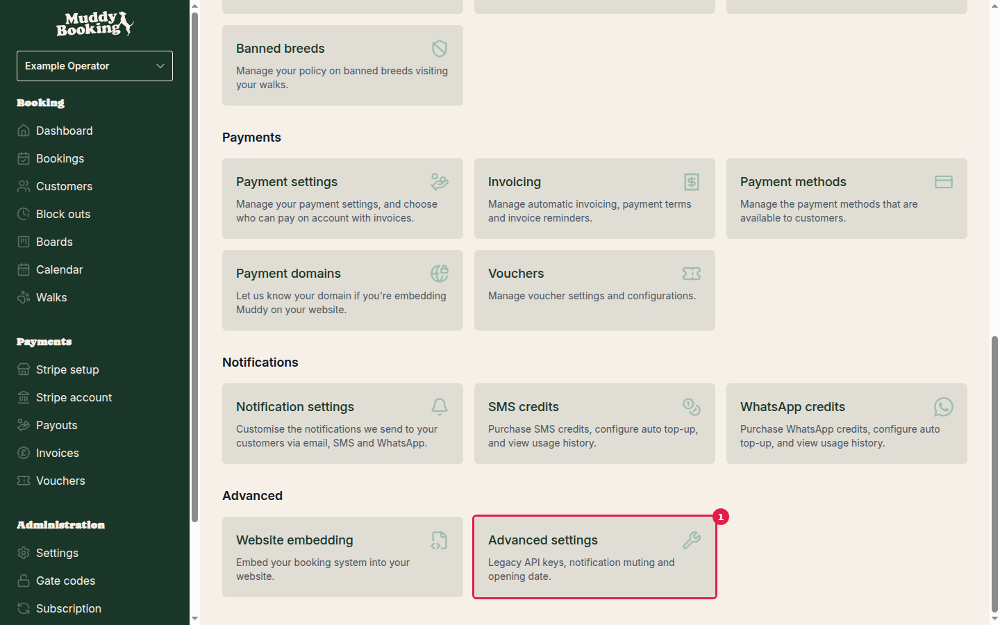
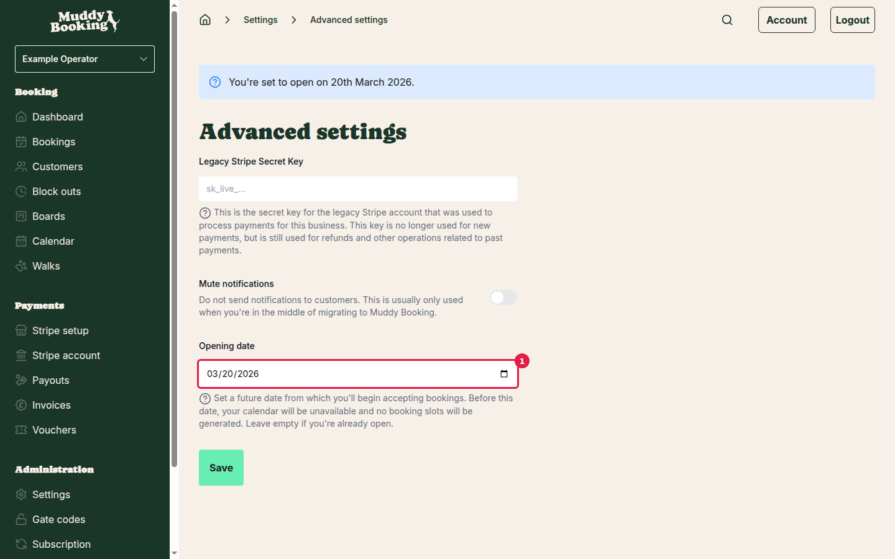
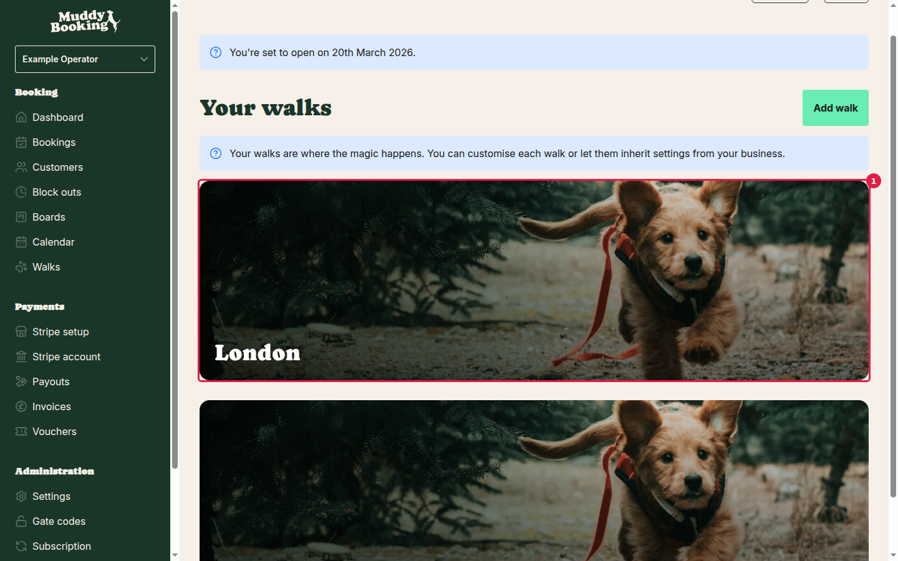
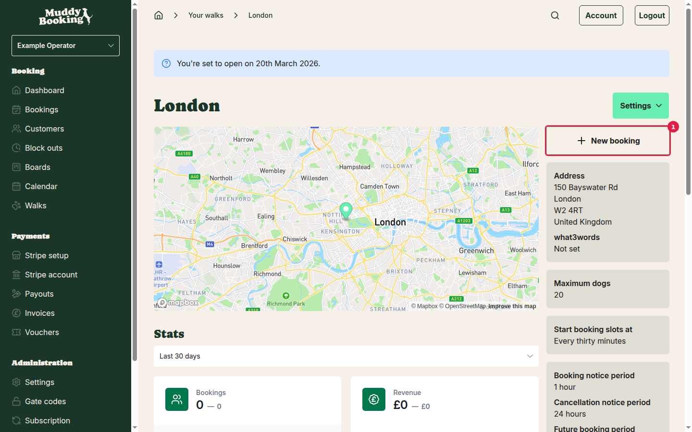
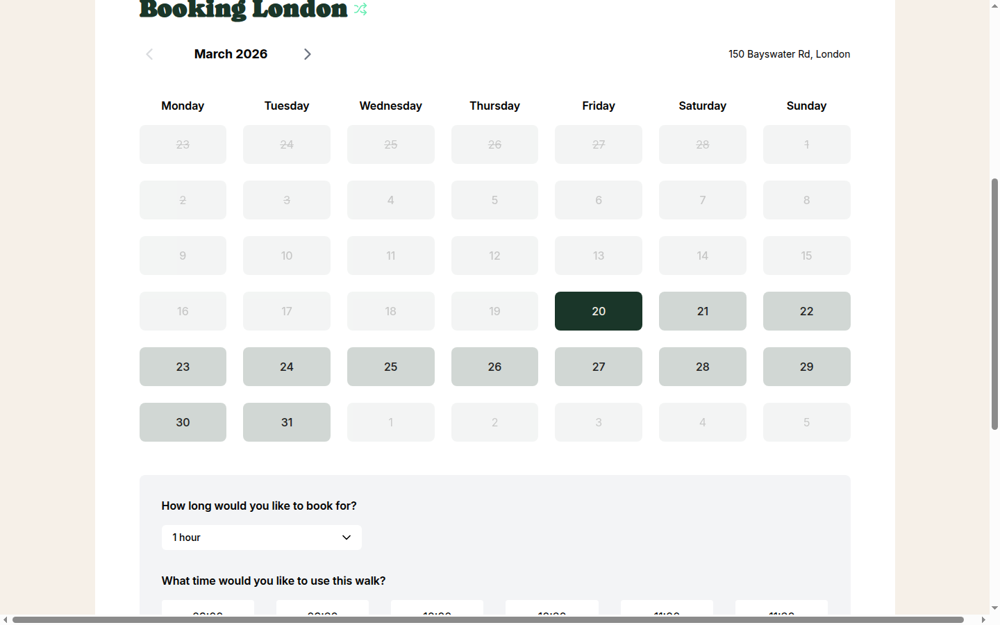
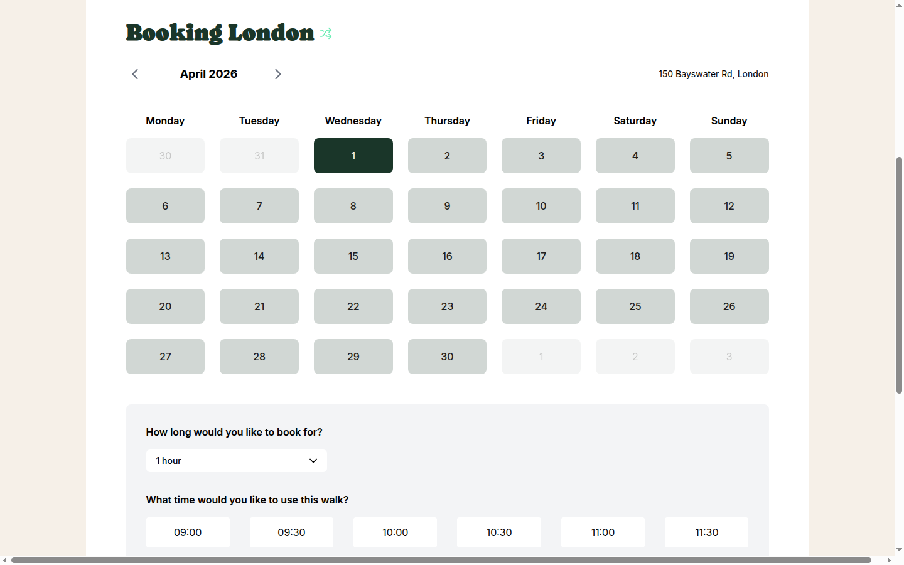

## What is an opening date?

The opening date is the day you start taking bookings. Customers can't book anything before it. Use it if you're setting up Muddy before you're ready to open.

## How to set your opening date

### Step 1: Go to Advanced settings

Click **Settings** in the left-hand menu, scroll down to the **Advanced** section and click **Advanced settings** **(1)**.

### Step 2: Enter your opening date

Find the **Opening date** field **(1)** and enter the date you'll open. If you're already open, leave it empty.

### Step 3: Save your changes

Click **Save**. You'll see a confirmation message and return to the settings page.

## How the opening date affects customer bookings

You can check what customers see in the booking calendar.

### Step 1: Access the booking calendar

Go to **Walks** in the left-hand menu and click one of your walks **(1)**.

Click **New booking** **(1)**. The booking calendar opens in a new tab.

### Step 2: Dates before the opening date are blocked

In this example the opening date is 20th March 2026. In March, the dates before the 20th are greyed out and can't be booked, and the dates from the 20th onwards are available **(1)**.

### Step 3: Dates after the opening date are available

Use the arrows to move to April 2026. Every date is after the opening date, so the whole month is available **(1)**, subject to your [opening times](setting-up-opening-times.md) and [block outs](adding-block-outs.md).

## Important notes

- **Removing the opening date**: to open straight away, delete the date and click **Save**. Customers can then book from today.
- **Past dates**: the opening date must be in the future.
- **Other availability rules still apply**: after you open, customers can only book times allowed by your opening times, existing bookings and block outs.
- **Existing bookings**: moving the opening date earlier doesn't affect bookings you already have.

## Tips

- **Launching**: set an opening date while you set up your walks and settings, so nobody can book before you're ready.
- **Seasonal businesses**: set an opening date for the start of each season, and clear it once you're open.
- **Check it works**: after setting a date, open the booking calendar as above and make sure the right dates are blocked.
