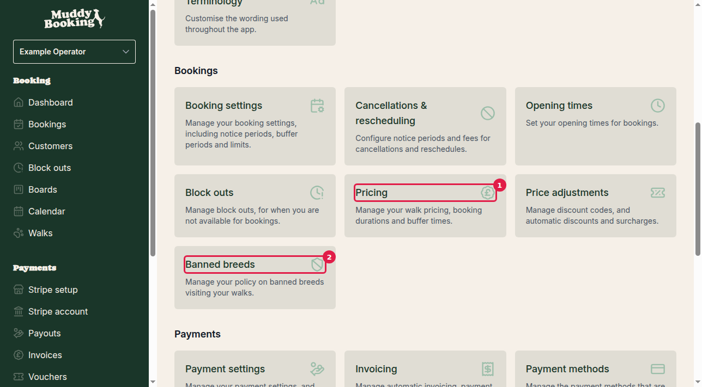
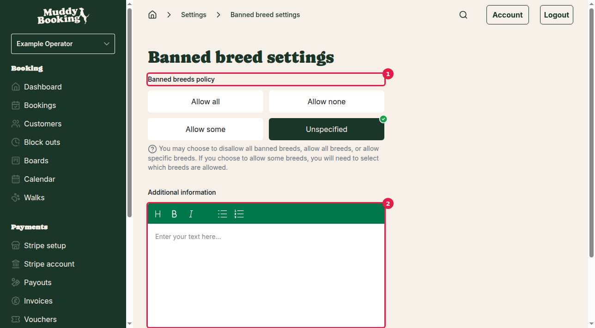
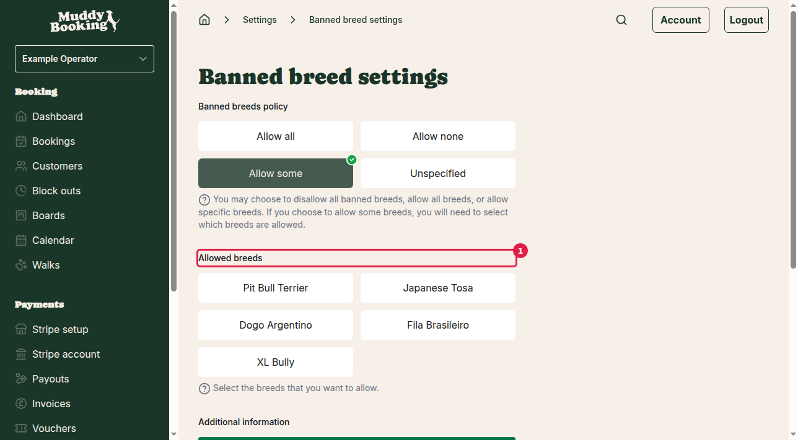
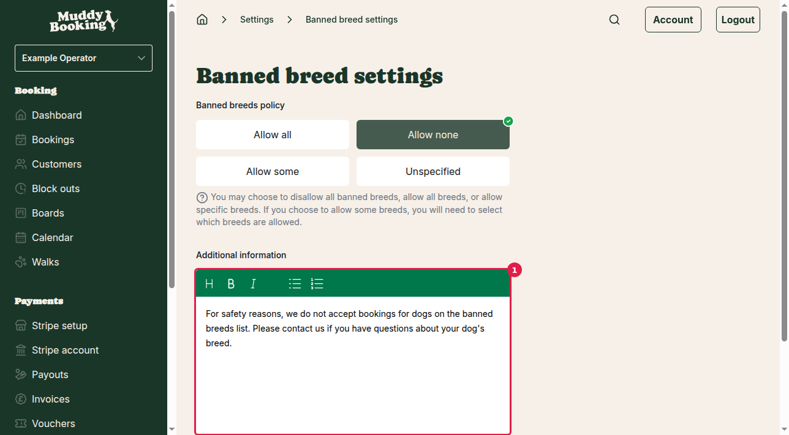

## Accessing banned breeds settings

1. Go to **Settings** in the main navigation
2. Scroll down to the **Pricing** section **(1)**
3. Click **Banned breeds** **(2)** - "Manage your policy on banned breeds visiting your walks"

## Configuring your banned breeds policy

The banned breeds settings page lets you control which dog breeds you accept for bookings. You have four policy options to choose from **(1)**:

### Policy options

**Allow all**
- Accepts all dog breeds without restrictions
- No additional settings required
- Good for businesses with no breed restrictions

**Allow none** 
- Blocks all dogs from the banned breeds list
- Strictest policy option
- Automatically rejects bookings for banned breeds

**Allow some**
- Lets you choose specific banned breeds to allow
- Shows a list of checkboxes for each banned breed
- Most flexible option for selective policies

**Unspecified**
- No policy is set
- Leaves breed restrictions unclear to customers

### Selecting specific breeds to allow

When you choose **Allow some** **(1)**, you'll see a list of banned breeds with checkboxes. Tick the boxes for breeds you want to accept:

The banned breeds list includes:
- Pit Bull Terrier
- Japanese Tosa  
- Dogo Argentino
- Fila Brasileiro
- XL Bully

Only the breeds you tick will be allowed to make bookings. All others from the banned list will be restricted.

## Adding additional information

Use the **Additional information** field **(1)** to explain your policy to customers. This text appears during the booking process, so make it clear and helpful.

Good examples include:
- Explaining why you have the policy
- Providing your contact details for questions
- Offering alternatives or exceptions
- Clarifying how you handle mixed breeds

## Saving your settings

Once you've configured your policy and added any additional information, click **Save** to apply your changes. Your banned breeds policy will immediately affect all new bookings.

## Important notes

- Changes apply to new bookings only - existing bookings aren't affected
- Customers see your policy during the booking process
- The system automatically checks breed restrictions when customers select their dog's breed
- If you're unsure about breed classifications, choose **Allow all** and handle restrictions manually