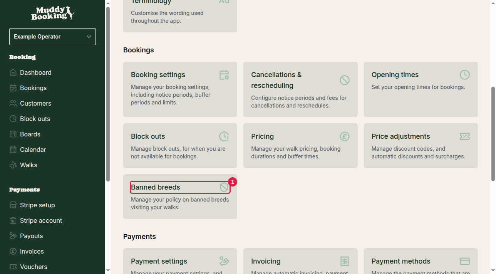
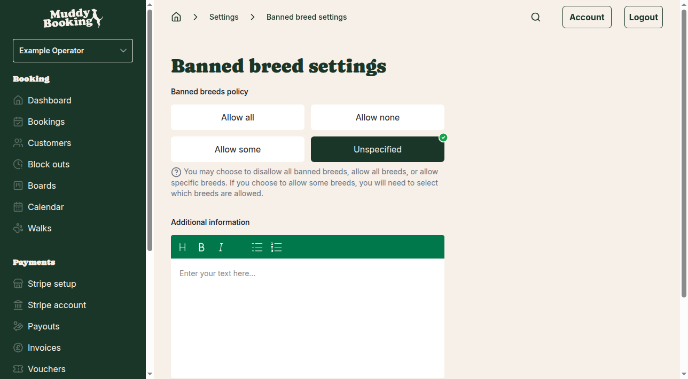
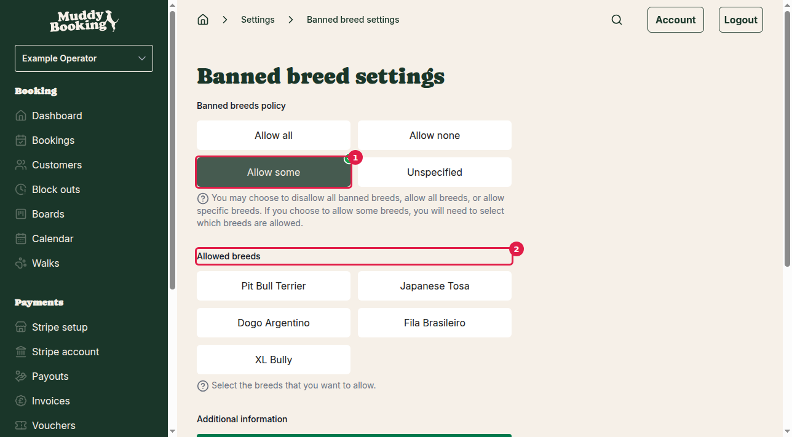
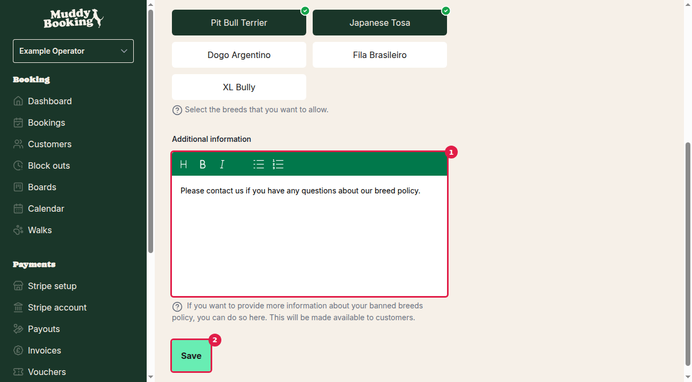

## Accessing banned breeds settings

To set up your banned breeds policy, navigate to your settings:

1. Go to **Settings** from your main menu
2. Find the **Pricing** section
3. Click **Banned breeds** **(1)**

## Understanding the policy options

Muddy Booking provides four different policy options for handling banned breeds:

### Allow all
Choose this option if you accept all dog breeds without any restrictions. This is the most inclusive policy and places no breed-based limitations on bookings.

### Allow none
Select this option if you do not accept any of the commonly banned breeds. This provides the most restrictive policy regarding banned breeds.

### Allow some
This option lets you create a custom policy by selecting specific breeds that you're comfortable accepting. When you choose this option, you'll see a list of breeds to select from.

### Unspecified
Choose this if you prefer not to set a specific banned breeds policy through the system.

## Setting up selective breed acceptance

If you want to accept some but not all banned breeds, select **Allow some** **(1)**. This will reveal the breed selection options **(2)**:

You can select from these commonly banned breeds:
- Pit Bull Terrier
- Japanese Tosa
- Dogo Argentino
- Fila Brasileiro
- XL Bully

Simply tick the checkbox next to each breed you're willing to accept for walks.

## Adding additional information

You can provide extra details about your banned breeds policy to help customers understand your requirements:

1. Scroll down to the **Additional information** section **(1)**
2. Enter any relevant details about your policy
3. Click **Save** **(2)** to apply your changes

The information you add here will be shown to customers, so consider including:
- Your reasoning behind the policy
- Contact information for questions
- Any exceptions or special circumstances
- Alternative arrangements you might offer

## Saving your settings

Once you've configured your banned breeds policy and added any additional information, click **Save** to apply your changes. You'll be returned to the main settings page, and your policy will be active immediately.

## Important considerations

- Your banned breeds policy affects all bookings across your entire service
- The policy information you provide will be visible to customers during the booking process
- Consider your insurance requirements and local regulations when setting your policy
- You can change your policy at any time by returning to this settings page

Setting a clear banned breeds policy helps manage customer expectations and ensures you only receive bookings for dogs you're comfortable walking.