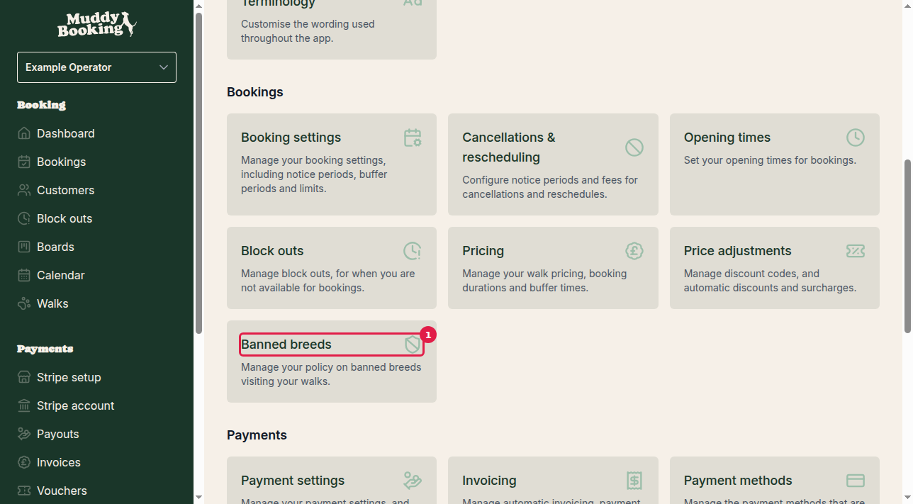
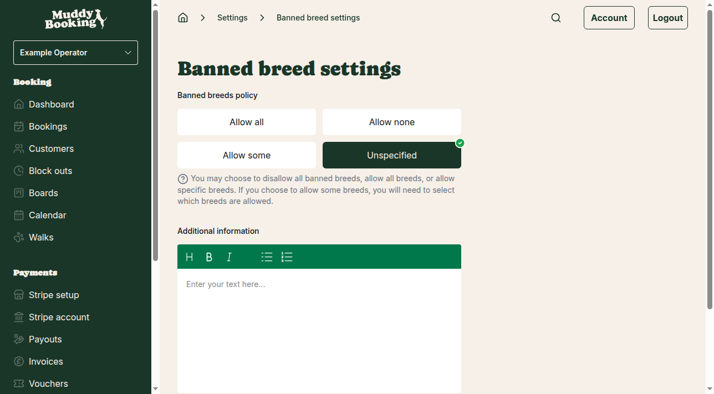
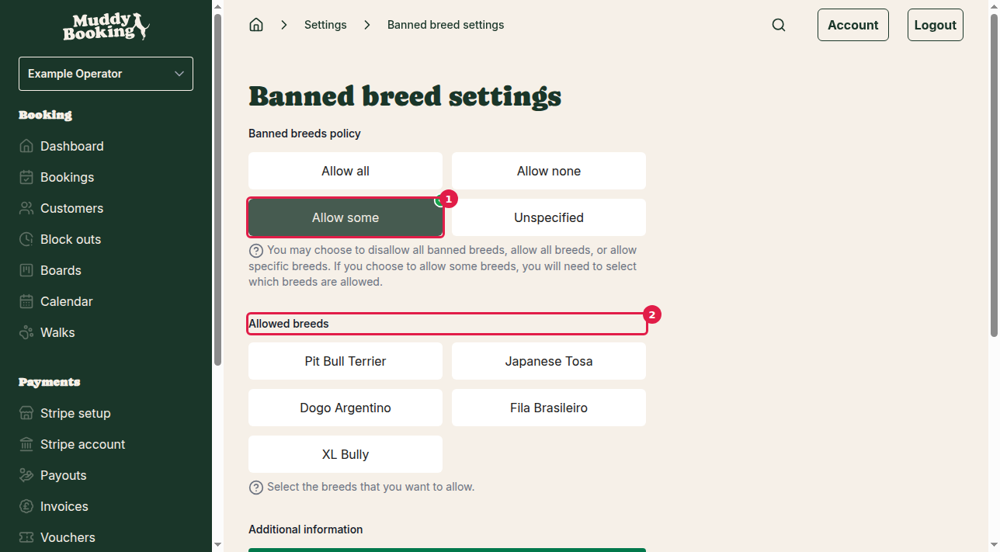
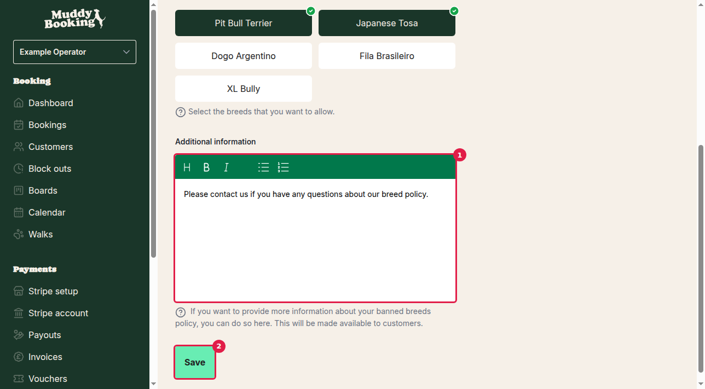

## Accessing banned breeds settings

1. Go to **Settings** in the left-hand menu
2. Find the **Pricing** section
3. Click **Banned breeds** **(1)**

## Understanding the policy options

There are four options:

### Allow all
You accept every breed.

### Allow none
You don't accept any of the commonly banned breeds.

### Allow some
You accept some of the commonly banned breeds and choose which ones.

### Unspecified
You don't set a policy in Muddy.

## Setting up selective breed acceptance

Select **Allow some** **(1)** to show the list of breeds **(2)**:

- Pit Bull Terrier
- Japanese Tosa
- Dogo Argentino
- Fila Brasileiro
- XL Bully

Tick each breed you're happy to accept.

## Adding additional information

You can explain your policy to customers:

1. Scroll down to **Additional information** **(1)**
2. Enter the details
3. Click **Save** **(2)**

Customers see this text, so you might include:
- Why you have the policy
- How to contact you with questions
- Any exceptions
- Any alternatives you offer

## Saving your settings

Click **Save**. You'll return to the settings page and the policy applies straight away.

## Important considerations

- The policy applies to all your bookings
- Customers see the policy when they book. To make them accept it before booking, see [Setting up legal documents](setting-up-legal-documents.md#requiring-customer-acceptance-5)
- Check your insurance and local regulations when choosing your policy
- You can change the policy at any time
