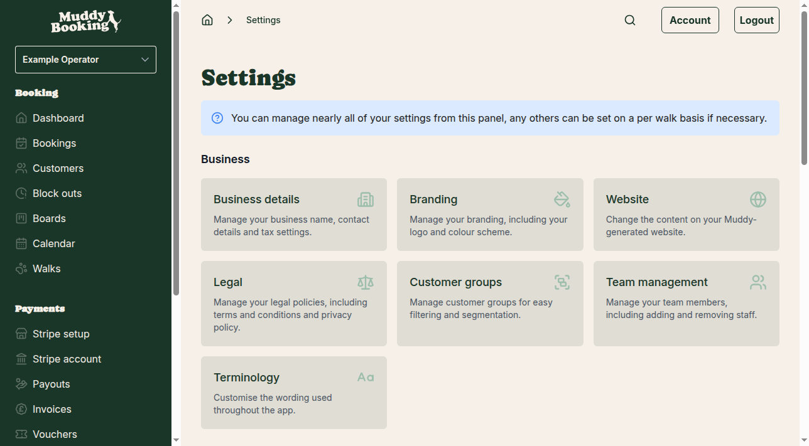
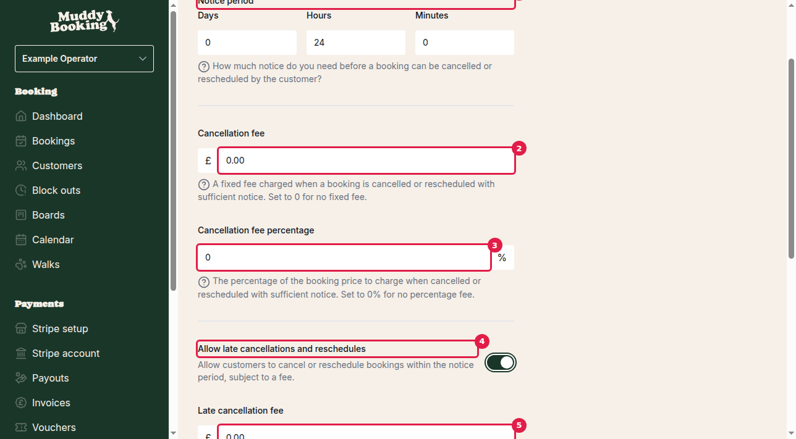

## Overview

Setting up a cancellation policy helps protect your business from lost revenue when customers cancel or reschedule bookings. You can configure different fees for standard cancellations (with enough notice) and late cancellations (within your notice period).

## Accessing cancellation settings

1. Go to **Settings** from the left-hand menu
2. Under the **Bookings** section, click **Cancellations & rescheduling**

## Setting the notice period

The notice period **(1)** determines how much advance warning you need before a booking can be cancelled or rescheduled without being considered "late". You can set this using a combination of:

- **Days** — whole days of notice required
- **Hours** — additional hours on top of days
- **Minutes** — additional minutes for precise timing

For example, setting "1 day and 2 hours" means customers must cancel at least 26 hours before their booking time to avoid late cancellation fees.

## Configuring standard cancellation fees

When customers cancel with sufficient notice (outside your notice period), you can charge:

### Fixed cancellation fee **(2)**
Enter a fixed amount in pounds that will be charged for any cancellation or reschedule with proper notice. Set to **£0** if you don't want to charge a fixed fee.

### Cancellation fee percentage **(3)**
Enter a percentage of the booking price to charge as a cancellation fee. Set to **0%** if you don't want to charge a percentage fee.

You can use both a fixed fee and percentage fee together — for example, £5 plus 10% of the booking price.

## Enabling late cancellations

By default, customers cannot cancel or reschedule within your notice period. To allow late changes with higher fees:

1. Enable **Allow late cancellations and reschedules** **(4)**

This reveals additional options for late cancellation fees, which are typically higher than standard fees to discourage last-minute changes.

## Configuring late cancellation fees

When late cancellations are enabled, you can set separate fees that apply when customers cancel within your notice period:

### Late cancellation fee **(5)**
A fixed amount charged for late cancellations or reschedules. This is usually higher than your standard fixed fee.

### Late cancellation fee percentage **(6)**
The percentage of the booking price to charge for late changes. You can set this up to **100%** to charge the full booking price for very late cancellations.

## Understanding the difference between standard and late fees

**Standard cancellation fees** apply when customers cancel or reschedule with sufficient notice (outside your notice period). These fees are typically lower and designed to cover basic administrative costs.

**Late cancellation fees** apply when customers cancel or reschedule within your notice period. These fees are usually higher to:
- Discourage last-minute changes
- Compensate for the difficulty of filling short-notice slots
- Cover the lost revenue from bookings that are hard to replace

## Tax settings

The **Fees include tax** setting determines whether the fixed fee amounts you enter already include tax, or if tax should be added on top. Enable this if you want to enter tax-inclusive amounts.

## Important notes

- Cancellation fees will never exceed the original booking price
- You can combine fixed fees and percentage fees for both standard and late cancellations
- If you don't enable late cancellations, customers cannot cancel or reschedule within your notice period at all
- Setting fees to £0 and 0% means no cancellation fee will be charged

## Saving your changes

After configuring your cancellation policy, click **Save** **(7)** to apply your settings. Your cancellation policy will immediately apply to all bookings.
