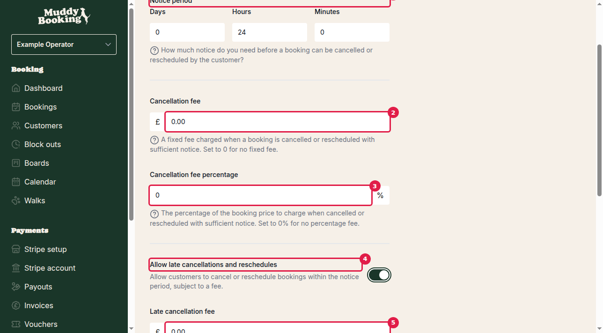

## Overview

A cancellation policy lets you charge a fee when customers cancel or reschedule. You can set one fee for cancellations made with enough notice and a separate, usually higher, fee for late cancellations.

## Accessing cancellation settings

1. Go to **Settings** in the left-hand menu
2. Under **Bookings**, click **Cancellations & rescheduling**

## Setting the notice period

The notice period **(1)** is how much warning you need for a cancellation or reschedule not to count as late. Set it in:

- **Days**
- **Hours**
- **Minutes**

For example, 1 day and 2 hours means customers must cancel at least 26 hours before the booking to avoid a late fee.

## Configuring standard cancellation fees

These apply when customers cancel or reschedule before the notice period starts.

### Fixed cancellation fee **(2)**
A set amount in pounds. Enter **£0** for no fixed fee.

### Cancellation fee percentage **(3)**
A percentage of the booking price. Enter **0%** for no percentage fee.

You can use both, for example £5 plus 10% of the booking price.

## Enabling late cancellations

By default, customers can't cancel or reschedule once the notice period has started. To let them, for a fee:

1. Switch on **Allow late cancellations and reschedules** **(4)**

The late fee settings appear.

## Configuring late cancellation fees

These apply when customers cancel or reschedule within the notice period.

### Late cancellation fee **(5)**
A set amount, usually higher than your standard fixed fee.

### Late cancellation fee percentage **(6)**
A percentage of the booking price, up to **100%** to charge the full price.

## Understanding the difference between standard and late fees

**Standard fees** apply when customers give enough notice. They're usually low, covering your admin.

**Late fees** apply within the notice period. They're usually higher, because a slot freed up at short notice is hard to fill.

## Tax settings

Switch on **Fees include tax** if the fixed amounts you enter already include tax. Leave it off to add tax on top.

## Important notes

- A cancellation fee never exceeds the booking price
- If late cancellations are off, customers can't cancel or reschedule within the notice period at all
- Setting fees to £0 and 0% means no fee is charged

## Saving your changes

Click **Save** **(7)**. The policy applies straight away to all bookings. To show customers a written cancellation policy, see [Setting up legal documents](setting-up-legal-documents.md#cancellation-policy).
