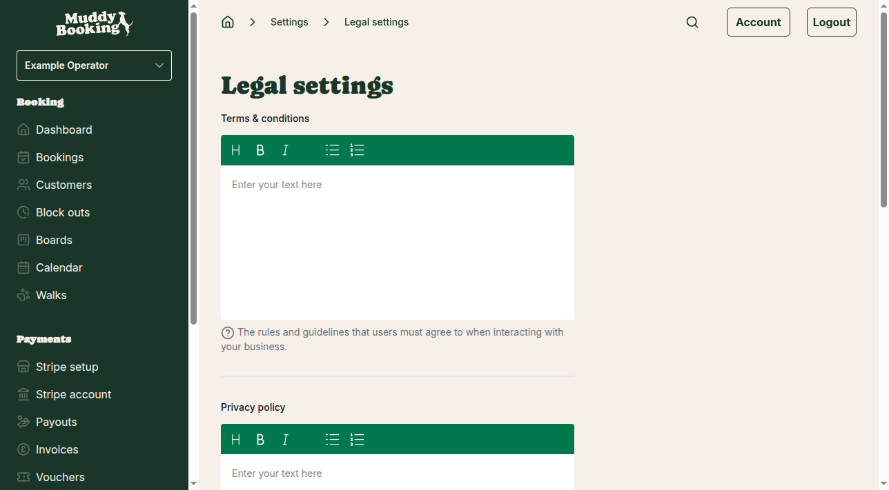
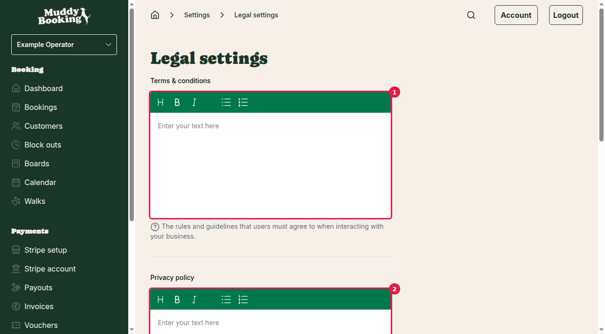
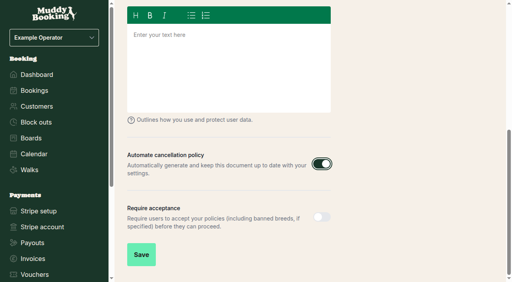
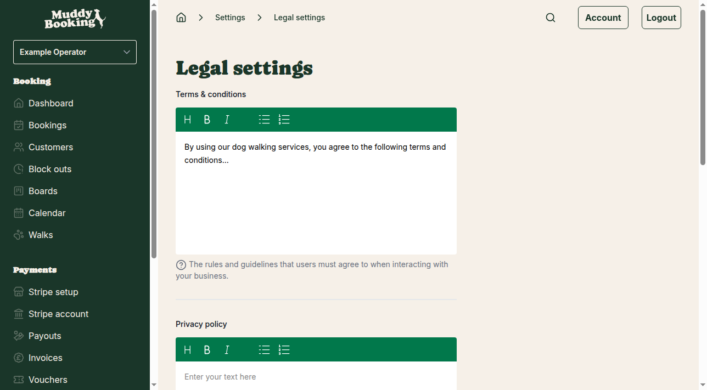

## Accessing legal document settings

Your legal documents help protect your business and inform customers about your policies. To set them up:

1. Click **Settings** in the left-hand menu
2. Under the Business section, click **Legal**

## Setting up your legal documents

The legal settings page allows you to configure three types of documents:

### Terms and conditions **(1)**

Your terms and conditions outline the rules and guidelines that customers must follow when using your dog walking services. Click in the text area and enter your complete terms and conditions.

This might include information about:
- Service expectations and limitations  
- Customer responsibilities
- Liability and insurance details
- Payment terms
- Booking requirements

### Privacy policy **(2)**

Your privacy policy explains how you collect, use, and protect customer data. Click in the text area and enter your complete privacy policy.

This should cover:
- What personal information you collect
- How you use customer data
- How you protect customer information
- Customer rights regarding their data
- Contact information for privacy questions

### Cancellation policy

You have two options for your cancellation policy:

#### Automatic cancellation policy **(3)**

Switch on **Automate cancellation policy** to have Muddy Booking automatically generate and maintain your cancellation policy based on your booking settings. This ensures your policy always matches your actual cancellation rules.

When automation is enabled, the cancellation policy text area disappears as the document is generated automatically.

#### Manual cancellation policy **(4)**

Switch off **Automate cancellation policy** if you prefer to write your own cancellation policy. The text area will appear where you can enter your custom policy covering:
- Cancellation notice periods
- Any cancellation fees
- Refund procedures
- Rescheduling policies

### Requiring customer acceptance **(5)**

Switch on **Require acceptance** to make customers explicitly agree to your policies before they can complete a booking. This includes:
- Your terms and conditions
- Your privacy policy  
- Your cancellation policy
- Any banned breeds policies you've configured

When this is switched off, your policies are still available to customers but they don't need to actively accept them.

## Saving your changes

After entering your legal documents and configuring your settings, click **Save** **(6)** to apply all changes.

## Important considerations

- **Get professional advice**: Consider having a solicitor review your legal documents to ensure they properly protect your business
- **Keep documents current**: Review and update your legal documents regularly, especially if your services or policies change
- **Be comprehensive**: Make sure your documents cover all aspects of your service to avoid misunderstandings with customers
- **Test the booking flow**: After saving, test your booking process from a customer's perspective to see how the legal documents are presented