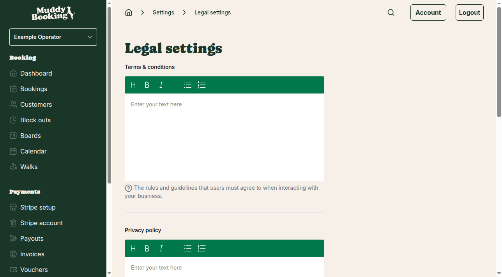
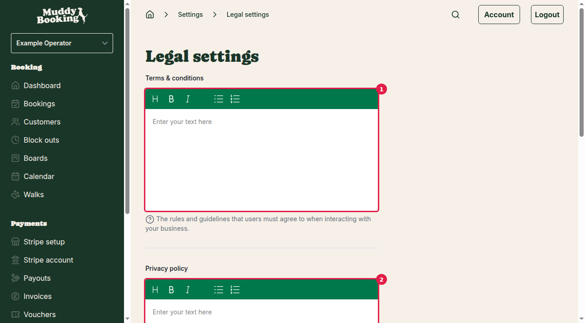
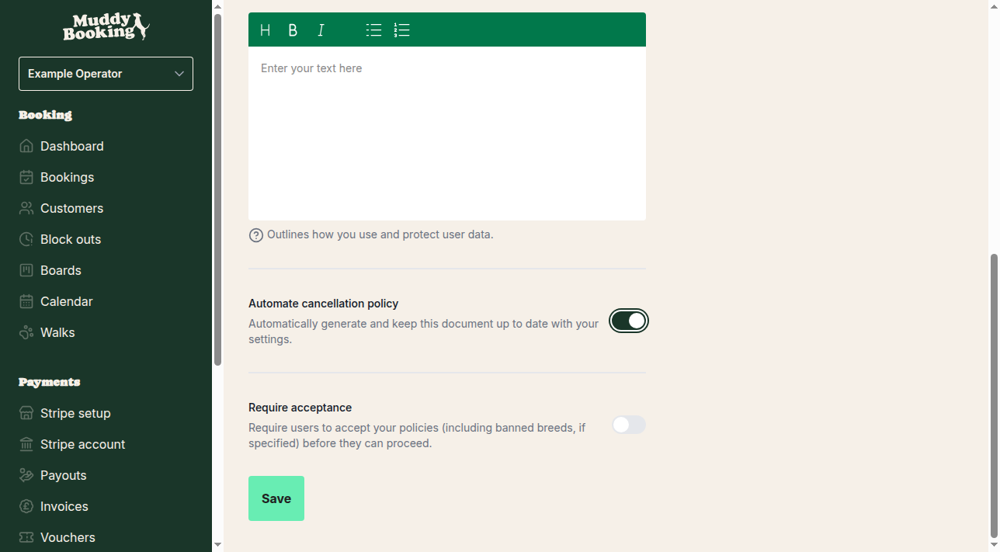
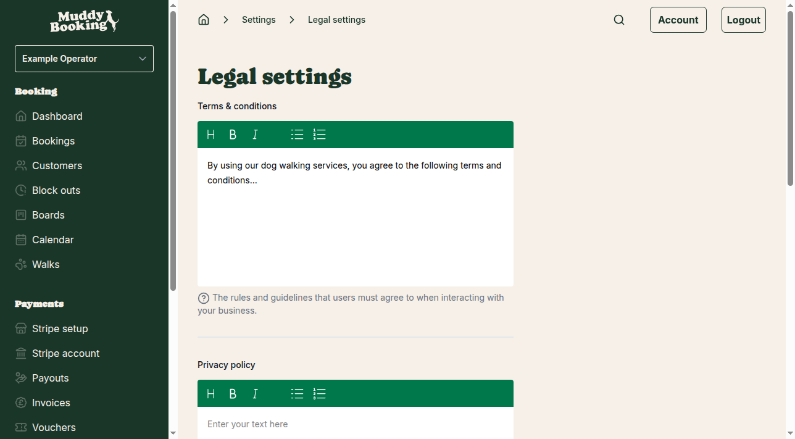

## Accessing legal document settings

1. Click **Settings** in the left-hand menu
2. Under the Business section, click **Legal**

## Setting up your legal documents

You can set up three documents here:

### Terms and conditions **(1)**

The rules customers agree to when they use your services. Enter them in the text box. You might cover:
- What your service includes and doesn't include
- What you expect from customers
- Liability and insurance
- Payment terms
- Booking requirements

### Privacy policy **(2)**

How you collect, use and protect customer data. Enter it in the text box. It should cover:
- What personal information you collect
- How you use it
- How you keep it safe
- Customers' rights over their data
- Who to contact with privacy questions

### Cancellation policy

You can let Muddy write this for you, or write your own.

#### Automatic cancellation policy **(3)**

Switch on **Automate cancellation policy** and Muddy writes the policy from your [cancellation rules](setting-up-cancellation-policy.md), and keeps it up to date when you change them.

The text box is hidden while this is on.

#### Manual cancellation policy **(4)**

Switch off **Automate cancellation policy** to write your own in the text box. Cover:
- How much notice customers need to give
- Any fees
- Refunds
- Rescheduling

### Requiring customer acceptance **(5)**

Switch on **Require acceptance** to make customers agree to the following before they can book:
- Your terms and conditions
- Your privacy policy
- Your cancellation policy
- Your [banned breeds policy](setting-up-banned-breeds.md), if you have one

When it's off, customers can still read your policies but don't have to accept them.

## Saving your changes

Click **Save** **(6)**.

## Important considerations

- **Get professional advice**: a solicitor can check your documents protect your business
- **Keep them up to date**: review them whenever your services or policies change
- **Check what customers see**: after saving, make a test booking to see how the documents are shown
