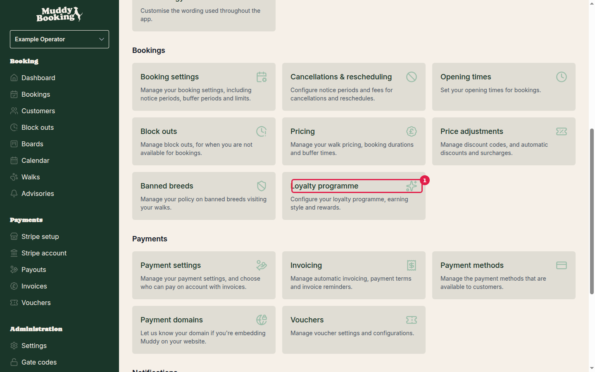
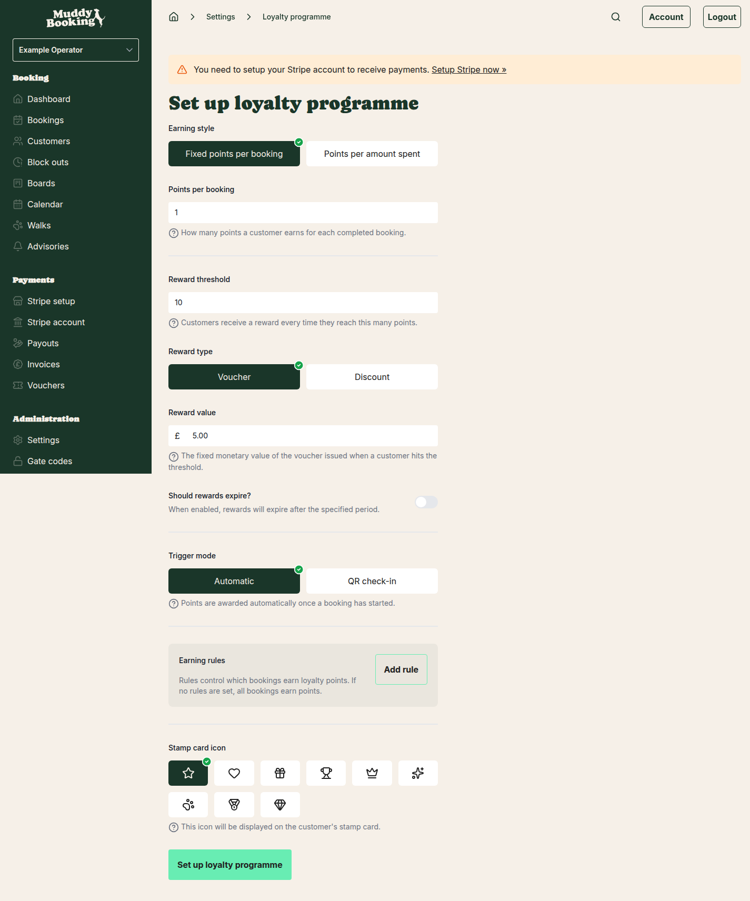
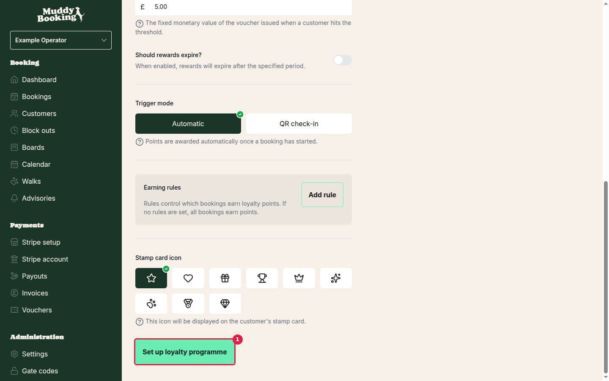
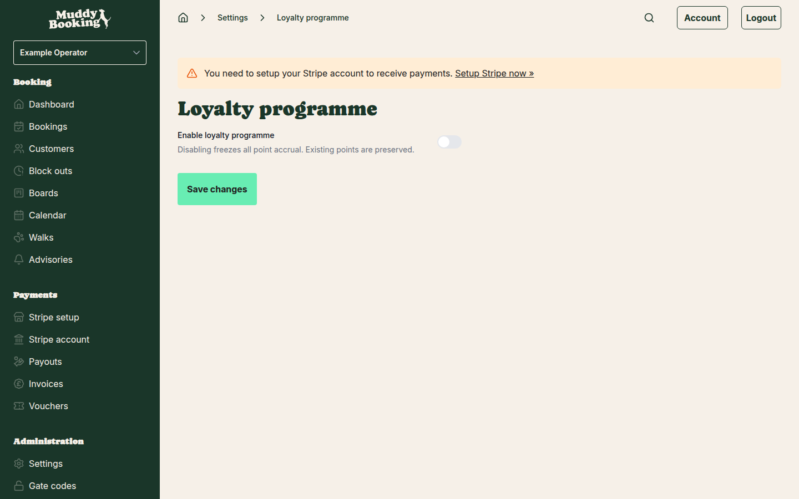

## Accessing loyalty programme settings

To set up your loyalty programme, go to **Settings** and click on **Loyalty programme** in the Pricing section.

## Initial setup

When you first access the loyalty programme settings, you'll see all the configuration options with a **Set up loyalty programme** button at the bottom.

Configure your loyalty programme settings:

### Earning style
Choose how customers earn points:
- **Fixed points per booking** — Customers earn a set number of points for each completed booking
- **Points per amount spent** — Points are awarded based on the booking value

### Points per booking
Set how many points customers earn for each completed booking (default is 1 point per booking).

### Reward threshold
Define how many points customers need to earn a reward (default is 10 points). When customers reach this threshold, they automatically receive a reward.

### Reward type and value
Choose between:
- **Voucher** — Issues a voucher with a fixed monetary value
- **Discount** — Applies a percentage discount

Set the reward value — for vouchers, this is the fixed amount (e.g., £5.00).

### Additional settings
- **Reward expiry** — Choose whether rewards expire after a set period
- **Trigger mode** — Select "Automatic" to award points once bookings start, or "QR check-in" for manual verification
- **Earning rules** — Add specific rules to control which bookings earn points (if no rules are set, all bookings earn points)
- **Stamp card icon** — Upload an icon that appears on customers' loyalty cards

Once configured, click **Set up loyalty programme** to enable the feature.

## Enabling and managing the programme

After initial setup, you can enable or disable the loyalty programme using the toggle switch at the top of the settings page.

**Important:** Disabling the programme freezes all point accrual, but existing customer points are preserved and can be reactivated later.

Remember to click **Save changes** after making any modifications.

## Managing customer points

Once customers start making bookings, you can view and manage their loyalty points through the customer management system.

### Viewing customer loyalty status

1. Go to **Customers** in the main menu
2. Click on any customer to view their profile
3. Their current loyalty points and reward progress will be displayed

### Manually adding points

To manually add points to a customer (useful for special circumstances or to trigger rewards):

1. Navigate to the customer's profile
2. Look for the loyalty points section
3. Click the option to manually adjust points
4. Enter the number of points to add
5. Add a note explaining the reason for the manual adjustment
6. Save the changes

**Tip:** If you add enough points to push a customer over the reward threshold, their reward will be automatically triggered and issued.

## Customer experience

### How customers see their progress

Customers can view their loyalty progress through their customer dashboard. When logged into their account, they'll see:

- Current points balance
- Progress towards their next reward
- A visual stamp card showing their journey
- History of earned points and redeemed rewards

### Impersonating customers

To see what customers see:

1. Go to the customer's profile in your management area
2. Click the **Impersonate** or **View as customer** option
3. This opens their dashboard view, showing exactly what they see

### Viewing customer history

From the customer's profile, you can:

- View all their booking history
- See loyalty points earned from each booking
- Track rewards issued and redeemed
- Review any manual point adjustments

Click **View all history** to see a complete timeline of the customer's activity and loyalty interactions.

## Tips for success

- **Set achievable thresholds** — Make sure customers can realistically reach reward levels to keep them engaged
- **Communicate clearly** — Let customers know about your loyalty programme through your website and booking confirmations
- **Monitor engagement** — Check which customers are close to rewards and consider targeted communication
- **Use manual adjustments sparingly** — Reserve manual point additions for special circumstances like service issues or celebrations

Your loyalty programme helps build customer retention by rewarding regular bookings with tangible benefits, encouraging repeat business and customer loyalty.